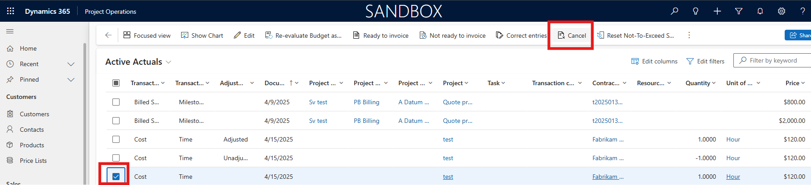
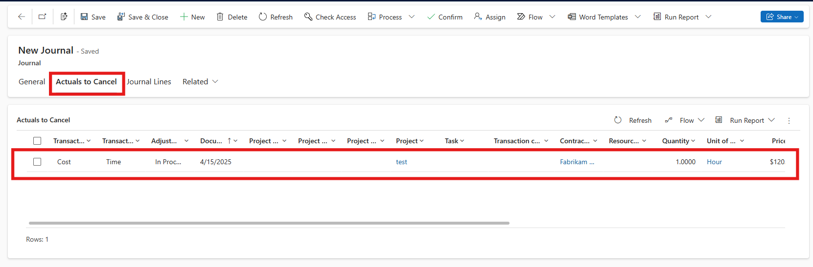

# Cancel actuals created via entry journals

[!INCLUDE[banner](../includes/banner.md)]

_**Applies To:** Project Operations for resource/non-stocked based scenarios, Lite deployment - deal to proforma invoicing_

Microsoft Dynamics 365 Project Operations provides the ability to create actuals by confirming entry journals instead of entering Time, Expense, or Material usage logs. When mistkaes are made during the creation of entry journals, there is a process to cancel the actuals which were created to assist in rectifying the mistake.

## Selecting and confirming actuals for cancellation

1. In the **Sales** area, in the left navigation pane, under **Transactions**, select **Actuals**.
2. In the **Actuals** list, select the actuals which need to be cancelled
3. On the ribbon select **Cancel**
   
> [!NOTE]
> Only actuals created via entry journals can be cancelled by this process. If other actuals are selected, they will be ignored when the correction journal is created.
4. This action will create and navigate to the correction journal if one or more of the selected actuals are valid to be canceled. Additionally the actuals selected for cancellation will have their adjustment status set to **In process**.
5. The newly created journal will have a tab named **Actuals to Cancel**. This is a list of all actuals which will be cancelled once the entry journal is confirmed.
   
6. Once the list of actuals has been verified, select **Confirm** from the ribbon. This will create the reversing acutals with an adjustment status of **Unadjustable**, and will set the status of the cancelled actuals to **Adjusted**.
> [!NOTE]
> This process is irreversible and cannot be undone once the correction journal is confirmed

[!INCLUDE[footer-include](../includes/footer-banner.md)]
