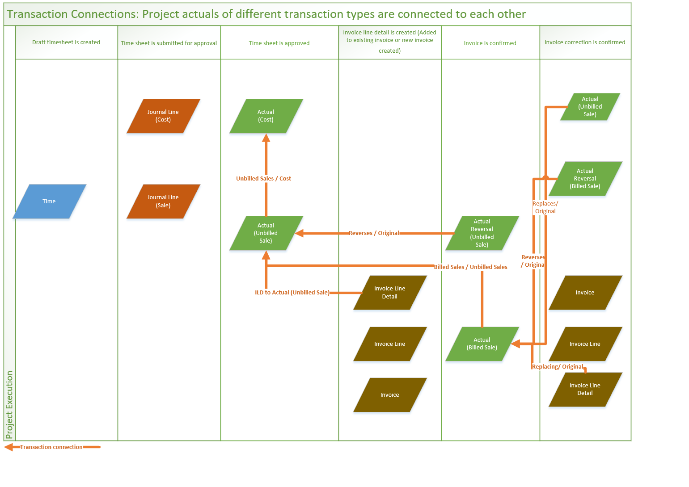

# Transaction connections - Link actuals of different transaction types

[!INCLUDE[banner](../includes/banner.md)]

_**Applies To:** Project Operations Integrated with ERP, Core deployment - deal to proforma invoicing_

Transaction connection records are created to link actuals of different types as time, expense, or material usage moves in its lifecycle from the quote or pre-sales stage to the contract stage, approvals and/or recalls, invoicing, and potentially credit or corrective invoicing.

The following example shows the typical processing of time entries in a Project Operations project lifecycle.

> 

The processing of time entries in a Project Operations project lifecycle follows these steps: 

1. Submission of a time entry causes two journal lines to be created: one for cost and one for unbilled sales. 
2. Eventual approval of the time entry causes two actuals to be created: one for cost and one for unbilled sales. These 2 actuals are linked using transaction connections.
3. When the user creates a project invoice, the invoice line transaction is created by using data from the unbilled sales actual.
4. When the invoice is confirmed, this creates two new actuals : an unbilled sales reversal and a billed sales actual. The unbilled sales reversal and the original unbilled sales actual are connected using reversing transaction connections. The billed sales and the original unbilled sales actuals are also connected to show the links between what was once backlog or work in progress (WIP) revenue to what is now billed revenue.   

Each event in the processing workflow triggers the creation of records in the **Transaction connection** table. This helps to build a trace of the relationships between the records that are created across time entry, journal line, actual, and invoice line details.

The following table shows the records in the **Transaction connection** entity for the preceding workflow.

|Event                   |Transaction 1                 |Transaction 1 role |Transaction 1 type       |Transaction 2          |Transaction 2 role |Transaction 2 type |
|------------------------|------------------------------|---------------|-----------------------------|-----------------------------|-------------------|-------------------|
|Time Entry Submission   |Journal Line (Sales) GUID     |Unbilled Sales |msdyn_journalline            |Journal Line (cost) GUID     |Cost            |msdyn_journalline  |
|Time Approval           |Unbilled Actual (Sales) GUID  |Unbilled Sales |msdyn_actual                 |Cost Actual(cost) GUID       |Cost            |msdyn_actual       |
|Invoice Creation        |Invoice Line Detail GUID      |Billed Sales   |msdyn_invoicelinetransaction |Unbilled Sales Actual GUID   |Unbilled Sales  |msdyn_actual       |
|Invoice Confirmation    |Reversing Actual GUID         |Reversing      |msdyn_actual                 |Original unbilled sales GUID |Original        |msdyn_actual       |
|                        |Billed Sales GUID             |Billed Sales   |msdyn_actual                 |Unbilled Sales Actual GUID   |Unbilled Sales  |msdyn_actual       |
|Draft Invoice Correction |Invoice Line Transaction GUID|Replacing      |msdyn_invoicelinetransaction |Billed Sales GUID            |Original        |msdyn_actual       |
|Confirm Invoice Correction|Billed Sales Reversal GUID  |Reversing      |msdyn_actual                 |Billed Sales GUID            |Original        |msdyn_actual       |
|                        |New Unbilled Sales GUID |Replacing            |msdyn_actual                 |Billed Sales GUID            |Original        |msdyn_actual       |

The following illustration shows the links that are created between different types of actuals at various events using the example of time entries in Project Operations.

> 

[!INCLUDE[footer-include](../includes/footer-banner.md)]
