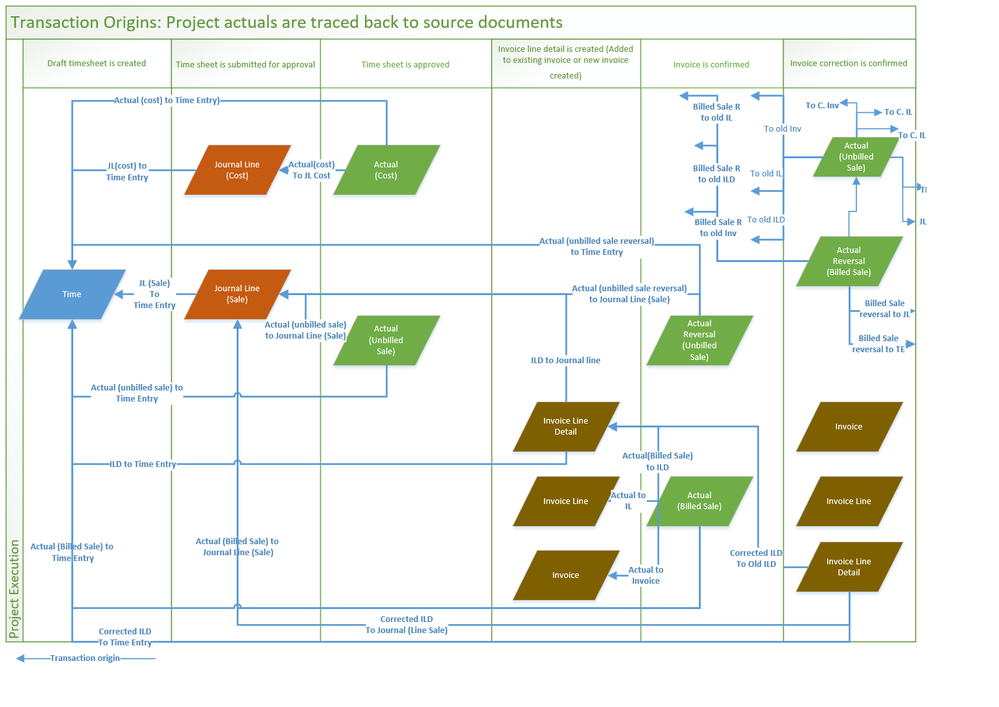

# Transaction origins - Link actuals to their source

[!INCLUDE[banner](../includes/banner.md)]

_**Applies To:** Project Operations Integrated with ERP, Core deployment - deal to proforma invoicing_

Transaction origin records are created to link actuals to their source, such time entries, expense entries, material usage logs, and project invoices.

The following example shows the typical processing of time entries in a Project Operations project lifecycle.

> 
 
1. Submission of a time entry causes two journal lines to be created: one for cost and one for unbilled sales.
2. Eventual approval of the time entry causes two actuals to be created: one for cost and one for unbilled sales.
3. When the user creates a project invoice, the invoice line transaction is created by using data from the unbilled sales actual.
4. When the invoice is confirmed, two new actuals are created: an unbilled sales reversal and a billed sales actual.

Each event in this processing workflow triggers the creation of records in the Transaction origin entity to help build a trace of the relationships between these records that are created across time entry, journal line, actual, and invoice line details.

The following table shows the records in the Transaction origin entity for the preceding workflow.

| Event                        | Origin                   | Origin type                       | Transaction                       | Transaction type         |
|------------------------------|--------------------------|-----------------------------------|-----------------------------------|--------------------------|
| Time Entry Submission        | Time entry Record GUID   | Time Entry                        | Journal Line Record GUID (cost)   | Journal Line             |
| Time entry Record GUID       | Time Entry               | Journal Line Record GUID (sales)  | Journal Line                      |                          |
| Time Approval                | Journal Line Record GUID | Journal Line                      | Unbilled Sales Record GUID        | Actual                   |
| Time entry Record GUID       | Time Entry               | Unbilled Sales Record GUID        | Actual                            |                          |
| Journal Line Record GUID     | Journal Line             | Cost Actual Record GUID           | Actual                            |                          |
| Time entry Record GUID       | Time Entry               | Cost Actual Record GUID           | Actual                            |                          |
| Invoice Creation             | Time entry Record GUID   | Time Entry                        | Invoice Line Transaction GUID     | Invoice Line Transaction |
| Journal Line Record GUID     | Journal Line             | Invoice Line Transaction GUID     | Invoice Line Transaction          |                          |
| Invoice Confirmation         | Invoice Line GUID        | Invoice Line                      | Billed Sales Record GUID          | Actual                   |
| Invoice GUID                 | Invoice                  | Billed Sales Record GUID          | Actual                            |                          |
| Invoice Line Detail GUID     | Invoice Line Detail      | Billed Sales Record GUID          | Actual                            |                          |
| Time entry Record GUID       | Time Entry               | Billed Sales Record GUID          | Actual                            |                          |
| Journal Line Record GUID     | Journal Line             | Billed Sales Record GUID          | Actual                            |                          |
| Time entry Record GUID       | Time Entry               | Unbilled Sales Reversal GUID      | Actual                            |                          |
| Journal Line Record GUID     | Journal Line             | Unbilled Sales Reversal GUID      | Actual                            |                          |
| Draft Invoice Correction     | Old ILD GUID             | Invoice Line Transaction          | Correction ILD GUID               | Invoice Line Transaction |
| Old IL GUID                  | Invoice Line             | Correction ILD GUID               | Invoice Line Transaction          |                          |
| Old Invoice GUID             | Invoice                  | Correction ILD GUID               | Invoice Line Transaction          |                          |
| Time entry Record GUID       | Time Entry               | Correction ILD GUID               | Invoice Line Transaction          |                          |
| Journal Line Record GUID     | Journal Line             | Correction ILD GUID               | Invoice Line Transaction          |                          |
| Confirmed invoice correction | Old ILD GUID             | Invoice Line Transaction          | Reversed Billed Sales Actual GUID | Actual                   |
| Old IL GUID                  | Invoice Line             | Reversed Billed Sales Actual GUID | Actual                            |                          |
| Old Invoice GUID             | Invoice                  | Reversed Billed Sales Actual GUID | Actual                            |                          |
| Time entry Record GUID       | Time Entry               | Reversed Billed Sales Actual GUID | Actual                            |                          |
| Journal Line Record GUID     | Journal Line             | Reversed Billed Sales Actual GUID | Actual                            |                          |
| Old ILD GUID                 | Invoice Line Transaction | New Unbilled Sales Actual GUID    | Actual                            |                          |
| Old IL GUID                  | Invoice Line             | New Unbilled Sales Actual GUID    | Actual                            |                          |
| Old Invoice GUID             | Invoice                  | New Unbilled Sales Actual GUID    | Actual                            |                          |
| Time entry Record GUID       | Time Entry               | New Unbilled Sales Actual GUID    | Actual                            |                          |
| Journal Line Record GUID     | Journal Line             | New Unbilled Sales Actual GUID    | Actual                            |                          |
| Correction ILD GUID          | Invoice Line Transaction | New Unbilled Sales Actual GUID    | Actual                            |                          |
| Correction IL GUID           | Invoice Line             | New Unbilled Sales Actual GUID    | Actual                            |                          |
| Correction Invoice GUID      | Invoice                  | New Unbilled Sales Actual GUID    | Actual                            |                          |

The following illustration shows the links that are created between actuals and their sources at various events using the example of time entries in Project Operations.

> 

[!INCLUDE[footer-include](../includes/footer-banner.md)]
