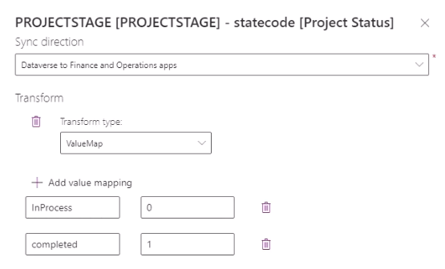

# Sync Project Status to prevent entry against closed projects

[!INCLUDE[banner](../includes/banner.md)]

_**Applies To:** Project Operations Integrated with ERP_

## Scenario

Contoso is live with Microsoft Dynamics 365 Project Operations for resource/non-stocked scenarios. As part of normal business activities, projects may be completed or put on hold. You can inactivate the project to ensure no expenses or invoices are generated.

## Solution

### Prerequisites

-   Microsoft Dynamics 365 Finance 10.0.29 or later must be installed.
-   Dual Write map 1.0.0.3 for Projects V2 (msdyn\_projects) must be installed or manually configured as described in this article.

### Create an updated version of the Project Operations integration Projects V2 dual-write map

To update the Project Operations Projects V2 dual-write map:

1. Go to the **Data management** workspace and select **Dual-write**.
2. Select the **Dual-write** tile.
3. from the T**Table map** column, locate and select **Project V2 (msdyn\_projects)**, and then select Stop.
4. Select the map name to open the map and then select **[None]**.
5. From the Select column dialog box, select **statecode \[Project Status\]** and then select OK. You can type **state** in the filter value to narrow the list.
6.  Select **Add or edit transform** in the **map type** column to edit the transform.
7.  From **Transform type** select **ValueMap**.
8.  Select **Add value mapping**, and then add the following **Keys** and **Values**:

   Key       | Value 
   ----------|-------
   InProcess | 0     
   completed | 1     

9. Select **Save**.
10. From the top of the **Dual-write > Projects V2 (msdyn_projects)** page, select **Save As**.
11. From **Add table** in the **Publisher** field, select **CDS Default Publisher**.
12. Set the **Version** field to 1.0.0.3.
13. Type a **Description**, and then select **Save**.
14. From the top of the **Dual-write > Projects V2 (msdyn_projects)** page, select **Run** to start the map, and then sekect **Yes** if asked to confirm prior to run. 

### Close a newly completed project

Dynamics 365 Finance uses the **project stage** field to differentiate between projects **in process** or **finished**. **Finished** projects can't incur expenses or be invoiced to customers.

1. Open a project to deactivate.
2. From the ribbon, select **Deactivate**.

> [!NOTE]
> You can either the deactive or close a project as they'll both behave the same in the context of Finance.

3. In Finance, open the **All projects list** page.
4. Confirm the deactivated project doesn't appear in the list.
5. In the **show projects** filter above the list, change the value from **Active** to **All**.
6. You'll now see the deactivated project.

If you attempt to log time or expense against this project in Finance, you shouldn't see the project for selection. If you manually enter the project number on an expense, you'll see a message like "Project stage finished doesn't allow recording in the project." Invoicing and other billing functions should be disabled as they are in the context of a closed project.

