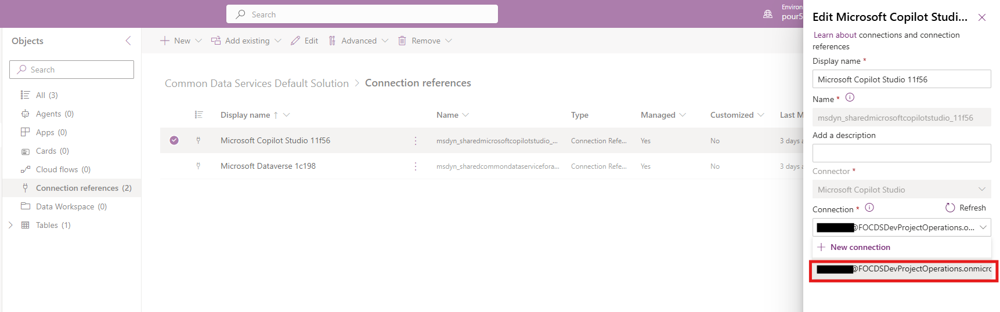

# Set up for Approvals feature of the Time and Expense Agent as an admin

[!INCLUDE[banner](../includes/banner.md)]

_**Applies To:** Project Operations for resource/non-stocked based scenarios, Lite deployment - deal to proforma invoicing._

The Microsoft Dynamics 365 Project Operations Time and Expense Agent requires a few steps of admin setup to enable it's approvals functionality which are outlined in this article.

- Set up Connections in the Power Apps home page.
- Activate the agent trigger.

## Set up Connections in the Power Apps home page

To set up Connections in the Power Apps home page, follow these steps.

1. Go to [https://make.powerapps.com[(https://make.powerapps.com).
1. Using the environment selector at the top of the page, select the environment where the agents were installed.
1. Once you are in the context of the correct environment, select **Solutions** from the left pane, filter by **managed solutions**, and select **Project Service Agent**.

To display a list of connection references, follow these steps.

1. select **Connection references** from the second frame from the left titled **Objects**.
1. Select the radio buttons next to the Connection references named **Microsoft Copilot Studio** and **Microsoft Dataverse**, and select **Advanced** on the ribbon.
1. On the drop-down menu, select **Add to solution** and then select **Common Data Services Default Solution**, then select **Save**.

   

1. After the connections are added to the default solution, select Back to solutions from the far-left frame.
1. Filter by Unmanaged solutions, and select the **Common Data Services Default Solution**.
1. From **Objects**, select **Connection references** under objects. Here you should see the **Microsoft Copilot Studio** and **Microsoft Dataverse** connection references.
1. Select the radio button next to **Microsoft Copilot Studio** and then select edit from the ribbon.
1. From the **Connection** section, select the drop-down, and select **New connection**.

   

   A new tab opens with a list of connections. In the top right enter Copilot Studio in the search field, then select the + to the right of the listing named **Microsoft Copilot Studio (preview)**. In the dialog box which appears select create and then sign in with the user you want the agent to run as.

   > !NOTE
   > The user who logs in to create these connections will be the user the agent acts as. This user must have the **Time and Approval Agent** security role (or a role which provides the same or greater privileges)

1. Return to the previous tab, and repeat these steps for the Microsoft Dataverse Connection reference and connect to **Microsoft Dataverse**.

Lastly return to the common Data Services Default Solution > Connection references page and select the correct user under **Connection**.

## Activate the agent trigger

The final step is to activate the cloud flow that acts as the agent trigger. 

To activate the agent trigger, follow these steps.

1. Return to the **Project Service Agent** solution, and select **Cloud flows** from the Objects menu. 
1. Select the three dots next to **Approvals Agent trigger** and then select turn on from the menu.

   

[!INCLUDE[footer-include](../includes/footer-banner.md)]
