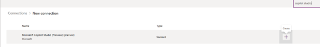

# Set up the Approvals feature of the Time and Expense Agent as an admin (preview)

[!INCLUDE[banner](../includes/banner.md)]
[!INCLUDE[banner](../includes/preview-note.md)]

_**Applies To:** Project Operations for resource/non-stocked based scenarios, Lite deployment - deal to proforma invoicing._

An admin must complete the following steps to enable the approvals functionality of the Time and Expense Agent:

1. Set up connections on the Microsoft Power Apps home page.
1. Activate the agent trigger.

## Set up connections on the Power Apps home page

To set up connections on the Power Apps home page, follow these steps.

1. Sign in to [Power Apps](https://make.powerapps.com).
1. Use the environment switcher at the top of the page to select the environment where the agents were installed.
1. In the left pane, select **Solutions**.
1. Filter the **Solutions** page for **Managed** solutions, and select **Project Service Agent**.

To view a list of connection references, follow these steps.

1. In the **Objects** pane, select **Connection references**.
1. Select the checkboxes for the **Microsoft Copilot Studio** and **Microsoft Dataverse** connection references.
1. On the command bar, select **Advanced** \> **Add to solution**.
1. Select **Common Data Services Default Solution**.
1. Select **Save**.

    

1. After the connections are added to the default solution, select **Back to solutions** in the left pane.
1. Filter the **Solutions** page for **Unmanaged** solutions, and select **Common Data Services Default Solution**.
1. In the **Objects** pane, select **Connection references**.
1. The **Microsoft Copilot Studio** and **Microsoft Dataverse** connection references should be listed. Select the checkbox for **Microsoft Copilot Studio**, and then select **Edit** on the command bar.
1. In the dialog that appears, in the **Connection** section, select **New connection**.

    

1. A new tab appears and shows a list of connections. In the search field in the upper right, enter **Copilot Studio**.
1. In the search results, select the **Create** button (**+**) to the right of **Microsoft Copilot Studio**.

    

1. In the dialog that appears, select **Create** to create a connection to Copilot Studio, and sign in as the user that you want the agent to run as.

    > [!NOTE]
    > The user that you sign in as must have the **Time and Approval Agent** security role, or another role that provides the same or greater privileges.

1. Return to the previous tab, and repeat the preceding steps for the **Microsoft Dataverse** connection reference to create a connection to Microsoft Dataverse.
1. Return to the **Connection references** page for the **Common Data Services Default Solution** solution.
1. In the dialog, in the **Connection** section, select the correct user.

    

## Activate the agent trigger

To activate the cloud flow that acts as the agent trigger, follow these steps.

1. Return to the **Project Service Agent** solution.
1. In the **Objects** pane, select **Cloud flows**.
1. In the row for **Approvals Agent trigger**, select the three vertical dots, and then, on the menu, select **Turn on**.

    

[!INCLUDE[footer-include](../includes/footer-banner.md)]
