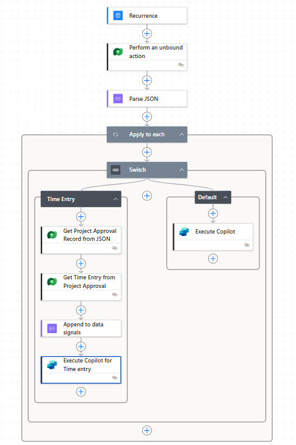

# Customize what data is sent to the Approvals Agent (preview)

[!INCLUDE[banner](../includes/banner.md)]
[!INCLUDE[banner](../includes/preview-note.md)]

_**Applies To:** Project Operations Integrated with ERP, Project Operations Core_

When the Approvals Agent is triggered, a predefined set of data related to the submitted record is passed to the agent. This article explains how to customize that data for customers who wish to have the agent make decisions based on data outside that predefined set, by modifying the Power Automate flow used to trigger the agent.

## Modifying the trigger flow

The default Approvals agent trigger flow has three steps:

1. The GetApprovalDataSignals API is called to retrieve data signals for the specified number of approval records
2. These data signals are parsed into a JSON object
3. In an apply to each loop, each set of data signals (one per project approval record) is sent as a message to the Approvals agent to initiate it

To add information to the data signals, additional steps to gather data and it to the data signals can be added inside the apply to each loop. The following outlines an example of one such customization.

### An example of a customized trigger flow

In this environment, a customization to the time entry record was created adding a field called threshold value. Additionally, a rule was added to the policy document for time entries that only entries with a threshold value greated than 100 should be marked as ready for approval. To enable the agent to make this decision, the threshold value needs to be added to the set of data signals sent to the agent.

To start, a switch statment is added inside the Apply to each loop with the value of the entry type from the parsed JSON deciding which branch the flow takes. Since the customization in this environment is only to the time entry entity, the switch statement has only two paths: one if the entry is of type time, and one for all other entries (default). 

In the default branch, the parsed JSON can be sent to the agent in the same manner as the unedited trigger flow. However, in the time entry branch three extra steps need to be added. The threshold value exists in the time entry record, but only the ID of the project approval record is included in the default set of data signals. Therefore, first retrieve the project approval record using the Get a row by ID action from the Dataverse connector and the ID from the data signals. Then, call get a row by ID again, this time using the ID of the linked time entry from the retrieved project approval record.

With the time entry record retrieved, all that remains is the append the threshold value to the data signals, and send that to the agent. The value can be appended using the compose action with the following argument: "addProperty(items('Apply_to_each'),'Threshold Value',outputs('Get_Time_Entry_from_Project_Approval')?['body/cradf_thresholdvalue'])" (where 'Get_Time_Entry_from_Project_Approval' is the title of the previous step and cradf_threshold value is the logical name of the customized column). All that remains is to send the new set of data signals to the agent using the Execute Copilot action from the Microsoft Copilot Studio connector, ensuring to choose the Approvals agent and in the Body/message parameter add the output of the previous step.

The final result looks like this:

And enables the agent to make approvals decisions based on the custom column threshold value:

