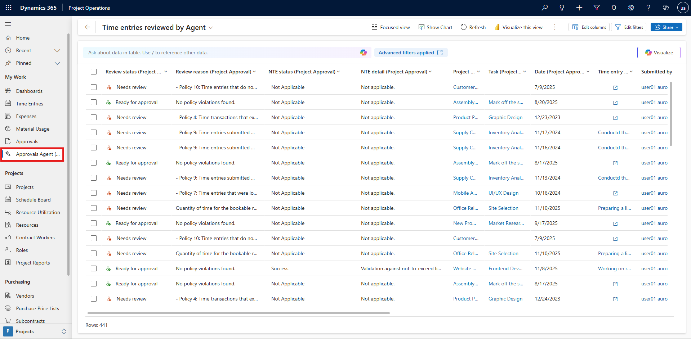
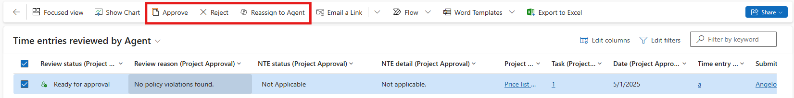

# Approvals feature of the Time and Expense Agent overview (preview)

[!INCLUDE[banner](../includes/banner.md)]

_**Applies To:** Project Operations for resource/non-stocked based scenarios, Lite deployment - deal to proforma invoicing_

The Approvals feature of the Time and Expense Agent aims to streamline the approval process for time, expense, and material transactions. The Time and Expense Agent uses a [Microsoft Copilot Studio](/microsoft-copilot-studio/fundamentals-what-is-copilot-studio) agent to provide an initial review of incoming time, expense, and material entries against customer uploaded policy documents for each type of entry. If the record is found to meet the criteria outlined in the policy document, it's marked as **ready for approval** and if not it's marked as **needs review**. This streamlines the approvals process for project managers while also reducing mistaken approvals which can lead to time consuming corrections.

## Set up the Approvals feature of the Time and Expense Agent

The Approvals feature of the Time and Expense Agent requires a few steps to be enabled and correctly setup. Learn more about the appropriate steps for admin setup in [Set up for the Approvals feature of the Time and Expense Agent as an admin](./approvals-agent-admin-setup). Once these steps are complete, the agent can be enabled by selecting **Enable Time and Expense Agent** in the feature control menu on the project parameters form.

Once the feature is enabled, a new tab appears in the Project Parameters form named **Time and Expense Agent**. Use the **Time and Expense Agent** form to upload policy documents for time, expense, and material submissions. Learn more about writing a policy document and examples in [Set up policy documents for the Approvals feature of the Time and Expense Agent](./approvals-agent-policy). If a policy document isn't available for a certain type of record, then approval records of that type aren't classified by the agent.

Additionally, in this menu you can set the mode of the agent to either **Classify** or **Classify and auto approve**. In the **Classify** mode, records marked as **ready for approval** still needs to be manually approved by the project manager, however, in the **Classify and auto approve** mode entries which are classified as **ready for approval** are automatically processed for approval. 

> [!NOTE]
> Rigorous testing is recommended before enabling the **Classify and auto approve** mode.

## Using the Approvals feature of the Time and Expense Agent

When a user submits a time, material, or expense record for approval in an environment with the agent enabled and policy documents uploaded, the record goes into a queue for classification by the agent. Once the agent classifies the submission, it creates a new record containing its classification decision which can be viewed by selecting the **Approvals agent** view on the left area selector.

When a record is selected in this view the user are shown three options on the ribbon: 

- Approve - The record is processed for approval.
- Reject - The user is prompted for a rejection comment, then the record is rejected and sent back to the submitter.
- Reassign to Agent - The record is returned to the agent's queue and reevaluated. Use this option when the policy document is updated and the record needs to be reviewed using the new document.

   

[!INCLUDE[footer-include](../includes/footer-banner.md)]
