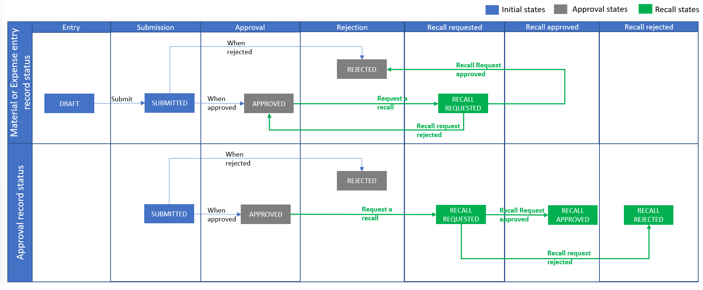

# Recall previously approved entries

[!INCLUDE[banner](../includes/banner.md)]

_**Applies To:** Project Operations Integrated with ERP, Core deployment - deal to proforma invoicing_

A project team member who submits a time, expense, or material usage entry can recall that entry after it has been approved. The recall process has two main steps:

1. A submitter requests a recall.
2. An approver approves the recall request.

## Request a recall

Follow these steps to request a recall of approved time, expense, or material usage entries.

1. Follow one of these steps, depending on the type of entry that you want to recall:

    - For time entries, go to **Projects** \> **My Work** \> **Time Entry**, and select all the time entries for a specific combination of a project and a task. Alternatively, in the grid, select the individual cells for time on a specific date for a specific project.
    - For expense entries, go to **Projects** \> **My Work** \> **Expenses**, and select the row for the expense entry to recall.
    - For material usage entries, go to **Projects** \> **My Work** \> **Material Usage Log**, and select the row for the material usage entry to recall.

2. Select **Recall**. A confirmation dialog box appears. If the selected time, expense, or material usage entries were already approved, you're prompted to enter a reason for the recall.
3. Enter a reason for the recall, and then select **OK** to confirm the operation. The system sends the person who approved the entries a request to approve the recall.

> [!IMPORTANT]
> You can't create a recall request for an approved time, expense, or material usage entry that has already been invoiced to the customer. If you try, you receive a message that states that the time, expense, or material usage entry can't be recalled because it was already invoiced. In this case, you can request a recall of the entry only if a corrective invoice is used to issue a full credit or refund to the customer on the original invoice.

## Approve or reject a recall request

Follow these steps to approve or reject a recall request.

1. Go to **Projects** \> **My Work** \> **Approvals**.
2. On the **Approvals** list page, change the view to **Recall requests for approval**. A list of submitted recall requests is shown.
3. Select one or more entries, and then select either **Approve** or **Reject**.
4. If you selected **Approve**, you receive a warning message that explains the impact of the approval. Select **OK** to confirm the operation. The recall request is approved.

    –or–

    If you selected **Reject**, the recall request is rejected.

> [!IMPORTANT]
> When a recall is approved, just as when it's requested, the system checks for any invoicing activity on the time, expense, or material usage entries. If an entry was already invoiced, or if it's on a draft invoice, the approver receives an error message that states that the time or expense can't be approved for recall because it was already invoiced. In this case, the approver can approve the recall only if a corrective invoice is used to issue a full credit or refund to the customer on the original invoice.

## Impact of a recall request

When an approval is recalled, there is both operational impact and financial impact.

### Operational impact

If a recall request is approved, the approval record is marked as **Rejected**. The status of the entry is changed to either **Returned** or **Rejected**, depending on whether it's a time entry or an expense or material usage entry.

The project team member can view entries, edit and then resubmit entries, or completely delete entries.

If a recall request is rejected, the status of the entry remains **Approved**, and the entry can't be edited by the project team member or the approver for the project.

### Financial impact

If a recall request is approved, the corresponding actuals for cost and sales are updated in the following manner:

- The **Adjustment Status** field is updated to **Adjusted**.
- The **Billing Status** field is updated to **Canceled**.

Next, reversal entries are created in the Actuals table. To create reversal entries, the system copies over the field values from the original actuals. The only values that aren't copied over are the quantity values. These values are reversed instead. Reversed actuals are created for both **Cost** and **Unbilled Sales** actuals. The **Adjustment Status** field on the reversed actuals is set to **Unadjustable**, and the **Billing status** field is set to **Canceled**. Because of these changes, the recorded spending and the revenue backlog on the project will no longer account for the amounts that these actuals represent.

If a recall request is rejected, there is no financial impact on the project.

## Changes to time entry records

The following illustration shows the changes that occur for approved time entries and the corresponding approval records when they are recalled.

## Changes to expense and material usage entry records

The following illustration shows the changes that occur for approved expense and material usage entries and the corresponding approval records when they are recalled.

[!INCLUDE[footer-include](../includes/footer-banner.md)]
