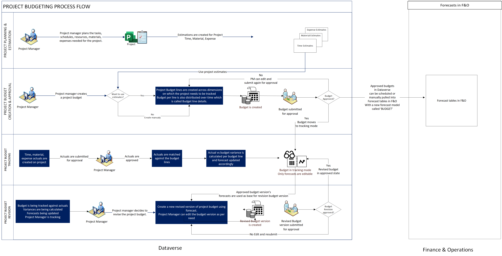

# Overview of project budget management

[!INCLUDE[banner](../includes/banner.md)]

_**Applies To:** Project Operations for resource/nonstocked based scenarios._

This article provides an overview of the end-to-end process for project budget management in project-based organizations. It covers the context of a resource nonstocked deployment.

In a project, each phase, task, or work package incurs costs as labor, materials, and expenses. A project budget represents a point-in-time snapshot of the estimated spend across the project phases and their associated tasks.

In a resource nonstocked deployment, budget creation, approval, and revision capabilities, like project editing capabilities, occur on the project page of the Microsoft Dataverse environment.

For an overview of all actions that can be performed on project budgets in Dataverse by using a Core deployment, see [Project budget management](../pro/budget/projectbudgetmanagement.md). Such actions can be performed in the Dataverse part of resource non-stocked deployments as well.

## Project budget management in Dynamics 365 Project Operations

The following illustration shows the typical business process flow for project budget management.

Here's a step-by-step description of the project budget management process. Steps 1 through 8 are performed in Dataverse. Steps 9 and 10 are performed in finance and operations apps.

1. In Dataverse, the project manager creates a budget for a project. The project budget can be created either from scratch or by using the project estimates of the project as input.
1. The project manager can budget for the **Time**, **Material**, or **Expense** transaction class for the different phases of the project.
1. The project manager submits the project budget for approval. An optional workflow for project budget approval can be enabled according to business requirements.
1. If the project budget is approved, all actuals that were created and approved for time, materials, and expenses are matched against the project budget lines. Actual budget consumption and forecasts are automatically updated, and any variance between the budget and actuals is shown.
1. The project manager periodically reviews the project budget and checks for variance between the budget and actuals.
1. The project manager updates the forecasts as required, based on the actual consumption during project execution.
1. If extra budget is allocated to the project, or if the contract is updated because of spending, the project manager might choose to revise the budget to align it with the updated forecasts.
1. The revised project budget follows the project budget approval workflow. After the project is approved, a new version of the project budget is used to compare the budget and actuals.
1. In finance and operations apps, you must enable the **Enable Project Budget management feature in Project Operations for nonstocked/resource based scenarios** feature to import approved budgets into forecasts in finance and operations apps. For information about how to enable this feature, see [Enable the project budget transfer to forecasts feature](transfer-budgets-to-forecasts.md#enable-the-project-budget-transfer-to-forecasts-feature).
1. After the feature is enabled, you can import budget lines into forecasts from the **All forecasts** page. You can also import them as a periodic scheduled job after the batch job is scheduled.

A project budget can be created for all types of projects (fixed-price, time and material, and investment), for both cost budgets and sales budgets.

[!INCLUDE[footer-include](../includes/footer-banner.md)]
