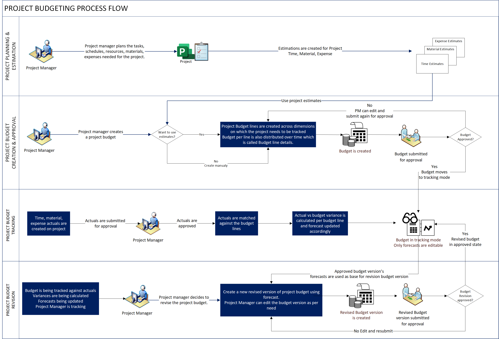

# Project budget management overview

_**Applies to:** Project Operations for resource/non-stocked based scenarios, Lite deployment - deal to proforma invoicing._

In a project each phase, task or work package would incur costs as labour, material, and expenses. Project budget represents a point in time snapshot of the estimated spend across the project phases and its associated tasks.

## Project budget management in Project Operations

This article provides an overview of the end-to-end project budget management process in project-based organizations. 

Project budget management typically follows the business process flow that is shown in the following diagram.

The following provides a step-by-step description of the project budget management process.
1.	The project manager creates a budget for a project. Project budget can be created ground up or using the project estimates of the project as an input. 

2.	Project manager can budget for Time, Material, Expense transaction class for various phases of the project.

3.	Project manager submits the budget for approval. An optional workflow for project budget approval can be enabled as per the business needs.

4.	With an approved project budget, all actuals created for time, material, expense would be matched against the project budget lines. Actual budget consumption & forecasts gets updated automatically and in case of any variance between budgeted vs actual would be shown.

5.	Project manager periodically reviews the project budget and checks for variance between budget vs actuals.

6.	Project manager, if needed would update the forecasts based on the actual consumption during the project execution. 

7.	Project manager would decide to revise the budget based on the new forecasts based on allocation of additional budget to project or with an update on the contract based on spend.

8.	Revised project budget would follow the project budget approval flow and if once project is approved a new version of the project budget would be used for actual vs budget comparison.

Project budget can be created for all types of projects viz fixed-price, time and material, investment.

## See also

- [Approvals overview](../approvals/approvals-overview.md)

[!INCLUDE[footer-include](../includes/footer-banner.md)]

[Microsoft](https://www.microsoft.com)
