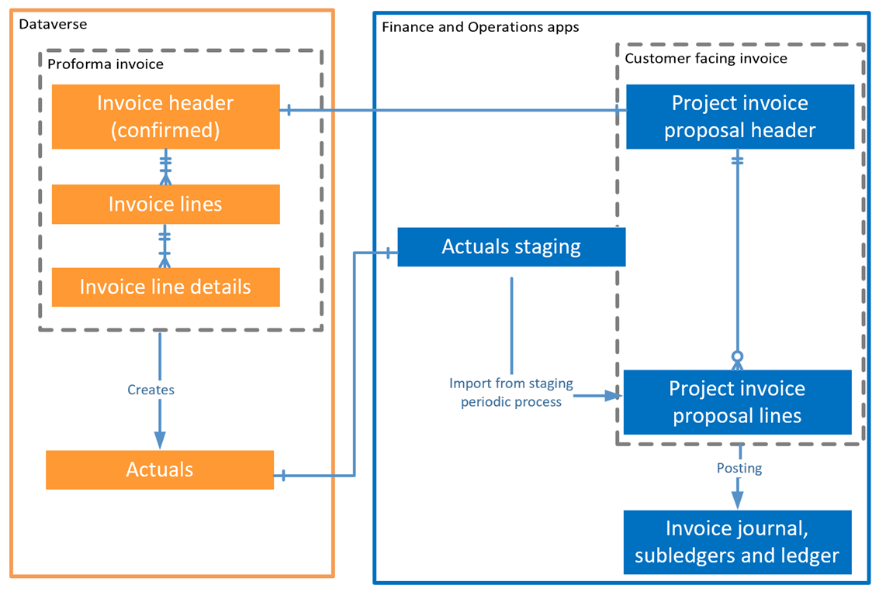

# Project invoice integration using Dual write Async configuration

[!INCLUDE[banner](../includes/banner.md)]

This article explains the Dynamics 365 Project Operations **dual-write asynchronous integration** for **customer invoicing**. The asynchronous dual-write process enables the creation of customer invoices with more than 1,000 invoice lines, overcoming the current limitation of the real-time dual-write synchronization.

In **Dynamics 365 Project Operations**, customer invoicing is a critical process that ensures accurate and timely billing for project-based work. 
Traditionally, the **dual-write real-time** synchronization mechanism has been used to integrate data between **Dynamics 365 Finance** and **Dataverse**. 
However, this real-time sync has a known **limitation**: it supports a maximum of 1,000 invoice lines per customer invoice.

To address this **constraint**, Microsoft has introduced the **dual-write asynchronous (async) integration** for customer invoicing. This enhancement significantly improves scalability and performance, especially for organizations dealing with high-volume, complex billing scenarios.

## Enable dual-write async configuration for customer invoice

In Project Operations, the Project manager manages the project billing backlog and creates a proforma invoice for the customer in Microsoft Dataverse. 
Dual-write integration ensures that the proforma invoice details are synchronized to finance and operations apps. 
The following graphic provides a high-level conceptual overview of this integration.
  
   

### Project operations parameters
To update the project operations parameters, follow below steps:
1.  Go to **Dynamics 365 Project operations** app.
2.  Select **Settings** and open **Parameters** form.
3.  Click **Edit** to open the parameters form.
4.  On the **Project task time tracking** dropdown, choose **Delayed update**.
5.  On the **Project actual values tracking** dropdown, choose **Delayed update**.

### Entities Involved in Project Invoice Generation
In **Dynamics 365 Finance**, the generation of a **project invoice** involves the synchronization of three key entities:

1. **Project invoice proposal V2 (invoices)** – Represents the draft version of the invoice.
2. **Project Operations integration actuals (msdyn_actuals)** – Contains the billed sales invoice transactions.
3. **Integration entity for project transaction relationships (msdyn_transactionconnections)** – Links actuals to the invoice proposal, ensuring traceability and data integrity.

To enable the dual-write asynchronous (async) integration, these entities must be transitioned from the real-time sync process to the asynchronous processing model. Follow the below steps to configure the entities in async mode:

1. In **Dynamics 365 finance**, go to **Data management** workspace.
2. Click **Dual-write**.
3. Select dual-write maps for Project Operations integration actuals (msdyn_actuals), Project invoice proposal V2 (invoices) and Integration entity for project transaction relationships (msdyn_transactionconnections).
4. Click on **Integration jobs**.
5. Click **New** to create a new integration job.
6. Select the integration job id.
7. Click **Add table map** and select Project invoice proposal V2 (invoices), Project Operations integration actuals (msdyn_actuals) and Integration entity for project transaction relationships (msdyn_transactionconnections) in sequence.
8. Click **Save** to save the integration job.
9. Click **Run** to run the integration job in async mode.

> [!NOTE]
> This feature is currently in preview.
