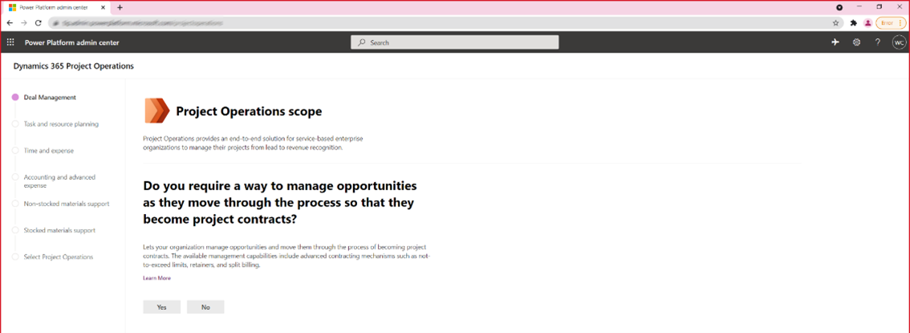

# Sign up for Project Operations Admin Lead Trials for resource/ non-stocked scenarios

_**Applies To:** Project Operations for Lite/resource/non-stocked based scenarios_

[!include [rename-banner](~/includes/cc-data-platform-banner.md)]

This topic explains how to subscribe to the preview/partner offer and deploy Project Operations environment for resource/ non-stocked based scenarios.

## Overview
With the new Project Operations Admin Lead Trial, customers will have the ability to automatically deploy any of the 3 suported deployment scenarios by simply completing a questionnaire to recommend the best deployment approach.   The proceeding sections will review the process to redeem your trial offer, administer Dual Write and provide links to all supporting material to help you get the most out of your trial experience.    

## Admin Trial Details
|                                                     | **Lite**                                                                                                                                                 | **Non-Stocked Materials** | **Stocked Materials** |
|-----------------------------------------------------|----------------------------------------------------------------------------------------------------------------------------------------------------------|---------------------------|-----------------------|
| Offer Type                                          | Admin Lead (requires tenant admin to redeem)                                                                                                             |                           |                       |
| Offer Use                                           | Once per Tenant                                                                                                                                          |                           |                       |
| Offer Duration                                      | 30 calendar days                                                                                                                                         |                           |                       |
| Redemptions per tenant                              | 1                                                                                                                                                        |                           |                       |
| Number of users                                     | 25                                                                                                                                                       |                           |                       |
| Extension                                           | 30                                                                                                                                                       |                           |                       |
| Number of trials environments                       | 3                                                                                                                                                        |                           |                       |
| Setup Data Provided                                 | Yes                                                                                                                                                      | Yes                       | Yes (USSI)            |
| Transactional Data                                  | No                                                                                                                                                       | No                        | No                    |
| Provisioning Time                                   | 15                                                                                                                                                       | 150                       | 30                    |
| Versions at launch                                  | UR11                                                                                                                                                     | 10.0.19/UR11              | 10.0.19               |
| DW Version                                          | n/a                                                                                                                                                      | TBD                       | TBD                   |

| CDS Environment Life Cycle Management Support (ELM) | Environment backup is available Solutions can be exported                                                                                                |                           |                       |
| CDS Application Life Cycle Support (ALM)            | CDS apps can be upgraded Adjacent CDS apps can be installed (e.g. Field Service)                                                                         |                           |                       |
| F&O ELM & ALM                                       | These environments will not have to Life Cycle Services (LCS), therefore customers will not have access to upgrades, quality updates or backup & restore |                           |                       |
| Upgrade to Paid                                     | No upgrade to paid at this time                                                                                                                          |                           |                       |

## Prerequisites

- To sign-up for the trial offer, please follow this link, https://www.aka.ms/try-po, Dynamics 365 Project Operations (CRM) - Preview Trial.
- The user who deploys the preview must have Azure tenant global administrator rights.
- The CDS environment will be provided free for a limited 30 day period.

> [!IMPORTANT]
> Only one person, the tenant administrator, in an organization needs to perform this task. If you aren't the subscriber to this release, wait until your organization has been signed up and you've received your user credentials.

### Dynamics 365 Project Operations (CRM) - Preview Trial 

Before you begin, make sure you are logged in to a browser with the user work account in the tenant where you want the Project Operations preview.

1. Redeem the first offer code, **Dynamics 365 Project Operations (CRM) - Preview Trial** by pasting it into the browser URL.

2. Confirm your order.

You will see confirmation offer was successfully redeemed.

Upon successful redemption of the offer, you will be redirected to, https://admin.powerplatform.com/projectoperationstrial

## Assign licenses

> [!IMPORTANT]
> You will need administrative access to your organization's Microsoft 365 Portal to complete the following steps.

1. Go to [Microsoft 365 admin center](https://portal.office.com/) to assign the licenses to your users.

2. On the **Active users** page, select the users that you want to assign a license to.

3. Verify that the **Dynamics 365 Project Operations (CRM) Preview**  license has been selected and select **Save changes**.

## Complete the Provisioning Questionnaire

Start the Provisioning Questionnaire
1.	Navigate to https://admin.powerplatform.com/projectoperationstrial.  Complete each question.

2.	Review the recommended deploy and select Begin Setup to initiate provisioning.
 
 
3.	Review the terms and conditions and select Start.
  
  
4.	Provisioning will be initiated and the user. 
 
5.	Once provisioning has been initiated, you will be redirected to the environment list in the Power Platform Admin center. While provisioning is in progress, the state of your environment will be PreparingInstance.
 
6.	Once provisioning has been completed, the state of your environment will be Ready.
 
7.	Once your provisioning has been completed, select the respective CDS and Finance & Operations URLs to validate the environments have been deployed.

## Current 

[!INCLUDE[footer-include](../includes/footer-banner.md)]
