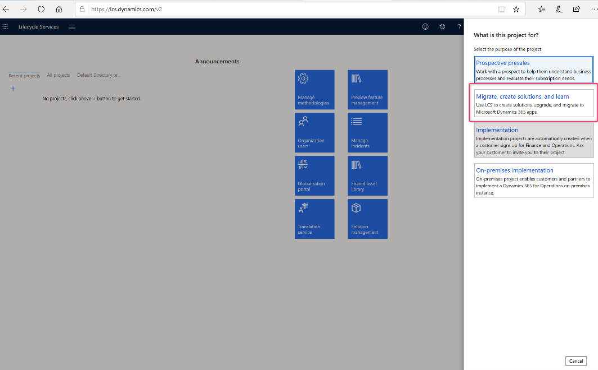
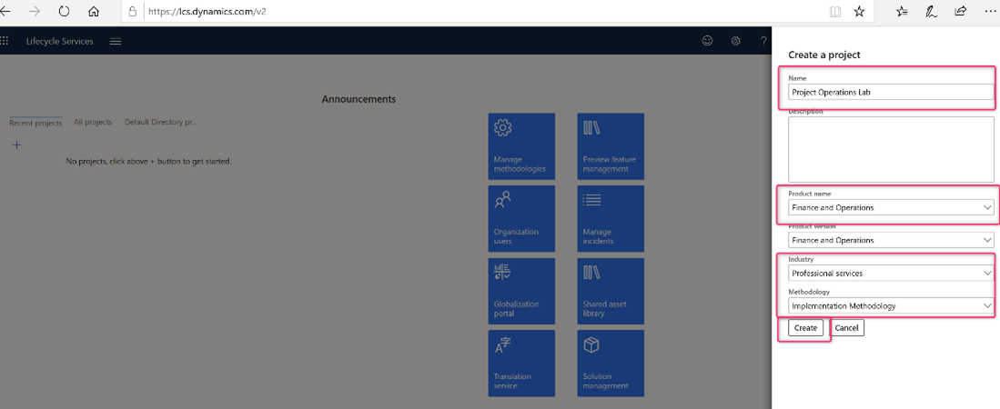

# Start a new LCS project

_**Applies To:** Project Operations for resource/non-stocked based scenarios_

Use Lifecycle Services (LCS) to manage you Dynamics 365 Project Operations environments. Complete the following steps to create a new LCS project.

1. Go to [LCS](https://lcs.dynamics.com/Logon/Index) and select **Sign in** using the account that you used to subscribe.
2. If prompted, accept the legal and privacy terms.
3. Select the plus sign ( **+** ) to create a new project.
4. For preview purposes, select **Migrate, create solutions, and learn** project type.

  

5. Name the project. 
6. Select **Finance and Operations** as the product name, and select the industry and methodology. 
7. Select **Create**.

Use this LCS project to deploy your Project Operations environment.

[!INCLUDE[footer-include](../includes/footer-banner.md)]