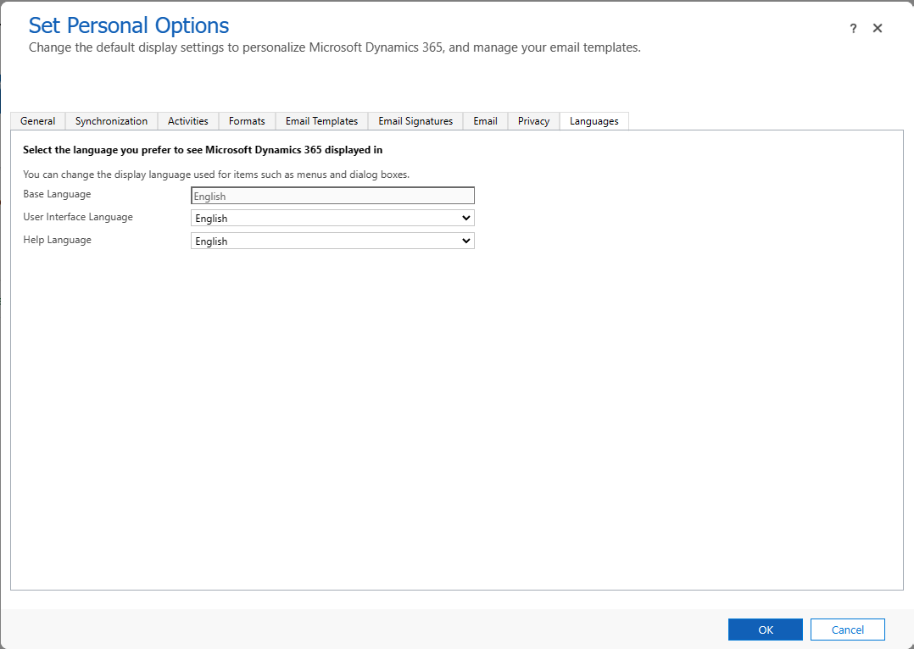
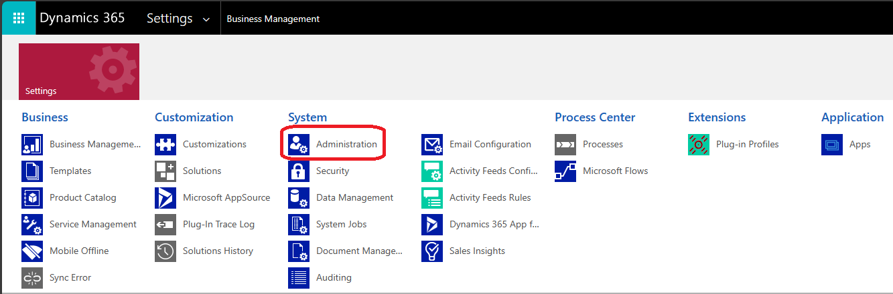
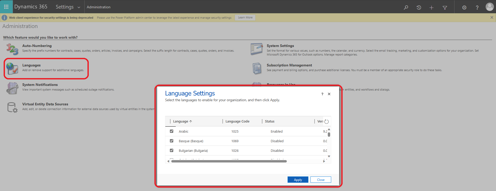
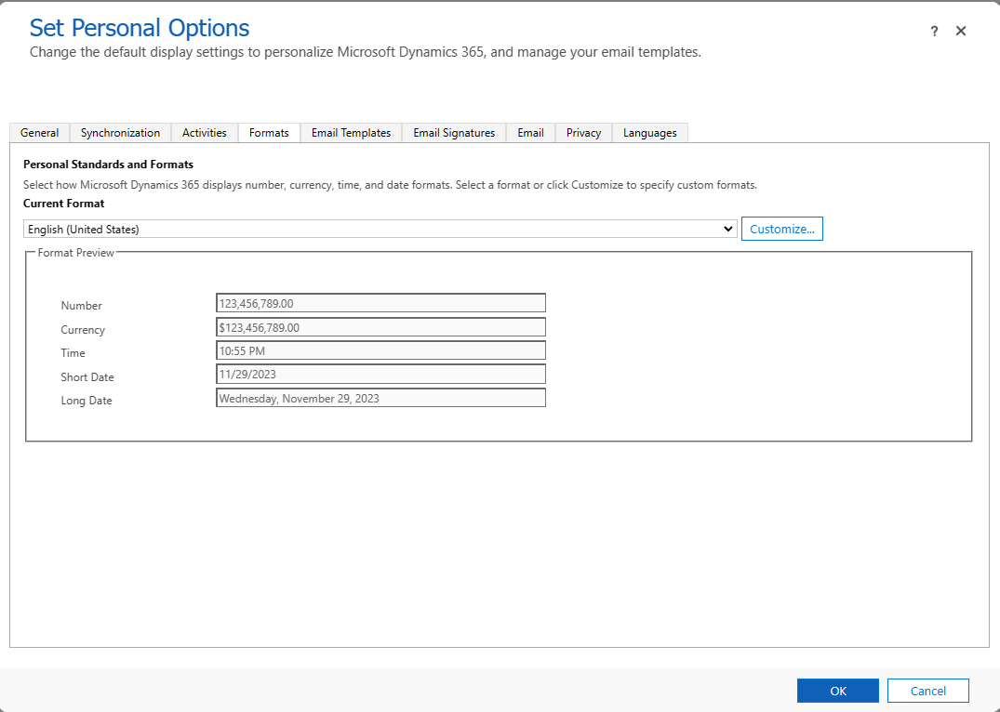

# Language Localization

[!INCLUDE[banner](../includes/banner.md)]

Microsoft Dynamics 365 Project Operations allows for localization of the user interface (UI) and data.

> [!NOTE]
> This only changes the localization for the current user. Each user needs to change their language settings individually.

## Language Localization of the Dynamics 365 Project Operations UI

To view and change the language the Microsoft Dynamics 365 Project Operations UI is displayed in, complete the following steps.

1. Select the **Settings** button. 
1. Select **Personalization Settings**.
1. Select the **Languages** tab. Here you can view and change which language to set for the Dynamics UI.

   

### How to add more Language options

If you need to add more language options to choose from in the **Languages** tab, a System Administrator needs to complete the following steps.

1. Select the **Settings** button.
1. Select **Advanced Settings**, this opens in a new tab.
1. Select the dropdown in the upper-left corner of the screen, then select **Administration**.

   
1. Select the **Languages** feature. Here you can add languages as an option for users to select from. The end users still need to set their language settings individually.

   

## Language Localization of the Tasks grid

To view and change the language the Tasks grid is displayed in, complete the following steps.

1. Select the **Settings** button.
1. Select **Personalization Settings**.
1. Select the **Formats** tab. Here you can view and change which language to set for the Tasks grid.

   

[!INCLUDE[footer-include](../includes/footer-banner.md)]
