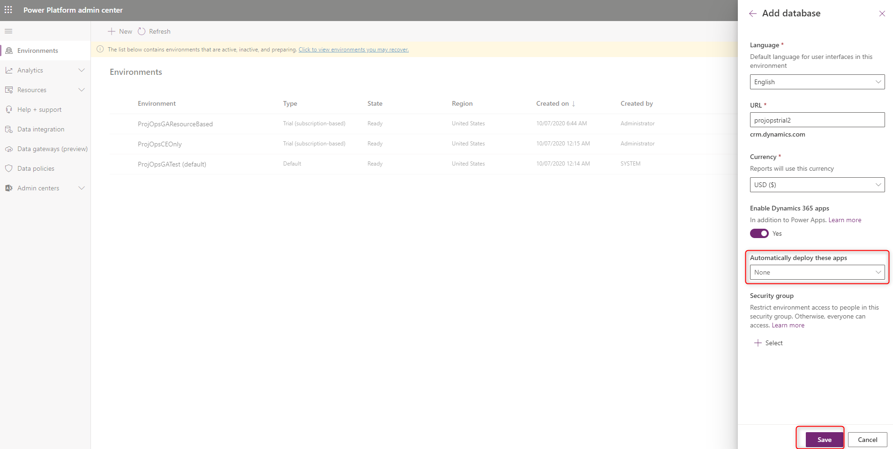
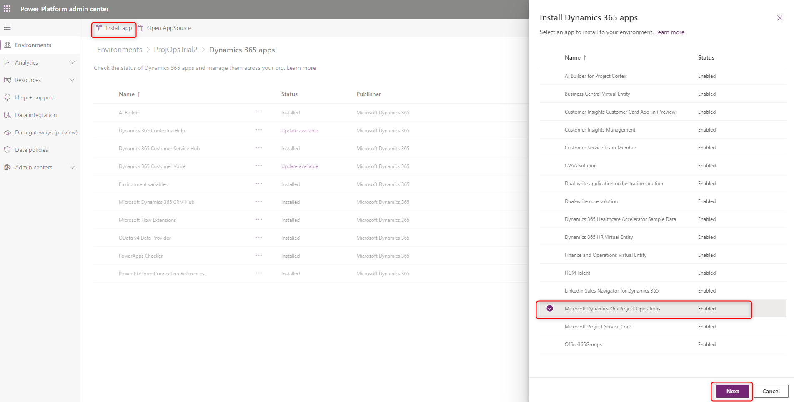

# Sign up for a preview subscription - lite 

[!INCLUDE[banner](../includes/banner.md)]

This article explains how to subscribe to the trial offer and deploy Dynamics 365 Project Operations lite deployment - deal to proforma invoicing.

> [!NOTE]
> This process will change in upcoming releases of Project Operations.

## Prerequisites
- The user who deploys the preview must have tenant administrator rights. You can create a tenant during the first offer redemption.

> [!IMPORTANT]
> Only one person, the tenant administrator, in an organization needs to perform this task. If you aren't the subscriber to this release, wait until your organization has been signed up and you've received your user credentials.
> 
> Trials are single use in the tenant. You can only run a trial one time. We recommend that you create a new tenant for the purpose of the trial.

### Dynamics 365 Project Operations trial 

Before you begin, make sure you are logged in to a browser with the user work account in the tenant where you want the Project Operations preview.

1. Go to [Project Operations Trial](https://aka.ms/try-po) to redeem the first offer code, **Dynamics 365 Project Operations**.
2. Confirm your order.

  You'll see the confirmation offer was successfully redeemed.

## Assign licenses

> [!IMPORTANT]
> You will need administrative access to your organization's Microsoft 365 Portal to complete the following steps.

1. Go to [Microsoft 365 admin center](https://portal.office.com/) to assign the licenses to your users.
2. On the **Active users** page, select the users that you want to assign a license to.
3. Verify that the **Dynamics 365 Project Operations** license is selected. 
4. Select **Save changes**.

## Create a new Dataverse environment

1. Provision a new Project Operations Dataverse deployment environment by following instructions in the article, [Dataverse deployment model](lite-deployment.md). When you select the environment type, make sure to use **Trial (Subscription based)**.
2. Select the **Enable Dynamics 365 apps** setting, and leave **Automatically deploy these apps** blank.  
3. Select **Save** to create the environment.

  

4. After the environment is created, install **Microsoft Dynamics 365 Project Operations** solution. 

## Set up demo data

Set up demo data by following instructions in the article, [Apply demo setup and configuration data](lite-apply-demo-setup-config-data.md).

[!INCLUDE[footer-include](../includes/footer-banner.md)]
