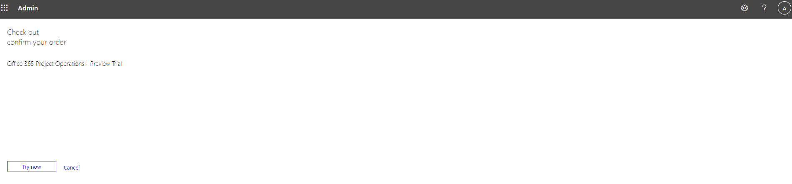
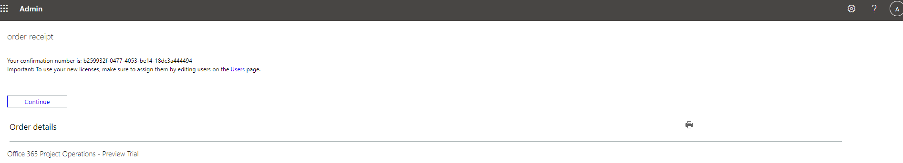

# Sign up for a preview subscription for lite deployment – deal to proforma invoicing

This topic explains how to subscribe to the preview partner offer and deploy Dynamics 365 Project Operations lite deployment - deal to proforma invoicing.

> [!NOTE]
> This process will change in upcoming releases of Project Operations.

## Prerequisites

- You will receive an email inviting you to participate in the preview. You can request a preview on the [Project Operations website](https://dynamics.microsoft.com/en-us/project-operations/overview/).
- The user who deploys the preview must have Azure tenant global administrator rights.
- Review all terms and conditions.

## Subscribe

When you receive a [preview request](https://forms.office.com/FormsPro/Pages/ResponsePage.aspx?id=v4j5cvGGr0GRqy180BHbR56j8lZs0FdAvwT75_WNFyxUMkRDV1NYQU5TNjE2VjhKOVBUNVg2R0s1NC4u) approval, you will receive two offers from Microsoft by email. These offers allow you to deploy the Project Operations Preview:

- Dynamics 365 Project Operations (CRM) - Preview Trial
- Office 365 Project Operations - Preview Trial

> [!IMPORTANT]
> Only one person, the tenant administrator, in an organization needs to perform this task. If you aren't the subscriber to this release, wait until your organization has been signed up and you've received your user credentials.

### Dynamics 365 Project Operations (CRM) - Preview Trial 

1. Make sure you are in the browser logged in with the user work account in the tenant you need Project Operations preview.
2. Redeem the first offer code Dynamics 365 Project Operations (CRM) - Preview Trial by pasting it into the browser URL.

3. Confirm your order.

4. You will see confirmation offer was successfully redeemed

### Office 365 Project Operations - Preview Trial

Repeat the same steps as with the first offer code. Make sure to add the second offer code using the same user account that was used with the first offer code.

## Assign licenses

> [!IMPORTANT]
> You will need administrative access to your organization's Office 365 Portal to complete the following steps.

1. Go to [Microsoft 365 admin center](https://portal.office.com/) to assign the licenses to your users.

2. On the **Active users** page, select the users that you want to assign a license to.

3. Verify that the **Dynamics 365 Project Operations (CRM) Preview ** and **Office 365 Project Operations - Preview** license have been selected and select **Save changes**.

## Create a new CDS environment

Provision a new Project Operations CDS deployment environment by following instructions in the topic, [CDS deployment model](lite-deployment.md). When selecting environment type make sure to use Trial (Subscription based).

Select **Enable Dynamics 365 apps** setting and leave **Automatically deploy these apps** setting to none and save to create the environment.

Once environment is created, install **Microsoft Dynamics 365 Project Operations** solution. 

## Install a CDS configuration and setup demo data

Install the CDS configuration and set up demo data by following instructions in the topic, [Apply demo setup and configuration data](lite-apply-demo-setup-config-data.md).
