# Sign up for a preview subscription for lite deployment – deal to proforma invoicing

This topic explains how to subscribe to the preview partner offer and deploy Dynamics 365 Project Operations lite deployment - deal to proforma invoicing.

> [!NOTE]
> This process will change in upcoming releases of Project Operations.

## Prerequisites

- You will receive an email inviting you to participate in the preview. You can request a preview on the [Project Operations website](https://dynamics.microsoft.com/en-us/project-operations/overview/).
- The user who deploys the preview must have Azure tenant global administrator rights.
- The user who deploys the preview will need a phone number and a valid credit card. During sign up, there will be no charges to the card for six months. After six months, you need to cancel the subscription. 
- Review all terms and conditions.

## Subscribe

When you receive a [preview request](https://forms.office.com/FormsPro/Pages/ResponsePage.aspx?id=v4j5cvGGr0GRqy180BHbR56j8lZs0FdAvwT75_WNFyxUMkRDV1NYQU5TNjE2VjhKOVBUNVg2R0s1NC4u) approval, you will receive two offers from Microsoft by email. These offers allow you to deploy the Project Operations Preview:

- Dynamics 365 Customer Service preview trial – single use code
- Dynamics 365 Project Operations – preview trial

### Dynamics 365 Customer Service paid offer

1. Using an InPrivate/Incognito browser window, redeem the first offer code for Dynamics 365 Customer Service. To sign up for Customer Service, you will need:

- A phone number
- A credit card. When you sign up, there will be no charges to the card for six months. After six months, you need to cancel the subscription.
- Review all terms and conditions.

2. Provide your contact information.

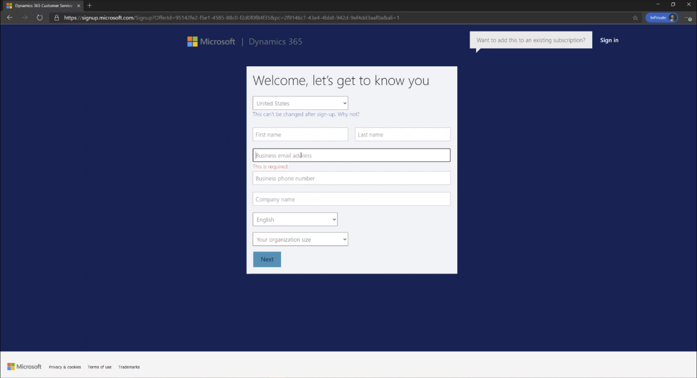

3. Provide the new tenant details.

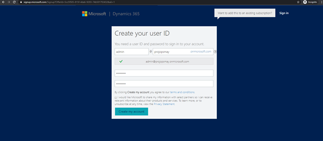

4. Verify your identity, save your new user ID, and then select **Set up**.

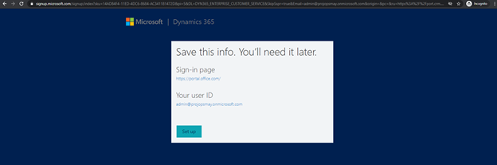

5. Complete the credit card signup and review all terms and conditions. 

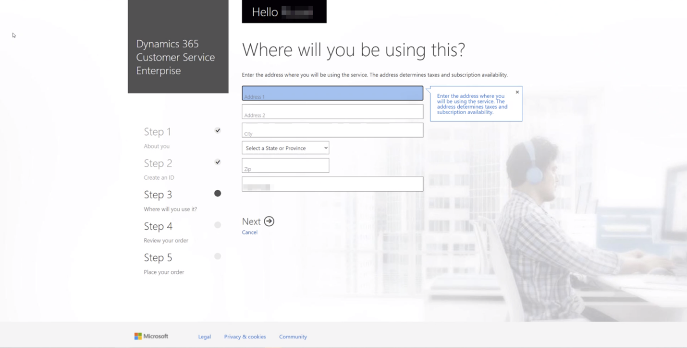

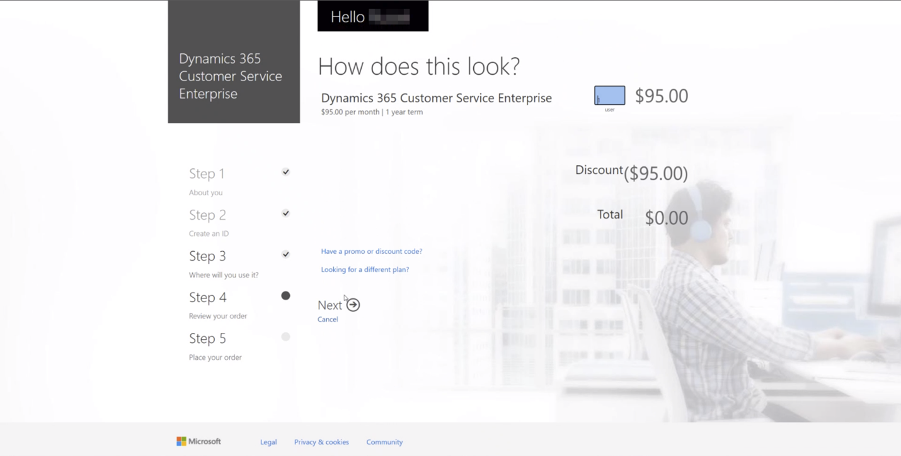

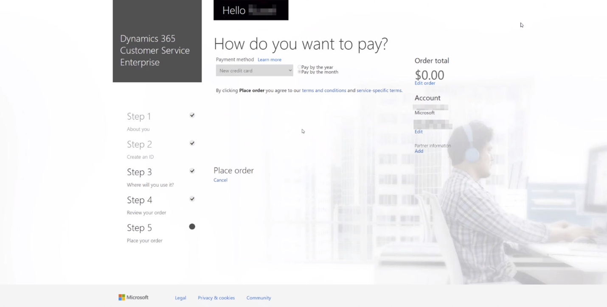

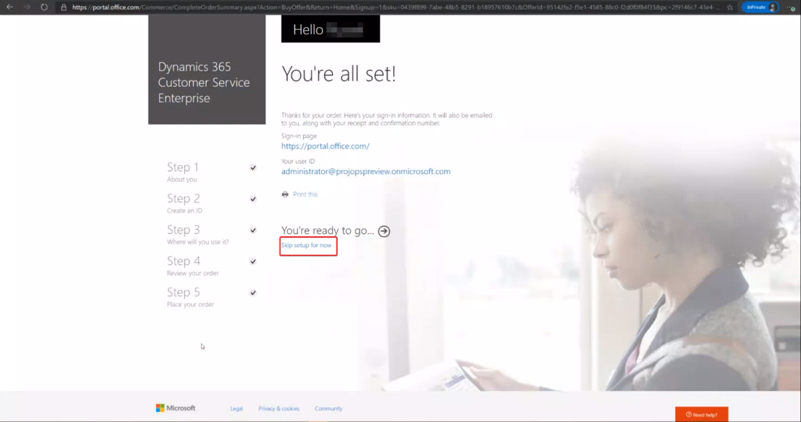

## Cancel the Dynamics 365 Customer Service enterprise offer

The Dynamics 365 Customer Service Enterprise Offer is provided for free for six months. The offer will renew at the full rate at the end of the six-month period. To cancel prior the renew date, complete the following instructions. 

> [!NOTE]
> After you complete these steps, you will no longer be able to use the Project Operations public preview environment.

1. Go to the [Admin portal](https://admin.microsoft.com/), and under **Billing**, select **Your Products**.

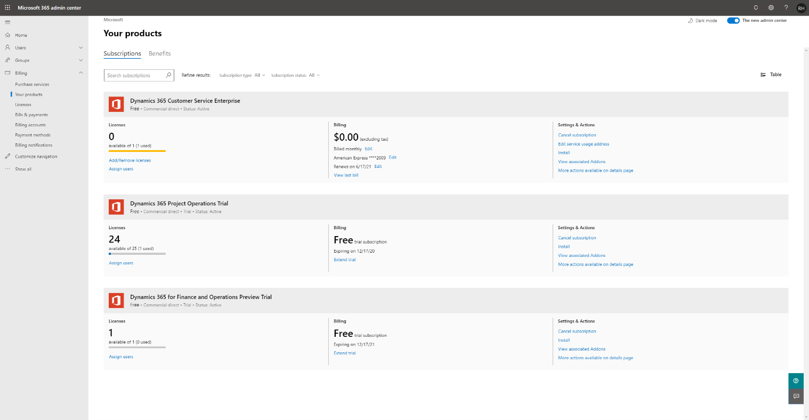

2. Select the **Dynamics 365 Customer Service Enterprise Offer**.

3. Select **Settings** > **Actions** > **Cancel Subscription**.
4. On the **Subscription cancellation** form, enter information in the required fields.
5. Select **Cancel** > **Subscription.**

### Dynamics 365 Project Operations – Preview trial

1. Redeem the second offer, Dynamics 365 Project Operations Trial with the URL provided in your welcome email.

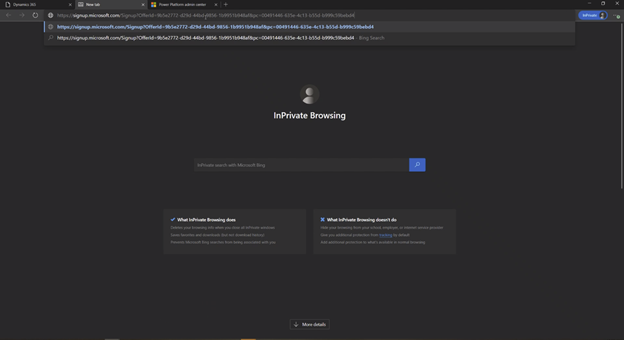

2. Verify that you are logged in as the user who belongs to the same organization that was subscribed using the first offer code and then proceed with redeeming the offer. 
3. Select **Yes, add it to my account**.

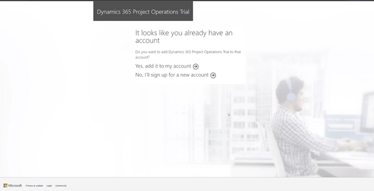

## Assign licenses

> [!IMPORTANT]
> You will need administrative access to your organization's Office 365 Portal to complete the following steps.

1. Go to [Microsoft 365 admin center](https://portal.office.com/) to assign the licenses to your users.

2. On the **Active users** page, select the users that you want to assign a license to.

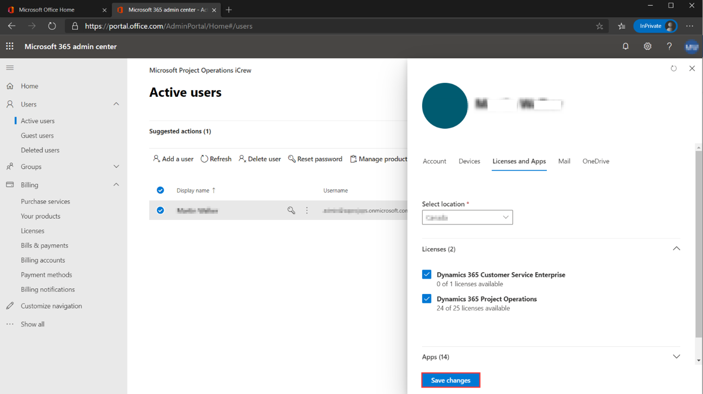

3. Verify that the **Customer Service Enterprise** and** Project Operations** license have been selected and select **Save changes**.

## Create a new CDS environment

Provision a new Project Operations CDS deployment environment by following instructions in the topic, [CDS deployment model](lite-deployment.md).

## Install a CDS configuration and setup demo data

Install the CDS configuration and set up demo data by following instructions in the topic, [Apply demo setup and configuration data](lite-apply-demo-setup-config-data.md).
