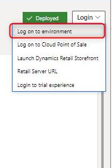

# Navigate Project Operations

_**Applies To:** Project Operations for resource/non-stocked based scenarios_

Dynamics 365 Project Operations for resource/non-stocked scenarios consists of two components: 

 - **Project Operations on Common Data Service (CDS) environment**: This component covers capabilities and processes from opportunity to proforma invoicing. 
 - **Project management and accounting on Dynamics 365 Finance environment**: This component covers expense management capabilities, project accounting, and revenue recognition. 

After you provision Project Operations as described in this topic, the Lifecycle Services (LCS) **Environment details** page provides easy access to both components of Project Operations.  

Use the environment name in the section, **Common Data Service Environment Name** to navigate to Project Operations on a CDS environment. 

  

Select **Login** > **Log on to environment** to navigate to the **Project management and accounting** module in Finance.  

   

> [!NOTE]
> You can access Project Operations in the Common Data Service and the **Project management and accounting** module directly by using their respective URLs. 

[!INCLUDE[footer-include](../includes/footer-banner.md)]