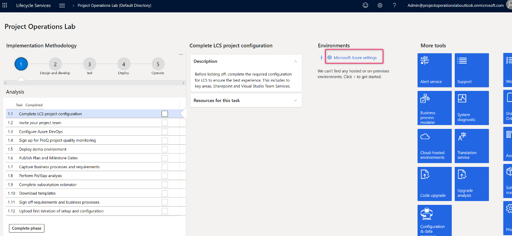
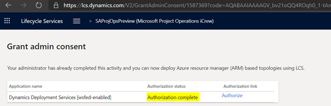
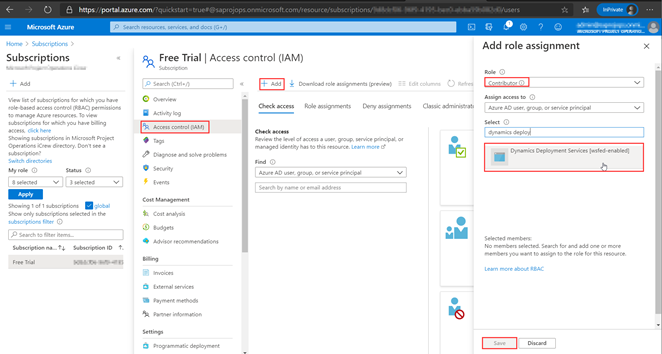

# Add an Azure subscription to LCS project

_**Applies To:** Project Operations for resource/non-stocked based scenarios_

|
 |
| --- |

## Add an Azure subscription to LCS project

Cloud hosted environments must be deployed using an existing Azure subscription. This topic explains how to connect your Azure subscription to LCS project.

### Grant admin consent

- Start on the project page in LCS.
- Navigate to Microsoft Azure settings.

- In Azure Connectors tab click Authorize link to allow deploying environments to this project.

- Click Authorize again to provide Admin consent.

- Accept permissions request.

### Provide Dynamics Deployment Services access to Azure subscription.

- Navigate to [Microsoft Azure billing](https://portal.azure.com/#blade/Microsoft\_Azure\_Billing/SubscriptionsBlade)
- Select your subscription. We will need to allow Dynamics Deployment Services to access this subscription and deploy environments.

- Select Access control (IAM) from the navigation pane, Click **Add role assignment**.
- In the slider on the right side select Contributor role, find **Dynamics Deployment Services** in the list and select them. Click **Save**.

### Add subscription connector to LCS project

- In LCS project Microsoft Azure Settings page click Add button to add a new connector

- Enter your Azure subscription ID. You can find your Azure subscription ID in [Azure Portal](https://ms.portal.azure.com/), under  **Settings**  in the lower left.
- Set Configure to use Azure Resource Manager to Yes
- Make sure Azures Subscription AAD Tenant Domain matches the domain owning Azure subscription you are using.
- Select  **Next**.
- Confirm Microsoft Azure Setup screen by clicking Next. If you see an error in this screen return to [Provide Dynamics Deployment Services access to Azure subscription](#_Provide_Dynamics_Deployment) part of this instruction and make sure you have completed all the steps there.
- Download the Azure Management Certificate to a local folder on your computer, and then upload it to Azure Management Portal by going to  **Settings**  \&gt;  **Management Certificates**. This certificate will enable LCS to communicate with Azure on your behalf. You can skip this step if your user has access to the subscription.
- Select  **Next**.
- Select the Azure region to deploy in. Select a data center that is close to where you plan to use this system.
- Select  **Connect**.

Now you have successfully connected your Azure subscription and can deploy Finance and Operations cloud hosted environments.

