# Set up and apply configuration data in the Common Data Service

[!INCLUDE[banner](../includes/banner.md)]

_**Applies To:** Project Operations Integrated with ERP_

## Prerequisites

Before you begin to configure data in Microsoft Dataverse, make sure you meet the following prerequisites:

1. Provision a Dataverse environment and a Dynamics 365 Finance environment for Project Operations.
1. Share legal entity information from Dynamics 365 Finance to the Dataverse environment. This action adds the following company records to the **Company** entity in Dataverse:

- THPM
- USPM
- GBPM

## Install setup and configuration data

1. Download, unblock, and unzip the [Setup and Configuration Data Package](https://download.microsoft.com/download/e/2/d/e2da6c98-d5dd-450c-aabe-fd6bf2ba374b/ProjOpsSampleSetupData-%20Integrated%20Latest.zip).
2. Navigate to the unzipped folder and run the executable file, _DataMigrationUtility_.
3. On page 1 of the Common Data Service Configuration Migration (CMT) Wizard, select **Import Data** and then select **Continue**.

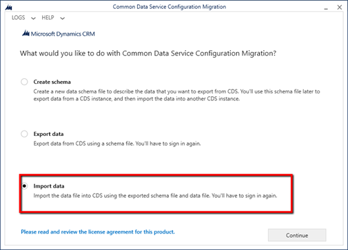

1. On Page 2 of the CMT Wizard, select **Microsoft 365** as the **Deployment Type**.
2. Select the **Display a list of available organizations** and **Show Advanced** check boxes.
3. Select the region of your tenant, enter your credentials, and select **Login**.

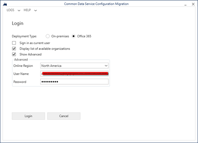

1. On page 3, from the list of organizations on the tenant, select the organization you want to import the demo data into and select **Login**.
2. On page 4, select the zip file, _SampleSetupAndConfigData_ from the unpacked folder.

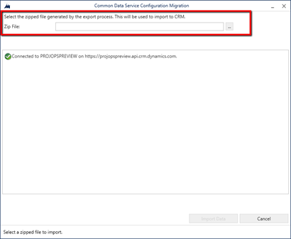

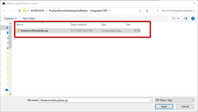

1. After the zip file is selected, select **Import Data**.

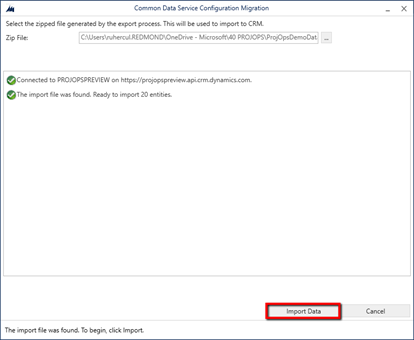

1. Import will run for approximately two-ten minutes depending on your network speed. After import completes, exit the CMT Wizard.
2. Check your organization for data in the following 26 entities:

- Currency
- Chart of Accounts
- Fiscal Calendar
- Currency Exchange Rate Types
- Payment Day
- Payment Schedule
- Payment Term
- Organizational Unit
- Contact
- Tax Group
- Customer Group
- Vendor Group
- Unit
- Unit Group
- Price List
- Project Parameter Price List
- Invoice Frequency
- Bookable Resource Category
- Transaction Category
- Expense Category
- Role Price
- Transaction Category Price
- Characteristic
- Bookable Resource
- Bookable resource category Assn
- Bookable Resource Characteristic

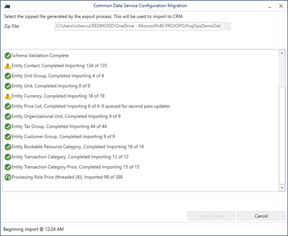

## Update Project Operations configurations

1. Navigate to the CE environment. You can find it by opening the [Power Platform Admin Center](https://admin.powerplatform.microsoft.com/environments), selecting the environment, and then selecting **Open Environment**.

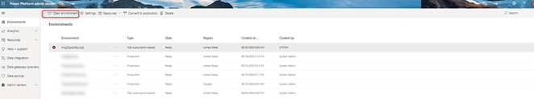

1. Go to **Projects** > **Resources** and then select **New** to create a bookable resource for your user.

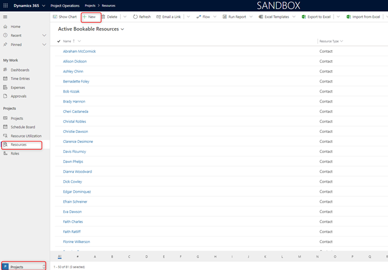

1. On the **General** tab, select your admin user. Verify that the time zone matches the one you are in.

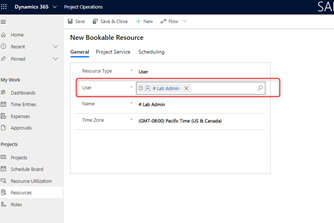

1. On the **Scheduling** tab, in the **Company** field, pick the **USPM** company, and then select **Save**.

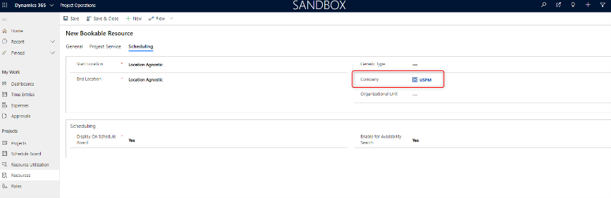

1. Select the **Work hours** tab.  

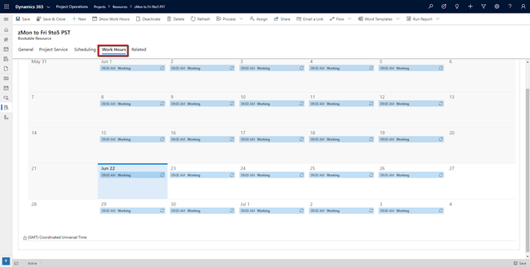

1. Double-click on any value in the calendar and select **Edit** > **All events in the series**.

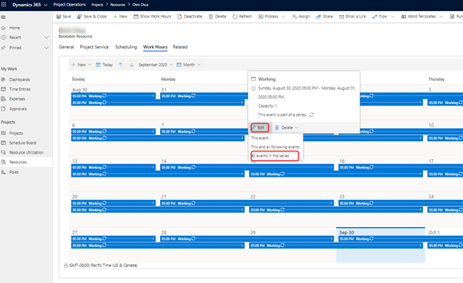

1. Change work hours to an eight (8) hour work day, mark weekends as non-work days, and make sure time zone matches yours.
2. Select **Save and close**.

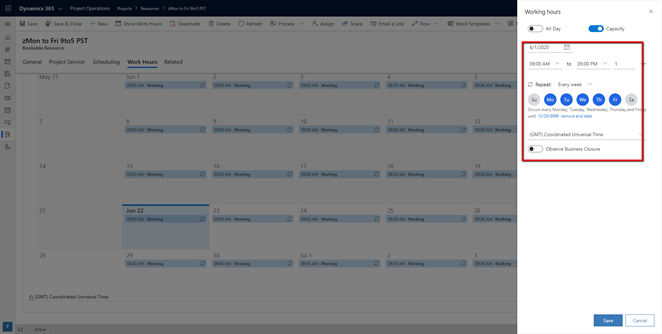

1. Go to **Settings** > **Calendar templates** and select **New**.

 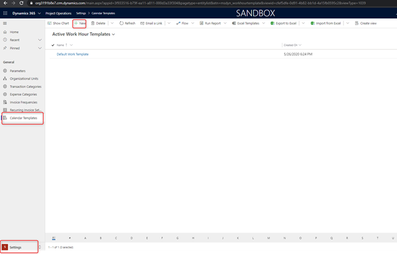

 1. Enter a name, select the template resource you created, and then select **Save**.

 

 1. Go to **Parameters** and double-click the record.

 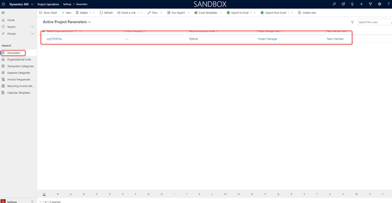

1. Update the following fields:

- **Default company**: USPM
- **Default Organizational Unit**: Contoso Robotics Global
- **Invoice Frequency**: Seventh and Last day
- **Work hour template**: Change to the template you created.

1. Select **Save**.

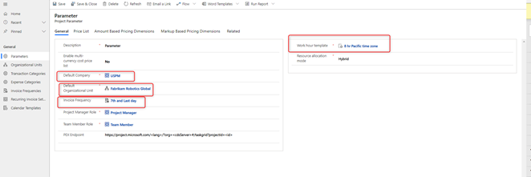

[!INCLUDE[footer-include](../includes/footer-banner.md)]
