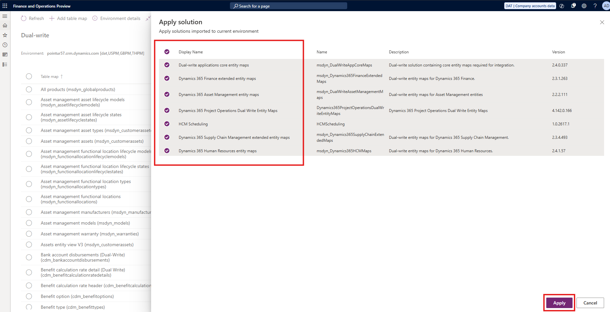

# Install Project Operations dual-write map versions

[!INCLUDE[banner](../includes/banner.md)]

_**Applies To:** Project Operations for resource/non-stocked based scenarios_

This article explains how to install dual-write maps required for Microsoft Dynamics 365 Project Operations for resource/non-stocked scenarios.

## Prerequisites

To install dual-write maps required by Project Operations for resource/non-stocked scenarios, the following prerequisites must be met: 

1. Install required Apps for Dataverse environment.
1. Install required solutions for Finance & Operations.
1. Refresh Entities from Finance & Operations.
1. Install required dual-write maps for Project Operations.

Instructions to complete the preqequisites are found in the following sections.

### 1. Install required apps for Dataverse environment

To ensure a smooth setup, the following apps must be installed in the **exact order** listed below:

1. Dual-write Application Core Solutions
1. Dual-write Asset Management Solutions
1. Dual write Finance and Extended Solutions
1. Dual-write Dynamics 365 Human Resources
1. Dual write Supply Chain Extended Solution
1. Dynamics 365 HR Integration to URS

To install and manage the apps using PowerApps portal, follow these steps.

1. Go to **Power Platform admin center**.
1. Select **Environments** and then select an environment.
1. Under **Resources**, select **Dynamics 365 apps**.
1. Select **Install** app.
1. Select an **Enabled** app, and then select **Next**.
1. Agree to the terms of service, and then select **Install**.

Learn about installing and managing PowerApps in [Manage Apps](/power-platform/admin/manage-apps#install-an-app-in-the-environment-view).

### 2. Install required solutions for Finance & Operations

To ensure a smooth setup, the following solutions must be applied in the **exact order** listed below. **This is a crucial prerequisite.**

1. Dynamics 365 Human Resources entity maps
1. Dynamics 365 Project Operations dual-write Entity Maps
1. Dual-write applications core entity maps
1. Dynamics 365 Finance extended entity maps
1. Dynamics 365 Asset Management entity maps
1. Dynamics 365 Supply Chain Management extended entity maps
1. HCM Scheduling

To apply a solution from Finance & Operations, follow these steps.

1. Go to **Finance and Operations app**.
1. Select **Data management**.
1. Select **dual-write**.
1. Select **Apply Solution**.
1. Select the solutions from, then select **Apply**.

### 3. Refresh Entities from Finance & Operations

Before proceeding, ensure that you refresh the entities from Finance and Operations app. **This is a crucial prerequisite.**

_Refreshing the entity list ensures all entities are available in the environment and that the entities have the latest metadata._

To refresh entities from Finance & Operations, follow these steps.

1. Go to **Finance and Operations app**.
1. Select **Data management**.
1. Select **Framework parameters**.
1. Select **Entity settings**.
1. Select **Refresh entity list**.

Learn more about refreshing entities in [Refresh Entity List](/dynamics365/fin-ops-core/dev-itpro/data-entities/data-entities#entity-list-refresh).

### 4. Install required dual-write maps for Project Operations

The table below shows the maps required for the Project Operations solution. Run the maps in the exact order listed and include any related table maps in your environment:

| Table Map Name                                       | Initial Sync Details                                                                                                                                        |
|------------------------------------------------------|-------------------------------------------------------------------------------------------------------------------------------------------------------------|
| Legal entities (**cdm_companies**)                   | Initial Sync **REQUIRED** for the table map and all related table map(s).   _Master for the initial sync_ should be the **Finance and Operations apps.** |
| CDS Exchange Rates (**msdyn_currencyexchangerates**) | Initial Sync **REQUIRED** for the table map and all related table map(s).   _Master for the initial sync_ should be the **Finance and Operations apps.** |
| Ledger (**msdyn_ledgers**)                           | Initial Sync **REQUIRED** for the table map and all related table map(s).   _Master for the initial sync_ should be the **Finance and Operations apps.** |
| Customers V3 (**accounts**)                          | Initial Sync **NOT REQUIRED**                                                                                                                               |
| Vendors V2 (**msdyn_vendors**)                       | Initial Sync **NOT REQUIRED**                                                                                                                               |
| Worker (**cdm_workers**)                             | Initial Sync **REQUIRED** for the table map and all related table map(s).   _Master for the initial sync_ should be the **Finance and Operations apps.** |

1. From the list of maps, select the Ledger **(msdyn\_ledgers)** map with all prerequisites and select the **Initial sync** check box. In the **Master for initial sync** field, select **Finance and operations apps** for both ledger map and all prerequisite maps. Select **Run**.

    

2. Follow the same steps for all remaining table maps listed in the above table. Do not select the **Initial sync** check box when running those maps.

## Project Operations dual-write maps

Dual-Write map versions are listed starting with the Project Operations May 2021 update, version 4.10.0.186.

The table below shows the maps required for the Project Operations solution. Run the maps in the exact order listed and include any related table maps in your environment:

Complete the following steps to run the listed maps.

1. Enable the Project resource roles for the **Project resource roles for all companies (bookableresourcecategories)** table map, because this map requires the initial synchronization. In the **Master for initial sync** field, select **Microsoft Dataverse**. 

    

    Wait until the status of the map is **Running** before you move on to the next step.

2. Select all the remaining required maps. You can filter the maps in the dual-write map list by entering the keyword in the search field in the upper-right corner. You can multi-select all maps and then run them. For more information, see [Manage multiple table maps](/dynamics365/fin-ops-core/dev-itpro/data-entities/dual-write/multiple-entity-maps). Make sure that you also enable and run related entity maps.

| Table Map Name                                                                                   | Latest Version | Initial Sync Details                                                                                                                      | Required Dynamics 365 Finance Version |
|--------------------------------------------------------------------------------------------------|----------------|-------------------------------------------------------------------------------------------------------------------------------------------|---------------------------------------|
| Project resource roles for all companies   (**bookableresourcecategories**)                   | 1.0.0.1        | Initial Sync **REQUIRED** for the table map and all related table map(s).   _Master for the initial sync_ should be the **Dataverse.** |                                       |
| Integration entity for project transaction relationships   (**msdyn_transactionconnections**) | 1.0.0.0        | Initial Sync **NOT REQUIRED**                                                                                                             |                                       |
| Project contract headers   (**salesorders**)                                                  | 1.0.0.1        | Initial Sync **NOT REQUIRED**                                                                                                             |                                       |
| Project contract lines   (**salesorderdetails**)                                              | 1.0.0.1        | Initial Sync **NOT REQUIRED**                                                                                                             | 10.0.42 or later                      |
| Project funding source   (**msdyn_projectcontractsplitbillingrules**)                         | 1.0.0.2        | Initial Sync **NOT REQUIRED**                                                                                                             |                                       |
| Projects V2   (**msdyn_projects**)                                                            | 1.0.0.2        | Initial Sync **NOT REQUIRED**                                                                                                             |                                       |
| Project tasks   (**msdyn_projecttasks**)                                                      | 1.0.0.4        | Initial Sync **NOT REQUIRED**                                                                                                             |                                       |
| Project transaction categories   (**msdyn_transactioncategories**)                            | 1.0.0.0        | Initial Sync **NOT REQUIRED**                                                                                                             |                                       |
| Project integration table for material estimates   (**msdyn_estimatelines**)                  | 1.0.0.4        | Initial Sync **NOT REQUIRED**                                                                                                             |                                       |
| Project invoice proposals V2   (**invoices**)                                                 | 1.0.0.3        | Initial Sync **NOT REQUIRED**                                                                                                             |                                       |

> [!IMPORTANT]
> If you receive a "Project validation failed" message or any other transient error while you're running all the maps simultaneously or one by one, select the relevant map, and then select **Refresh tables**. This performs a refresh of the table maps, integration keys etc.
>
> 

#### Add an integration key - bookableresourceid [Bookable Resource]
 
With the 10.0.40 and later dual-write maps release, a change was made to add a new required key for references to Bookable Resource that is mandatory for several maps, specially for **msdyn_actuals**.

To add an integration key, follow these steps.

1. Go to **Finance and Operations app**.
1. Select **Data management**.
1. Select **dual-write**.
1. Select **Integration key**.
1. In the first column next to **Bookable Resource**, add **bookableresourceid [Bookable Resource]**
1. Select **Save**.

> [!WARNING]
> Only after following the above mentioned **Important** points, proceed with the rest of the maps as mentioned in the following table.

| Table Map Name                                                                                                      | Latest Version | Initial Sync Details          | Required Dynamics 365 Finance Version |
|---------------------------------------------------------------------------------------------------------------------|----------------|-------------------------------|---------------------------------------|
| Project Operations integration actuals   (**msdyn_actuals**)                                                     | 1.0.0.19       | Initial Sync **NOT REQUIRED** | 10.0.39 or later                      |
| Project worker resource import   (**bookableresources**)                                                         | 1.0.0.0        | Initial Sync **NOT REQUIRED** | 10.0.39 or later                      |
| Project Operations integration contract line milestones   (**msdyn_contractlinescheduleofvalues**)               | 1.0.0.7        | Initial Sync **NOT REQUIRED** |                                       |
| Project Operations integration entity for expense estimates   (**msdyn_estimatelines**)                          | 1.0.0.3        | Initial Sync **NOT REQUIRED** | 10.0.42 or later                      |
| Project Operations integration entity for hour estimates   (**msdyn_resourceassignments**)                       | 1.0.0.6        | Initial Sync **NOT REQUIRED** | 10.0.38 or later                      |
| Project Operations integration project expense categories export entity   (**msdyn_expensecategories**)          | 1.0.0.1        | Initial Sync **NOT REQUIRED** |                                       |
| Project Operations integration project expenses export entity   (**msdyn_expenses**)                             | 1.0.0.5        | Initial Sync **NOT REQUIRED** | 10.0.42 or later                      |
| Project Operations integration project vendor invoice export entity   (**msdyn_projectvendorinvoices**)          | 1.0.0.1        | Initial Sync **NOT REQUIRED** | 10.0.29 or later                      |
| Project Operations integration project vendor invoice line export entity   (**msdyn_projectvendorinvoicelines**) | 1.0.0.9        | Initial Sync **NOT REQUIRED** | 10.0.42 or later                      |
| Project Operations integration project vendor invoice export entity V2   (**msdyn_projectvendorinvoices**)       | 1.0.0.1        | Initial Sync **NOT REQUIRED** | 10.0.42 or later                      |

### Important information
Always first try to run the latest version of the map in your environment (even if the documentation has a lower version mentioned). Certain features and capabilities might not work correctly if any of the following conditions exist:

- A map isn't activated.
- The latest version of the map isn't activated. 
- Related table maps aren't activated.

You can view the active version of the map on the **dual-write** page. The **Version** column indicates which version is active. Activate a new version of the map by selecting **Table map versions**, selecting the latest version, and then saving the selected version. If you've customized an out-of-box table map, you must reapply the changes. For more information, see [Application lifecycle management](/dynamics365/fin-ops-core/dev-itpro/data-entities/dual-write/app-lifecycle-management).
