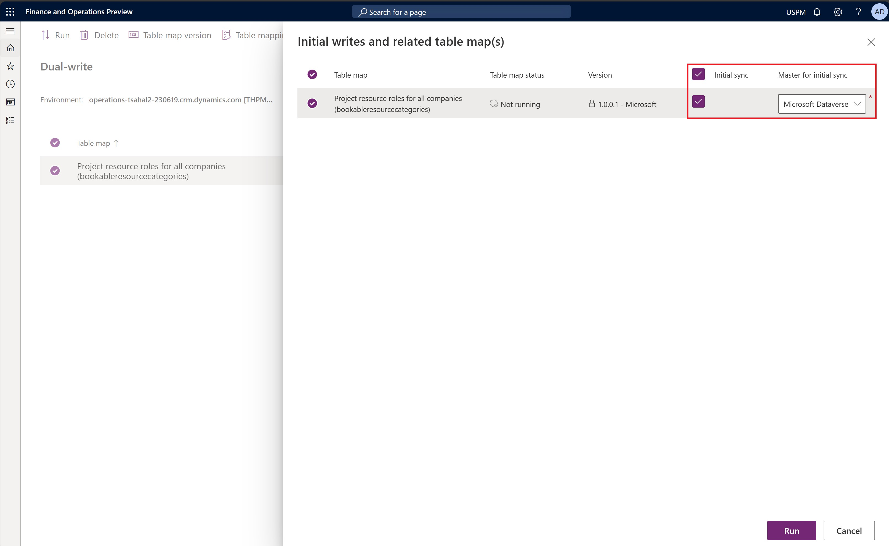

# Project Operations Dual-write map versions

[!INCLUDE[banner](../includes/banner.md)]

_**Applies To:** Project Operations for resource/non-stocked based scenarios_

Using Dynamics 365 Project Operations for resource/non-stocked scenarios requires a set of Dual-write maps to be running in the environment. 

## Prerequisites

The following apps are required in the Dataverse environment. They must be installed in the following order:

1. Dual-write Application Core Solutions
2. Dual-write Asset Management Solutions
3. Dual Write Finance and Extended Solutions
4. Dual-write Dynamics 365 Human Resources
5. Dual Write Supply Chain Extended Solution
6. Dynamics 365 HR Integration to URS

The following maps are required for the Project Operations solution. Make sure to run the maps listed in the following table and any related table maps in your environment.

| Table map | Initial sync |
| --- | --- |
| Ledger (msdyn_ledgers) | Requires initial sync for the table map and all prerequisites. Master for initial sync is finance and operations apps. |
| Legal entities (cdm_companies) | Not required. The system populates this entity automatically when environments are linked using Dual-write. |
| Customers V3 (accounts) | Not required for provisioning. |
| Vendors V2 (msdyn_vendors) | Not required for provisioning. |

1. From the list of maps, select the Ledger **(msdyn\_ledgers)** map with all prerequisites and select the **Initial sync** check box. In the **Master for initial sync** field, select **Finance and operations apps** for both ledger map and all prerequisite maps. Select **Run**.

    

2. Follow the same steps for all remaining table maps listed in the above table. Do not select the **Initial sync** check box when running those maps.

## Project Operations Dual-write maps

The following maps are required for a Project Operations solution. Dual-write map versions are listed starting with the Project Operations May 2021 update, version 4.10.0.186.

| Entity map | Latest version | Initial sync | Required Dynamics 365 Finance version |
| --- | --- | --- | --- |
| Project resource roles for all companies (bookableresourcecategories) | 1.0.0.1 | Requires an initial synchronization for the table map to sync the Project Manager and Team member resource roles that are populated in the Dynamics 365 Dataverse environment during provisioning. Dataverse is the main source for the initial synchronization. ||
| Integration entity for project transaction relationships (msdyn\_transactionconnections) | 1.0.0.0 | Not required for provisioning. ||
| Project contract headers (salesorders) | 1.0.0.1 | Not required for provisioning. ||
| Project contract lines (salesorderdetails) | 1.0.0.0 | Not required for provisioning. ||
| Project funding source (msdyn_projectcontractsplitbillingrules) | 1.0.0.2 | Not required for provisioning. ||
| Projects V2 (msdyn\_projects) | 1.0.0.2 | Not required for provisioning. ||
| Project tasks (msdyn\_projecttasks) | 1.0.0.4 | Not required for provisioning. ||
| Project transaction categories (msdyn\_transactioncategories) | 1.0.0.0 | Not required for provisioning. ||
| Project integration table for material estimates (msdyn\_estimatelines) | 1.0.0.0 | Not required for provisioning. ||
| Project invoice proposals V2 (invoices) | 1.0.0.3 | Not required for provisioning. ||
| Project Operations integration actuals (msdyn_actuals) | 1.0.0.18 | Not required for provisioning. |10.0.39 or later|
| Project Operations integration contract line milestones (msdyn_contractlinescheduleofvalues) | 1.0.0.6 | 10.0.42 or later ||
| Project Operations integration entity for expense estimates (msdyn_estimatelines) | 1.0.0.2 | Not required for provisioning. ||
| Project Operations integration entity for hour estimates (msdyn_resourceassignments) | 1.0.0.6 | Not required for provisioning. |10.0.38 or later|
| Project Operations integration project expense categories export entity (msdyn_expensecategories) | 1.0.0.1 | Not required for provisioning. ||
| Project Operations integration project expenses export entity (msdyn_expenses) | 1.0.0.3 | Not required for provisioning. ||
| Project Operations integration project vendor invoice export entity (msdyn_projectvendorinvoices) | 1.0.0.2 | Not required for provisioning. |10.0.29 or later|
| Project Operations integration project vendor invoice line export entity (msdyn_projectvendorinvoicelines) | 1.0.0.7 | Not required for provisioning. | 10.0.39 or later |
| Project Operations integration project vendor invoice export entity V2 (msdyn\_projectvendorinvoices) | 1.0.0.0 | Not required for provisioning.  ||

Complete the following steps to run the listed maps.

1. Enable the Project resource roles for the **Project resource roles for all companies (bookableresourcecategories)** table map, because this map requires the initial synchronization. In the **Master for initial sync** field, select **Microsoft Dataverse**. 

    

    Wait until the status of the map is **Running** before you move on to the next step.

2. Select all the remaining required maps. You can filter the maps in the Dual-write map list by entering the keyword **Project** in the search field in the upper-right corner. You can multi-select all maps and then run them. For more information, see [Manage multiple table maps](/dynamics365/fin-ops-core/dev-itpro/data-entities/dual-write/multiple-entity-maps). Make sure that you also enable and run related entity maps.

    > [!NOTE]
    > If you receive a "Project validation failed" message while you're running all the maps simultaneously, select the relevant map, and then select **Refresh tables**.
    >
    > 

3. With the 10.0.40 and later Dual-write maps release, a change was made to add a new required key for references to Bookable Resource that is required for several maps. From the **Dual-write** page, select into **Integration key**. In the first column next to **Bookable Resource**, add bookableresourceid [Bookable Resource] and Select **Save**.

The following maps are optional for a Project Operations solution.

| Entity map | Latest version | Initial sync | Required Dynamics 365 Finance version |
| --- | --- | --- | --- |
| Project worker resource import (bookableresources) | 1.0.0.1 | Not required for provisioning |10.0.39 or later|

### Project Operations Dual-write map versions

Always run the latest version of the map in your environment. Certain features and capabilities might not work correctly if any of the following conditions exist:

- A map isn't activated.
- The latest version of the map isn't activated. 
- Related table maps aren't activated.

You can view the active version of the map on the **Dual-write** page. The **Version** column indicates which version is active. Activate a new version of the map by selecting **Table map versions**, selecting the latest version, and then saving the selected version. If you've customized an out-of-box table map, you must reapply the changes. For more information, see [Application lifecycle management](/dynamics365/fin-ops-core/dev-itpro/data-entities/dual-write/app-lifecycle-management).
