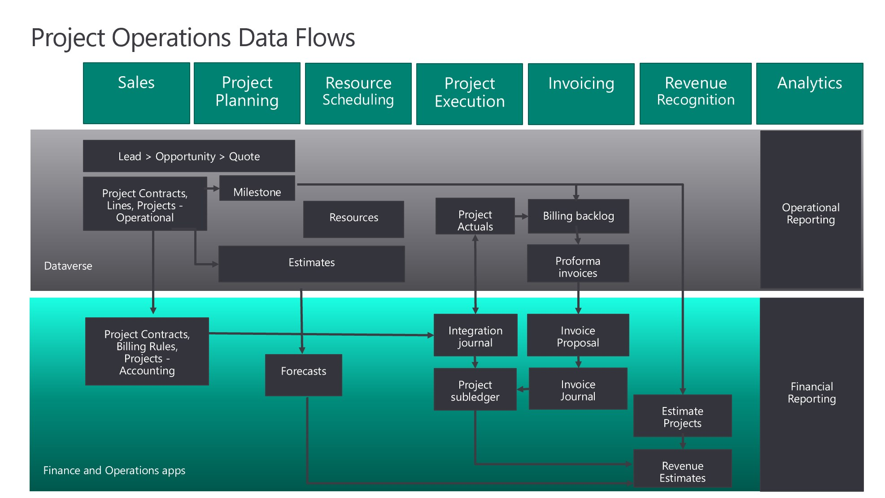

# Project Operations dual-write integration overview

_**Applies To:** Project Operations for resource/non-stocked based scenarios_

Project Operations uses [Dual Write capabilities](https://docs.microsoft.com/dynamics365/fin-ops-core/dev-itpro/data-entities/dual-write/dual-write-home-page) to synchronize data across Microsoft Dataverse and Dynamics 365 Finance.

The following illustration shows how data is synchronized as part of this integration between Dataverse and Finance.

Project Operations on Dataverse provides front-end project management support for service organizations. The out-of-the-box user interface (UI) and easy no-code/low-code extensibility uses the Power Platform capabilities. For Project managers, Resource managers, Project team members, and other front-office personas, the experience and UI is in Dataverse.

Project Operations in Finance provides project accounting and revenue recognition support. Project Operations plugs in to the financial framework in Finance for sales tax calculation, currency exchange rates, financial dimension reporting, and more. The Project accountant experiences are mostly based in Finance.

Project Operations integration consists of the following component integration:

- Data set up and configuration 
- Project estimates and actuals
- Project invoices 
- Expense management
- Vendor invoices
