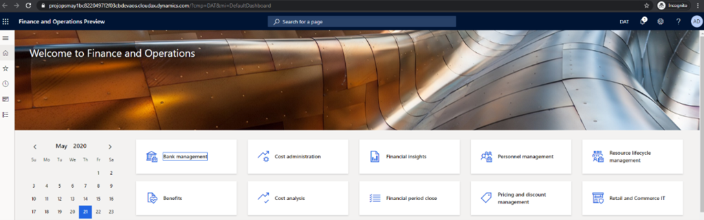
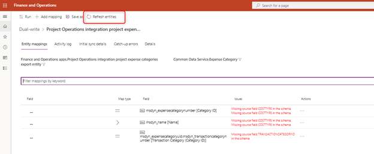
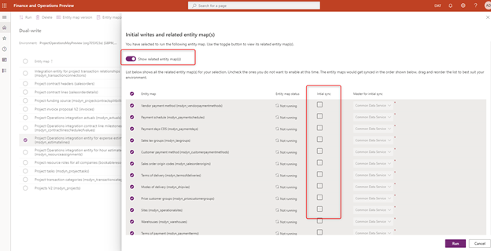

# Provision a new environment

_**Applies To:** Project Operations for resource/non-stocked based scenarios_

This topic provides information about how to provision a new Dynamics 365 Project Operations environment for resource/non-stocked based scenarios.

## Enable Project Operations automated provisioning in an LCS project

Use following steps to enable the Project Operations automated provisioning flow for your LCS project.

1. Go to [LCS](https://lcs.dynamics.com/v2) and select the **Preview Feature management** tile.
2. In the **Preview feature** list, select **Project Operations** and the select **Preview feature enabled** to enable Project Operations.

> [!NOTE]
> This step is performed only one time per LCS project.

## Provision a Project Operations environment

1. Open a new Dynamics 365 Finance [demo environment](https://docs.microsoft.com/en-us/dynamics365/fin-ops-core/dev-itpro/deployment/deploy-demo-environment) or [sandbox/ production environment](https://docs.microsoft.com/en-us/dynamics365/fin-ops-core/dev-itpro/deployment/deployenvironment-newinfrastructure) deployment. 
2. Walk trhough the **Environment provisioning** wizard. 

> [!IMPORTANT]
> Make sure selected application version is 10.0.13 or higher.

3. To provision Project Operations, under **Advance settings**, select **Common Data Service**. 
4. Enable the **Common Data Service Setting** by selecting **Yes** and then enter information in the required fields:

  - Name
  - Region
  - Language
  - Currency

5. In the **Common Data Service Template** field, select **Project Operations**.

> [!IMPORTANT]
> Select **Agree** to acknowledge the terms of service and then select **Done** to return to the deployment settings.

6. Complete the remaining required fields in the wizard and confirm the deployment. Environment provisioning time varies based on the environment type. Provisioning might take up to six hours.

  After deployment completes successfully, the environment will show in a **Deployed** state.

 To confirm the environment has deployed successfully, select **Login** and log on to environment to confirm it is up and running.

 You should see the Finance UI.

## Apply updates to the Finance environment

Project Operations requires a Finance environment with application version **10.0.13 (10.0.569.20009)** or higher.

You might need to apply quality updates to your Finance environment to receive this version.

1. In LCS, on the **Environment details** page, in the **Available Updates** section, select **View Update**.

2. on the next screen, select **Save package.**

3. Select all and save the package.

Give package a name and description and confirm saving. Depending on the internet connection this process will take some time.

Once package is saved **Done** button will be enabled. Click it to save this package to your LCS project Assets library.

Saving and validating the package might take ~15 minutes.

To apply the update, navigate to LCS Environment details page and select Maintain\&gt; Apply updates

In the updates list select the package created in the previous steps and select Apply.

Environment servicing will take some time. Once it is complete, environment will return to deployed state.

## Establish Dual Write connection between CE and F&amp;O Environments

Navigate to LCS project environment details page.

Under Common Data Service Environment Information, select **Link to CDS for Apps.**

Once completed the LCS UI update to indicate the linking was successfully completed. Select **Link to CDS for Apps**. You will be redirected to Dual Write within Finance and Operations.

To access the entities to be mapped in the integration, select **Apply Solution** from the menu.

Select Both solutions, **Dynamics 365 Finance and Operations Dual Write Entity Map** s and **Dynamics 365 Project Operations Dual Write Entity Maps** and select **Apply.**

Once the solutions have been applied, the Dual Write entities will be applied to the environment.

Once complete, all available mappings will be listed in the environment.

## Refresh the data entities after the update

Navigate to Data management workspace in Finance and Operations environment:

Open Framework parameters tile:

In Entity settings page select Refresh Entity list button

Refresh is going to take some time (~20 minutes). You will get an alert once it is complete.

## Run Project Operations Dual Write maps

Navigate to LCS project environment details page.

Under Common Data Service Environment Information, select **Link to CDS for Apps.** Once selected, you will be redirected to the list of entities in the mappings.

Start the maps as described in the table below (following the sequence):

| **Entity Map** | **Refresh entity** | **Initial sync** | **Master for initial sync** | **Run prerequisites** | **Prerequisites initial sync** |
| --- | --- | --- | --- | --- | --- |
| **Project Resource Roles for All Companies (bookableresourcecategories)** | No | Yes | Common Data Service | No | N\A |
| **Legal entities (cdm\_companies)** | No | Yes | Finance and Operations apps | No | N\A |
| **Project Operations integration actuals (msdyn\_actuals)** | No | No | N\A | Yes | No |
| **Project contract lines (salesorderdetails)** | No | No | N\A | No | No |
| **Integration entity for project transaction relationships (msdyn\_transactionconnections)** | No | No | N\A | No | N\A |
| **Project Operations integration contract line milestones (msdyn\_contractlinesscheduleofvalues)** | No | No | N\A | No | N\A |
| **Project Operations integration entity for expense estimates (msdyn\_estimateslines)** | No | No | N\A | No | N\A |
| **Project Operations integration entity for hour estimates (msdyn\_resourceassignments)** | No | No | N\A | No | N\A |
| **Project Operations integration project expenses export entity (msdyn\_expenses)** | Yes | No | N\A | No | N\A |
| **Project Operations integration entity for hour estimates (msdyn\_resourceassignments)** | Yes | No | N\A | No | N\A |

To refresh the entity open the it&#39;s details by clicking on the map name and click Refresh entities button. Proceed with running the map once refresh is complete.

Make sure the map in the table is in Running state before you proceed with enabling the next map. Running maps with larger number of prerequisites might take some time.

To run a map with prerequisites, turn on toggle Show related entity maps. If table indicates Prerequisite initial sync as No, make sure initial sync flag is OFF in all the prerequisite maps before running it.

Lastly validate all Project related maps are in the running state:

You have now successfully provisioned and configured Project Operations environment.
