# Provision a new environment

[!INCLUDE[banner](../includes/banner.md)]

_**Applies To:** Project Operations Integrated with ERP_

This article provides information about how to provision a new Dynamics 365 Project Operations environment for Project Operations Integrated with ERP based scenarios.

## Enable Project Operations automated provisioning in an LCS project

Use following steps to enable the Project Operations automated provisioning flow for your LCS project.

1. Go to [LCS](https://lcs.dynamics.com/v2) and select the **Preview Feature management** tile.
2. In the **Preview feature** list, select **Project Operations Feature**, and then select **Preview feature enabled** to enable Project Operations.

   > [!NOTE]
   > This step is performed only one time per LCS project.

## Provision a Project Operations environment

1. Open a new Dynamics 365 Finance [demo environment](/dynamics365/fin-ops-core/dev-itpro/deployment/deploy-demo-environment) or [sandbox/ production environment](/dynamics365/fin-ops-core/dev-itpro/deployment/deployenvironment-newinfrastructure) deployment. 
2. Walk through the **Environment provisioning** wizard. 

   > [!IMPORTANT]
   > Make sure selected application version is 10.0.13 or higher.

3. To provision Project Operations, under **Advance settings**, select **Common Data Service**. 
4. Enable the **Common Data Service Setting** by selecting **Yes** and then enter information in the required fields:

  - Name
  - Region
  - Language
  - Currency
 
5. In the **Common Data Service Template** field, select **Project Operations** 
6. Select the environment type for your deployment. A subscription-based trial will let you deploy a CDS environment for 30 days. 

     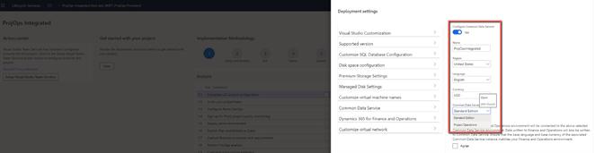

    > [!IMPORTANT]
    > Select **Agree** to acknowledge the terms of service and then select **Done** to return to the deployment settings.
    >
    >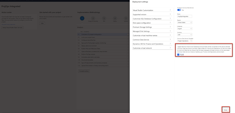

7. Optional - Apply demo data to the environment. Go to **Advanced settings**, select **Customize SQL Database Configuration**, and set **Specify a dataset for Application database** to **Demo**.
8. Complete the remaining required fields in the wizard and confirm the deployment. The time to provision the environment varies based on the environment type. Provisioning might take up to six hours.

   After the deployment completes successfully, the environment will show as **Deployed**.

9. To confirm that the environment has deployed successfully, select **Login** and log on to the environment to confirm.

    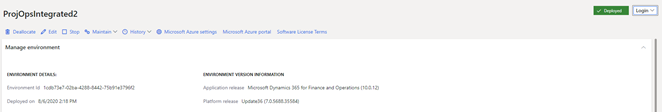

## Apply updates to the Finance environment

Project Operations requires a Finance environment with application version **10.0.13 (10.0.569.20009)** or higher.

You might need to apply quality updates to your Finance environment to receive this version.

1. In LCS, on the **Environment details** page, in the **Available Updates** section, select **View Update**.

    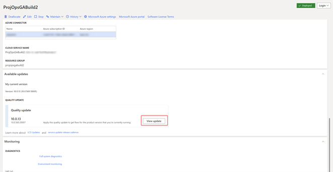

2. On the **Binary updates** page, select **Save package.**

    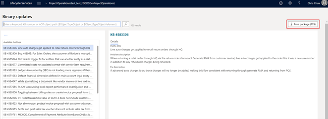

3. Click **Select all** and then select **Save package**.

    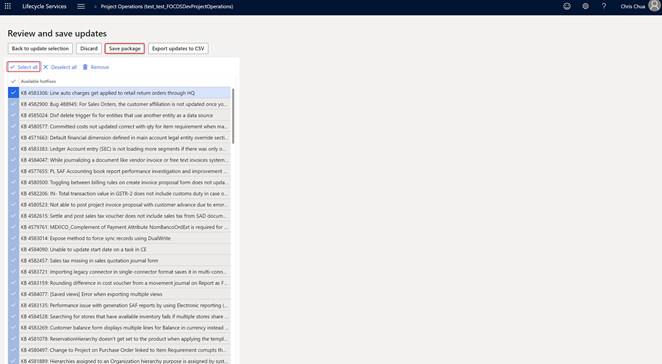

4. Enter a name and a description of the package, and then select **Save**. Depending on the internet connection, this process might take some time.

    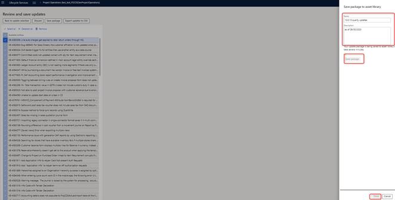

5. After the package is saved, select **Done** and save this package to the Assets library in your LCS project.

   Saving and validating the package might take ~15 minutes.

6. To apply the update, navigate to the **Environment details** page in LCS and select **Maintain** > **Apply updates**.

    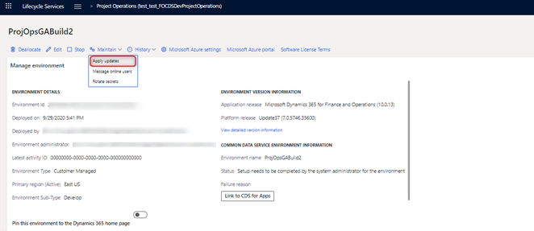

7. In the updates list select the package you created, and select **Apply**.

    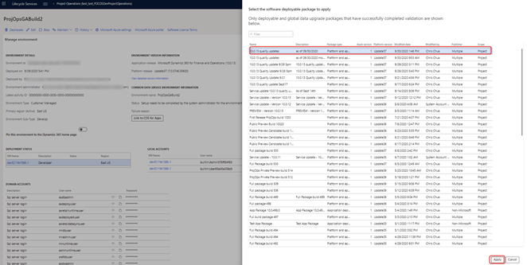

   Environment servicing will take some time. After it is complete, the environment will return to a deployed state.

    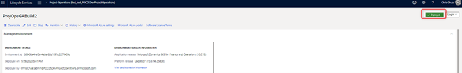

## Establish a Dual Write connection 

1. In your LCS project, go to the **Environment details** page.
2. Under **Common Data Service Environment Information**, select **Link to CDS for Apps**.
3. After the link is complete, select **Link to CDS for Apps** again. You will be redirected to Dual Write in Finance.

    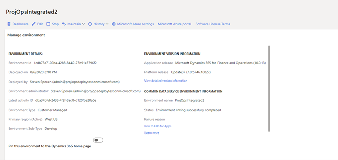

4. Select **Apply Solution** to access the entities that will be mapped in the integration.

    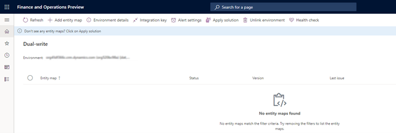

5. Select both solutions, **Dynamics 365 Finance Dual Write Entity Map** and **Dynamics 365 Project Operations Dual Write Entity Maps**, and then select **Apply**.

    

    After the solutions are applied, the Dual Write entities are applied to the environment.

    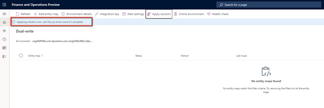

    After the entities are applied, all available mappings are listed in the environment.

    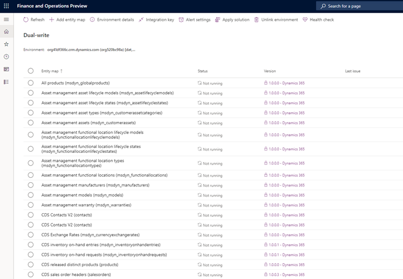

## Refresh the data entities after the update

1. In Finance, go to the **Data management** workspace.

    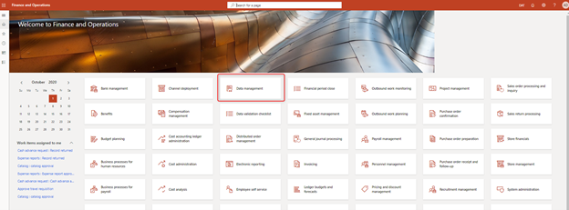

2. Select the **Framework parameters** tile.

    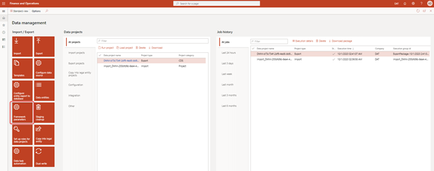

3. On the **Entity settings** page, select **Refresh Entity list**.

    

The refresh is going to take approximately 20 minutes. You will receive an alert when it is complete.

  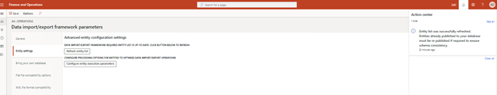

## Update security settings on Project Operations on Dataverse

1. Go to Project Operations on your Dataverse environment. 
2. Go to **Settings** > **Security** > **Security roles**. 
3. On the **Security roles** page, in the list of roles, select **dual-write app user** and select the **Custom Entities** tab.  
4. Verify that the role has **Read** and **Append To** permissions for the following entities:
      
      - **Currency Exchange Rate Type**
      - **Chart Of Accounts**
      - **Fiscal Calendar**
      - **Ledger**
      - **Company**
      - **Expense**

5. After the security role is updated, go to **Settings** > **Security** > **Teams**, and select the default team in the **Local Business Owner** team view.
6. Select **Manage Roles** and verify that the **dual-write app user** security privilege is applied to this team.

## Run Project Operations Dual Write maps

1. In your LCS project, go to the **Environment details** page.
2. Under **Common Data Service Environment Information**, select **Link to CDS for Apps.** After you select the link, you will be redirected to the list of entities in the mappings.
3. Start the maps. For more information, see [Project Operations dual-write map versions](resource-dual-write-maps.md#project-operations-dual-write-maps)
4. Validate all project related maps are in the running state.

    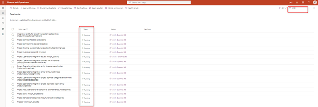

## Apply configuration data in CDS for Project Operations (optional)

If you have applied demo data to the Finance environment, see [Set up and apply configuration data in the Common Data Service for Project Operations](resource-apply-pro-setup-config-data.md) to apply demo data to CDS environment.

Your Project Operations environment is now provisioned and configured. 

[!INCLUDE[footer-include](../includes/footer-banner.md)]
