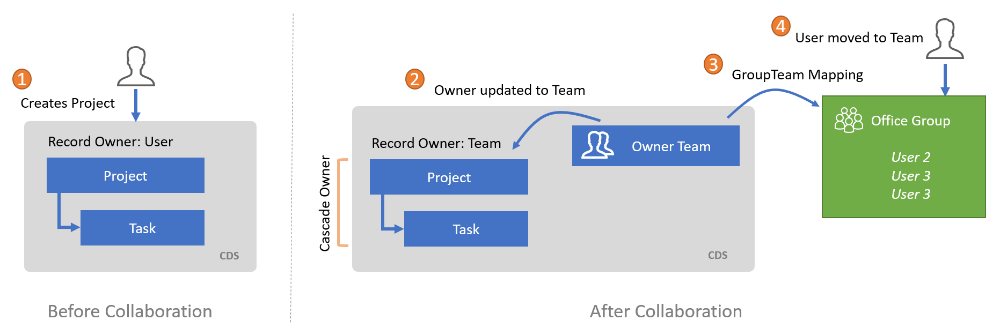

# Security Model

[!INCLUDE[banner](../includes/banner.md)]

_**Applies To:** Project Operations Integrated with ERP, Core deployment - deal to proforma invoicing_

Microsoft Dynamics 365 Project Operations contains a unique security model that allows for a role-based business security model that collaborates with Microsoft Office Groups. 

## Security roles
Project Operations front-end capabilities include the following roles:

| Role                          | Description                                                                                                                                                                 | Scope |
|-------------------------------|-----------------------------------------------------------------------------------------------------------------------------------------------------------------------------|------|
| Practice manager              | Supports cross-project reporting.                                                                                                            | Business unit              |
| Project approver              | Approves time and expenses against a project.                                                                                                                              | Business unit |
| Project billing administrator | Creates the invoice proposal.                                                                                                                                                 | Business unit |
| Project manager               | Creates the project plan and requests resources.                                                                                                                              | Business unit |
| Project resource              | Team members who can be booked and report time.                                                                                                          | Business unit|
| Resource manager              | All resource management functions, such as fulfill resource requests and bookings, separated to support a hybrid Project manager + Resource manager configuration and a single and centralized Resource manager role. | Business unit |

Microsoft Project for the Web includes the following roles:

| Role           | Description                                                                                                        | Scope  |
|----------------|--------------------------------------------------------------------------------------------------------------------|--------|
| Project user   | Collaborative user of Project   who is able to create their own projects and view any projects shared with   them. | User   |
| Project system | Role used for application   context. Customers should not use this system role.                                    | Global |

## Security enforcement
Actions that are performed at the project level are performed in the context of the logged in user. This means that in order to create, open, or delete a project, the user is required to have access available in CDS. Access in CDS may be granted through any of the possible mechanisms included in the platform. For example, a user with a larger scope may access the project or if an explicit project share action has been performed which grants the user access.

It's important to consider this when creating projects in Project Operations.

## Modern group collaboration with Project Operations
Project for the Web and Project Operations support modern groups for collaboration. Users added to the project through a group are able to edit the project plan.

Project for the Web adds users to the group automatically upon assignment.

Groups allow the permissions of the project and supporting collaboration artifacts to be worked on collaboratively. The following diagram depicts the events and state changes that happen during the group assignment process.

Project Operations does not create a group through implicit action and only does so through the explicit action of pressing groups.

Group member search in the **Group management** dialog, is limited to those who are set as part of the environment's security group. For more information, see [Control user access to environments: security groups and licenses](/power-platform/admin/control-user-access).

1. The Project is created and owned by the creating User.
2. The Project owner is updated to the team.
3. The Owner team is mapped to the specified or created Office Group.
4. The original owner of the Project is added to the Office Group.

## Deployment recommendation
As the Office group collaboration model evolves, functionality will be added to provide more detailed control over time. Customers that deploy Project Operations today are encouraged to focus on a traditional Microsoft Dynamics 365 security model.

For more information, see [Security in Common Data Service](/power-platform/admin/wp-security).

## Project Operations and Microsoft Dynamics 365 Finance security
Project Operations includes the following roles:

- Project manager
- Project accountant

For more information about security in Finance, see [Role-based security](/dynamics365/fin-ops-core/dev-itpro/sysadmin/role-based-security).

[!INCLUDE[footer-include](../includes/footer-banner.md)]
