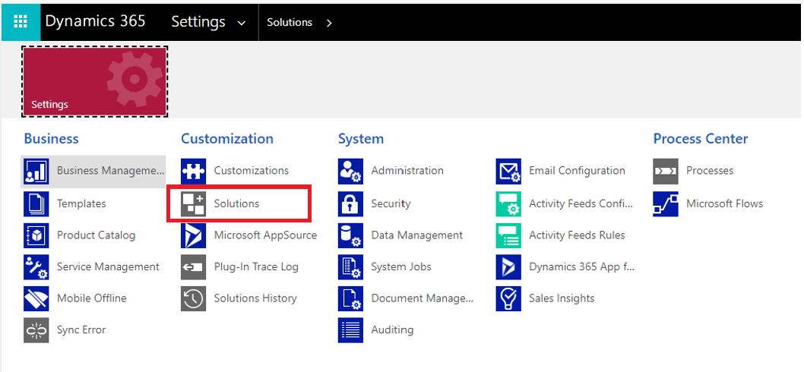

# Uninstall Dynamics 365 Project Operations 

[!INCLUDE[banner](../includes/banner.md)]

_**Applies To:** Project Operations Integrated with ERP_

To uninstall Dynamics 365 Project Operations, you must be assigned the role of Administrator.

1. Go to **Settings** > **Solutions**.

    
  
2. Remove the solutions in the exact order they are listed in the following table. 

    | Step | Solution   name                                    | Note                                                                                         |
    |------|----------------------------------------------------|----------------------------------------------------------------------------------------------|
    | 1 | msdyn_ProjectServiceUpgrade_managed.cab            | If not found, skip this solution.                                                            |
    | 2 | ProjectOperations_Anchor                           | If not found, skip this solution.                                                            |
    | 3 | Dynamics365ProjectOperationsDualWriteEntityMaps    | If not found, skip this solution.                                                            |
    | 4 | Dynamics365ProjectOperationsDualWrite              | If not found, skip this solution.                                                            |
    | 5 | ProjectService                                     | No additional notes.                                                                         |
    | 6 | ProjectServiceCore_Patch                           | No additional notes.                                                                         |
    | 7 | ProjectServiceCore                                 | No additional notes.                                                                         |
    | 8 | ProjectServiceDeprecatedComponents                 | If not found, skip this solution.                                                            |
    | 9 | FieldServiceCommon                                 | Required for dual-write with Dynamics 365 Finance or Dynamics 365 Supply Chain Management.   |
    | 10 | msdyn_AssetCommon                                  | Required for dual-write with Dynamics 365 Finance or Dynamics 365 Supply Chain Management.   |
    | 11 | msdyn_TESA_Anchor                                  | Required for Dynamics 365 Field Service.                                                     |
    | 12 | msdyn_TESA_Patch                                   | Required for Dynamics 365 Field Service.                                                     |
    | 13 | msdyn_TESA                                         | Required for Dynamics 365 Field Service.                                                     |
    | 14 | ResourceSchedulingControls                         | Required for Dynamics 365 Field Service.                                                     |
    | 15 | MicrosoftDynamicsScheduling3_CumulativePatch       | Required for Dynamics 365 Field Service.                                                     |
    | 16 | MicrosoftDynamicsScheduling_Patch_xx               | Required for Dynamics 365 Field Service.                                                     |
    | 17 | MicrosoftDynamicsScheduling                        | Required for Dynamics 365 Field Service.                                                     |
    | 18 | Dynamics365FinanceAndOperationsAnchor              | If not found, skip this solution.                                                            |
    | 19 | Dynamics365Notes                                   | If not found, skip this solution.                                                            |
    | 20 | Dynamics365FinanceAndOperationsDualWriteEntityMaps | If not found, skip this solution.                                                            |
    | 21 | DualWriteCore                                      | If not found, skip this solution.                                                            |
    | 22 | Dynamics365AssetManagementApp                      | If not found, skip this solution.                                                            |
    | 23 | Dynamics365AssetManagement                         | If not found, skip this solution.                                                            |
    | 24 | Dynamics365SupplyChainExtended                     | If not found, skip this solution.                                                            |
    | 25 | Dynamics365FinanceExtended                         | If not found, skip this solution.                                                            |
    | 26 | HCMCommon                                          | If not found, skip this solution.                                                            |
    | 27 | Dynamics365FinanceAndOperationsCommon              | If not found, skip this solution.                                                            |
    | 28 | Party                                              | If not found, skip this solution.                                                            |
    | 29 | Dynamics365Company                                 | If not found, skip this solution.                                                            |
    | 30 | CurrencyExchangeRates                              | If not found, skip this solution.                                                            |
    | 31 | AssetCommon                                        | If not found, skip this solution.                                                            |
