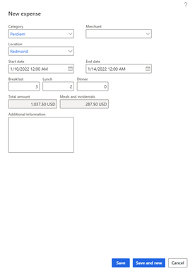
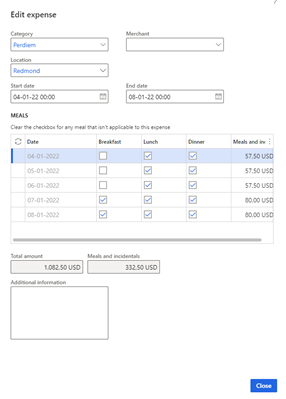
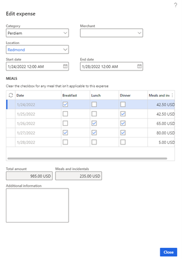

---
# required metadata

title: Per diem expenses
description: This topic provides information about how to work with per diem expenses.
author: suvaidya
ms.date: 01/26/2022
ms.topic: article
ms.prod: 
#

# optional metadata

ms.search.form: 
audience: Application User
# ms.devlan: 
ms.reviewer: kfend
ms.search.scope: 
# ms.tgt_pltfrm: 
# ms.custom: 
ms.search.region: 
# ms.search.industry: 
ms.author: suvaidya
ms.search.validFrom: 
ms.dyn365.ops.version: 
---

# Per diem expenses

Per diem is a fixed, predetermined amount of money that a company pays to its employees who are traveling for work. 

As per IRS (Internal Revenue Service), per diem payment is a daily allowance paid by a company to its employees for lodging, meals, and incidental expenses incurred when travelling. This allowance is paid instead of paying their actual travel expenses.  Employees can use their “incidentals/other” per diem allowance to cover tips, room service, laundry, or dry-cleaning services for all-important business meetings. The per diem rate can differ depending upon whether the employer chooses to reimburse for the combined lodging and meal costs or if they choose to reimburse for meals and incidentals alone .

Per diem rates can be based on the time of year, the travel location, or both. When you create a per diem rule, you can specify that a percentage of the per diem rate will be withheld if a worker receives complimentary meals or services. You can also set a minimum and maximum number of hours that the per diem rate can apply to a worker's travel.

The per diem calculation is done by calculating the total allowance offered per day minus the meal reduction (cost of complimentary meals) provided to the employee. 

## Per diems in Reimagined Expense interface 
The Per diem feature is supported in the reimagined expense workspace in 10.0.25 release and above.  
To enable this feature, in Feature Management, first enable the "Expense Reports Reimagined " interface and then enable the "Per-diem for expense report re-imagined interface".

## Configuration

**Step 1:** Using "Per diems" tab under Expense Management Parameters , configure per diems to be calculated based on one of the following 3 options-  
1.	**Meal type per trip** – Per diem will be calculated based on the type of meal entered (i.e., breakfast/lunch/dinner) **and** the meal reduction specified for each of these for the per diem allowance for the duration of the trip. 
2.	**Meal type per day** - Per diem will be calculated based on the type of meal entered (i.e., breakfast/lunch/dinner) **and** the meal reduction specified for each of these for the per diem allowance /day.  
3.	**Number of meals per day** – Per diem will be calculated based on the number of meals entered per day **and** the meal reduction for the number of meals provided per day.

Under “ Calculations and codes”, update the "Per diem locations"  and in the  "per diems" section, update the daily allowance for hotel, meals and incidentals  and the meal reduction per location. 

## How the per diem feature works
Below is an example of the user experience when either of the 3 scenarios mentioned above, is configured-  
Note that the Total amount is same across all 3 scenarios until the meal reduction is applied based on the chosen configuration making the total amount payable different across each scenario. 

Create a new Per diem expense and select the location and provide the start and end dates.
The per diem is calculated based on the daily allowance set for that location for hotel, meals, and incidentals. 

For e.g. For Redmond (USA) location if the daily hotel allowance is $150, meals is $75 and Incidentals (Other) is $5, 
then for the selected duration of 10th- 14th Jan (5 days- assuming calendar day with time)

Total amount payable = 5 (150+75+5)  = 5* 230  =  1150 USD
Meals and incidentals portion of the total amount = 5(75+5) = 400 USD
Now, if Breakfast, lunch, and dinner were provided during the trip, then those will need to be accounted for as meal reduction.

**1.	Per diem is set to meal type per trip**

Let’s assume meal reduction is 30% for breakfast, 30% for lunch and 40% for dinner, then: 
As an example, when 3 breakfasts, 2 lunches and 0 dinners were provided to the employee-

Meal reduction = 3(30%*75) + 2(30%*75) + 0 =  3(22.5)+2(22.5) +0=  67.5+45 = 112.5 
**So, meals and incidentals = 400 USD- 112.5 USD = 287.5 USD 
So, Total amount = Total allowance - Meal reduction = 1150 USD – 112.5 USD = 1037.5 USD **

  

**2.	Per diem is set to meal type per day**

Let’s assume meal reduction is 30% for breakfast, 30% for lunch and 40% for dinner, 

In this case, a meals grid opens, and the user can uncheck the meals that were provided for (complimentary) during the trip.  
As an example, when breakfast has been provided for the first 3 days of the trip , 
Per day meal reduction on the first 3 days = 30% (75) = 22.5 , 

Total meal reduction =  3(22.5)  =  67.5 USD  
Meals and incidentals for days 1-3 =  75-22.5 =  57.5 USD 

**Total meals and incidentals = sum of meals and incidentals across 5 days = 400-67.5= 332.5 USD 
Total amount payable = total amount – meal reduction =  1150- 67.5 = 1082.5 USD **

 

**3. Per diem is set to number of meals per day**
The meal reduction is calculated based on the no. of meals provided for (unselected in grid) per day- 
Configuraton - 
Hotel= $150, Meals =$75, Incidentals =$5
1 meal – meal reduction = 20% = $15
2 meals – meal reduction = 50% = $37.5
3 meals – meal reduction = 100% = $75 

Meals and incidentals allowance which includes $5 for incidentals- 
1 meal =  $75-$15 =  $60+$5 = $65
2 meals =  $75 -$37.5 =  $37.5 +$5 =  $42.5
3 meals = $75- $75 =0 +$5 = $5 

**Total meals and incidentals = sum (meals and incidentals/day) =235 USD
Total amount =  $Total allowance - Total meal reduction = 985 USD**

 

## Notes ##
In the Reimagined expense interface, users will not be able to create per diem expenses with overlapping dates starting release version 10.0.23.  On doing so, they will see an error similar to "There is another expense of category Per diem, overlaps for the date range 1/1/2021  12:00:00 am, 1/10/2021 12:00:00 am". 

