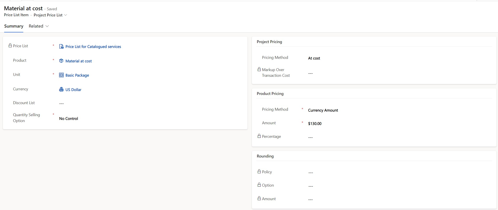
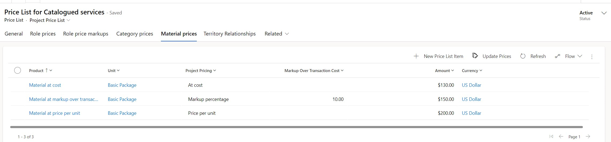

# Set up cost and sales rates for materials

[!INCLUDE[banner](../includes/banner.md)]

_**Applies To:** Project Operations Integrated with ERP, Core deployment - deal to proforma invoicing_

You can set up cost and sales prices for products in Microsoft Dynamics 365 Project Operations. Cost and sales prices for products can only be listed in one currency, which must be the currency on the price list header.

To set up cost and sales rates for products, follow these steps. 

1. Go to **Sales** > **Customers** > **Price Lists** and select **New** to create a new price list. 
1. In the newly created price list, select **Project Price list** in the view selector.
1. On the **Material prices** page, on the subgrid menu, select **New price list item**.
1. On the **Quick Create** page, enter the product and unit that you're creating the new price for.
1. Select the pricing method under **Project Pricing**, and then update the **Pricing Method** and **Amount** fields under **Product Pricing**.

## Material pricing methods in Project Operations

Project Operations supports the following pricing methods for sales price lists:

- **Price per unit** – By default, the sales price of the material is set to the amount specified in the **Currency amount** field.
- **At cost** – By default, the sales price of the material is set to the transaction cost of the material.
- **Markup percentage** – The sales price of the material is calculated as a markup percentage over the transaction cost of the material.

### Example

The following illustration shows a view of three products, each of which is set up with a different project pricing method. The **Amount** field refers to the amount used to price product-based contract lines.

If each product has a transaction cost of $100, the unbilled sales actuals per unit of usage in projects are calculated in the following way.

| Product | Project pricing method | Markup percentage | Sales price | Currency |
|---|---|---|---|---|
| Material at Cost | At Cost | | 100 | USD |
| Material at Mark up over transaction cost | Mark up percentage | 10 | 110 | USD |
| Material at price per unit | Price per unit | | 200 | USD |

> [!NOTE]
> For material transactions, unit conversions aren't supported. For example, if a price list has a price with a unit of ea, then expenses must be expressed in ea and not bundle even if the unit group has a conversion between them. Alternatively, a price with a unit of bundle for the same item can be added to the price list.

For more information about how to define prices for catalog items, see [Define product pricing with price lists and price list items](/dynamics365/sales/create-price-lists-price-list-items-define-pricing-products) and [Decimal precision in currency and pricing](/dynamics365/sales/decimal-precision-currency-pricing).

> [!NOTE]
> Project Operations doesn't support all the pricing methods for products that Dynamics 365 Sales supports. Originally, only the **Currency amount** pricing method could be used for projects. However, as of Project Operations release UR 30, two other pricing methods are supported. 

> [!NOTE]
> Price defaulting for expenses, based on cost [Mark up over transaction cost] is valid on project estimates, actuals, quote lines, contract line details, budget lines, and budget line details.

[!INCLUDE[footer-include](../includes/footer-banner.md)]
