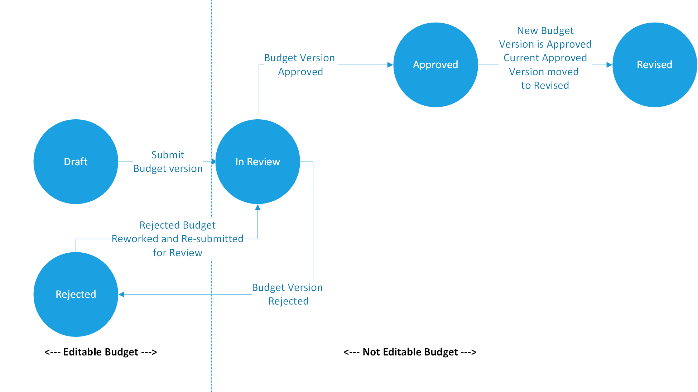

# Project budget status management

[!INCLUDE[banner](../../includes/banner.md)]

_**Applies To:** Project Operations Integrated with ERP, Project Operations Core._

This article provides information that will help you manage the status of a project budget. It explains the different statuses that a project budget can have, the triggers for transitions from one status to another, and the statuses that a project budget can be edited in.

> [!NOTE]
> Actuals can be tracked only against project budgets that have a status of **Approved**.

As a prerequisite for the procedures in this article, a project budget must be created. For information about how to create a budget for a project, see [Create and delete project cost budgets](create-delete-project-budget.md).

The following table describes the different project statuses.

| Budget status | Description |
|---|---|
| Draft | While a budget is in this status, budget dimensions, quantities, prices, and budget amounts can be updated and saved. Budget lines are editable. The budget must be submitted to move to **In Review** status. |
| In Review | The budget has been submitted for approval and is in review. If the budget is approved, it moves to **Approved** status. If it's rejected, it moves to **Rejected** status. While a budget is in this status, it can't be edited. |
| Approved | The budget has been approved, and actuals will be tracked against the budget lines. While a budget is in this status, it can't be edited. |
| Rejected | The budget that was submitted for review has been rejected. Budget lines must be updated according to the user's needs and then resubmitted to move back to **In Review** status. While a budget is in this status, budget lines can be edited. |
| Revised | An approved budget version was revised, and the new budget version has been approved. The previously approved version moves to **Revised** status. While a budget is in this status, budget lines can't be edited. |

The following illustration shows the transitions between project budget statuses.

## Approve a budget

To approve a project budget, follow these steps.

1. Sign in to Microsoft Dynamics 365 Project Operations.
1. In the left navigation, change the area to **Projects**.

    If a budget has been created, the **Budget** tab is visible, and budget lines have been created according to the requirements of the project.

1. Make sure that all the budget lines have been created, and that you want to approve the budget.
1. On the command bar, select **Submit budget**.

    The budget moves to **In Review** status and can no longer be edited.

1. After the submitted budget is validated, select **Budget** on the command bar. The menu that appears has two options: **Approve** and **Reject**. Follow one of these steps:

    - To approve the submitted budget, select **Approve**.
    - If you want additional changes to be made to the budget, select **Reject**. The budget moves to **Rejected** status and can be edited. After the required edits are made, the budget can be submitted again for approval.

> [!NOTE]
> Currently, no workflow for budget approval is implemented.

## Delete a budget

To delete a project budget, follow these steps.

> [!IMPORTANT]
> Budget data can't be recovered after a budget is deleted.

1. Sign in to Project Operations.
1. In the left navigation, change the area to **Projects**.

    If a budget has been created, the **Budget** tab is visible, and budget lines have been created according to the requirements of the project.

1. On the command bar, select **Budget**, and then select **Delete**.

    The **Delete** option is available only if the budget is in a status that allows for deletion. (A budget can be deleted only if it's in either **Draft** or **Rejected** status. It can't be deleted if it's in **In Review**, **Approved** or **Revised** status.)

1. In the dialog box that appears, select **Confirm** to confirm that you want to delete the budget, or select **Cancel** to cancel the deletion.

> [!NOTE]
> A project that has a budget can't be deleted unless the project budget is deleted.

[!INCLUDE[footer-include](../../includes/footer-banner.md)]

[Microsoft](https://www.microsoft.com)
