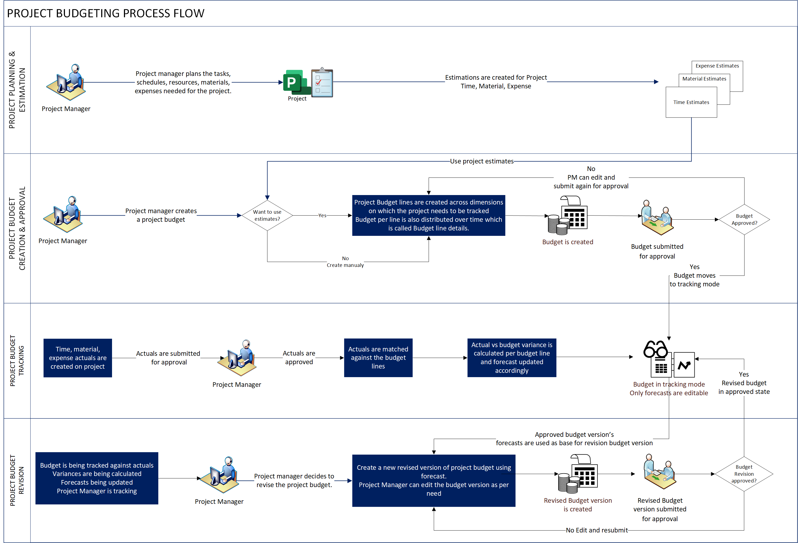

# Project budget management overview

_**Applies to:** Project Operations for resource/non-stocked based scenarios, Lite deployment - deal to proforma invoicing._

In a project each phase, task or work package would incur costs as labour, material, and expenses. Project budget represents a point in time snapshot of the estimated spend across the project phases and its associated tasks.

## Project budget management in Project Operations

This article provides an overview of the end-to-end project budget management process in project-based organizations. 

Project budget management typically follows the business process flow that is shown in the following diagram.

The following provides a step-by-step description of the project budget management process.

1. The project manager creates a budget for a project. The project budget can be created from the ground up or by using the project estimates of the project as an input. 
1. The project manager can budget for time, material, or expense transaction class for the various phases of the project.
1. The project manager submits the budget for approval. An optional workflow for project budget approval can be enabled as per the business needs.
1. With an approved project budget, all actuals created for time, material, expense are matched against the project budget lines. Actual budget consumption and forecasts get updated automatically and any variance between budgeted vs actual is shown.
1. The project manager periodically reviews the project budget and checks for variance between budget vs actuals.
1. If needed, the project manager updates the forecasts based on the actual consumption during the project execution. 
1. The project manager decides to revise the budget based on the new forecasts based on allocation of additional budget to project or with an update on the contract based on spend.
1. The revised project budget follows the project budget approval workflow, and after the project is approved, a new version of the project budget would be used for actual vs budget comparison.

The project budget can be created for all types of projects, particularly fixed-price, time and material, investment.

[!INCLUDE[footer-include](../../includes/footer-banner.md)]

[Microsoft](https://www.microsoft.com)

