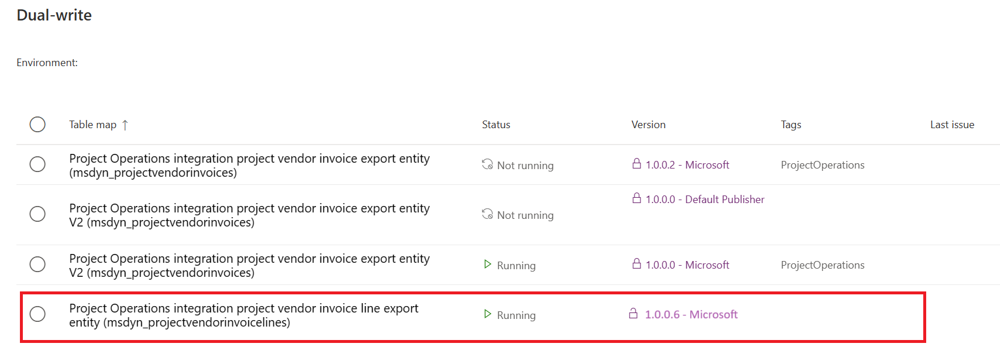
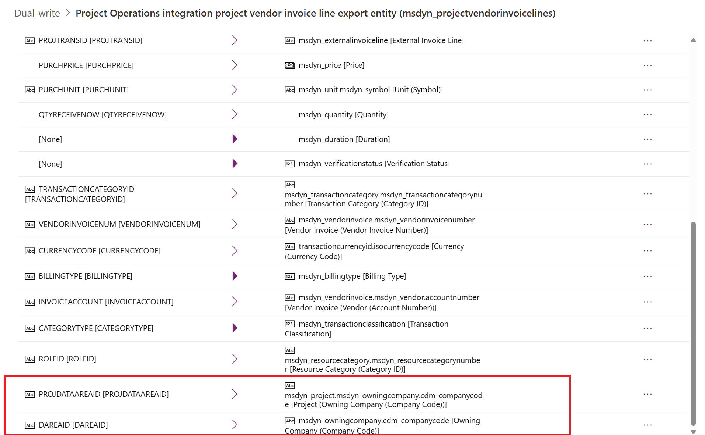

[!include [banner](../../includes/dataverse-preview.md)]

_**Applies To:** Project Operations for resource/non-stocked based scenarios_

To utilize the capabilities outlined in this article, it is necessary to activate the features **Enable subcontract actuals processing with Project Operations for resource-based scenarios** and **Enable Intercompany Vendor invoices for resource-based/non-stocked scenarios** within the Feature Management workspace.

## Minimum version required

To use this feature for **Microsoft Dynamics 365 Project Operations non-stocked/resource-based scenarios**, the following versions are required:

**Project Operations Dataverse** version 4.88.0.0 or later.
**Dynamics 365 Finance** version 10.0.38 or later.

## Run dual-write maps for the vendor invoice lines
Make sure that the mapping for Project Operations integration **project vendor invoice line export entity** and **msdyn_projectvendorinvoicelines** uses version **1.0.0.6** or later.

The following screenshot shows the dual-write entity map that's used for vendor invoice lines.

The following screenshot shows the dual-write field mapping that's used for vendor invoices lines.

## Create and post intercompany vendor invoice
**USPM**, the lending legal entity, must create and post the intercompany vendor invoice for a project from **GBPM**, the borrowing legal entity. 
This **vendor invoice** represents the outsourced labor and expense that were performed by vendors that are paid by USPM.

1. In **Finance**, go to **Accounts payables** > **Invoices** > **Pending vendor invoices**.
2. On the **Action Pane**, select New to create a **vendor invoice**.
3. On the **Invoice header**, in the Invoice account field, select Subcontractor.
4. Select the **invoice date**.
5. On the **Invoice line** FastTab, select **Add line** to create a **vendor invoice line**.
8. Select the **Procurement category** that was created for subcontract lines, and enter the **unit price**, **unit of measurement**, and **quantity**.
9. In the **vendor invoice lines** section, on the **Project tab**, select the Project company **GBPM** and the **project** from the **GBPM** company.
10. Select the **Project category**. It can be of type **expenses** or **hours**. If the selected **project category** is of the Hour type, select the role.
11. Select **Post** to post the vendor invoice.

Once the **vendor invoice** has been successfully posted, it becomes accessible within **Dataverse** for verification and processing by the **project manager**. To understand the process of verifying vendor invoices in Dataverse, refer to the section on **[Verification of vendor invoices](/articles/pro/subcontracting/VI-Verification.md)**. Upon confirmation of an **intercompany vendor invoice** in Dataverse, this action triggers the generation of corresponding actual transactions within the Dataverse system.

| Transaction type  | Description | 
| ------------- | ------------- |
| Cost  | This transaction is created for Borrowing legal entity and does not synchronize with D365 Finance for integration journal posting.  |
| Unbilled sales  | This transaction is created for Borrowing legal entity and synchronize with D365 Finance for integration journal posting.  |
| Inter-organizational sales | This transaction is created for Lending legal entity and synchronize with D365 Finance for integration journal posting.         |
| Resourcing unit cost | This transaction is created for lending legal entity and  synchronize with D365 Finance for integration journal posting.          |

## Post the integration journal for lending legal entity
Once the vendor invoice is validated and approved by the **Project Manager** within **Dataverse**, the subsequent step involves the posting of **Project Integration Journals** in **D365 Finance** specifically for the lending legal entity.

1. In **D365 Finance** Go to **Project management and accounting** > **Periodic** > **Project Operations on Customer Engagement** > **Import from staging** and select to run the periodic process. This periodic process will fill in Project Operations Integration journal.
2. Go to **Project management and accounting** > **Journals** > **Project Operations integration journal** and review the journal lines. The system creates the journal lines for **Inter-organizational sales** and **Resourcing unit cost**.
3. On the **Action pane**, select **Post** to post the integration journal.

Following the completion of the **Project integration journal** posting, the subsequent action entails generating an **Intercompany customer invoice** by the **lending legal entity**, succeeded by the **vendor invoice posting** performed by the **borrowing legal entity**.

To understand the process of creating intercompany customer and vendor invoices, refer to the section on **[Create intercompany customer and vendor invoices](/articles/project-accounting/create-intercompany-customer-vendor-invoices.md)**

