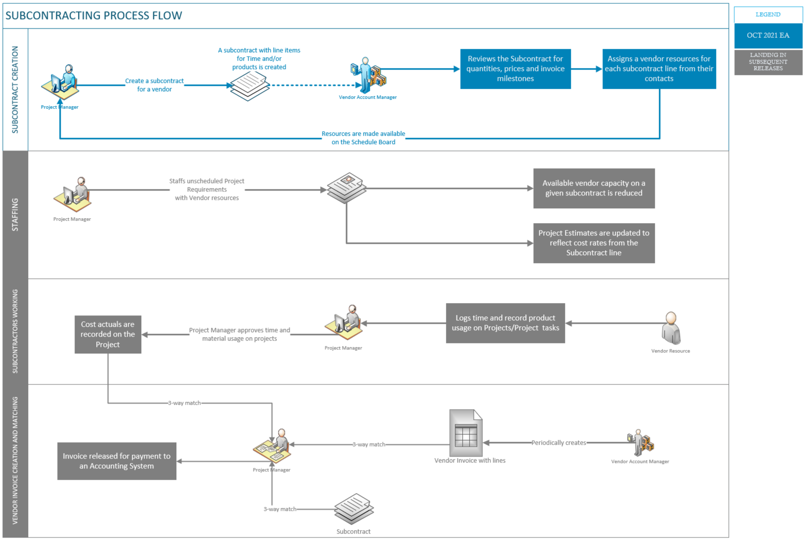

# Subcontracting (October 2021 Early Access release)

[!include [banner](../../includes/dataverse-preview.md)]

_**Applies To:** Lite deployment - deal to proforma invoicing_

This topic provides an overview of the subcontracting capabilities in Dynamics 365 Project Operations that are part of the October 2021 early access release. This feature set is not ready for production or live environments, so these features will remain in early access release until the full feature set is released. We strongly recommend that you do not use the subcontracting feature set for live production scenarios until the preview banner is removed. 

The following list provides an outline of what is currently available in the October 2021 Early Access release:

1. The project manager creates a subcontract with a vendor. By default, the price lists that are attached to the vendor record are used for the subcontract. The vendor account has a relationship type of **Vendor** or **Supplier**.

2. The project manager can itemize all the purchases as line items on the subcontract. Subcontract lines can be for time, expenses, or products. The transaction class of the subcontract line determines what the line is for.

3. The vendor account manager and the project manager can iterate over the subcontract. Pricing can be adjusted in the purchase price lists that are attached to the subcontract.

4. At this point or later in the process, if the subcontract line is for time, the vendor account manager associates vendor contacts with each subcontract line. This association provides information to the project manager who is working on the subcontract. When a vendor contact is associated with a subcontract line, the system automatically creates a bookable resource from the contact, if a bookable resource doesn't already exist.

5. The billing method on each subcontract line can be **Fixed Price** or **Time and Material**. For fixed-price subcontract lines, a milestone-based invoice schedule is set up.

The remaining steps in the business process flow for subcontracting that are outlined in the Overview are currently not available. As new functionality is added, this topic will be updated. 

The following illustration represents the Subcontracting Early Access release as contrasted with the end-to-end business process.

  

## Quantity-based and work-based subcontract lines early access release
In the October 2021 Early Access release, only quantity-based subcontract lines are supported. This means that a subcontract line can be used to purchase time, expenses, or materials from a vendor but not a whole body of work. This also means that the quantity being purchased (units of time, expenses, or quantity of materials) on a subcontract line can be used on any project in the system.

[!INCLUDE[footer-include](../../includes/footer-banner.md)]
