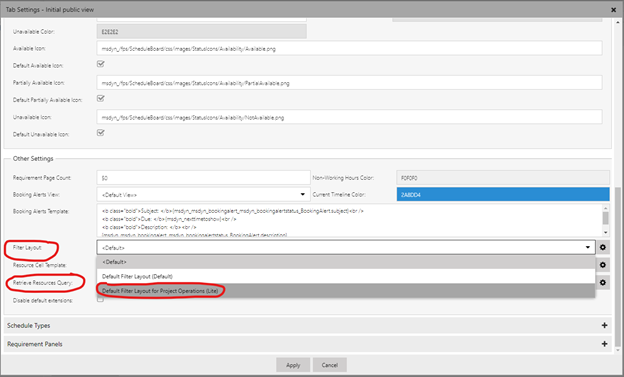
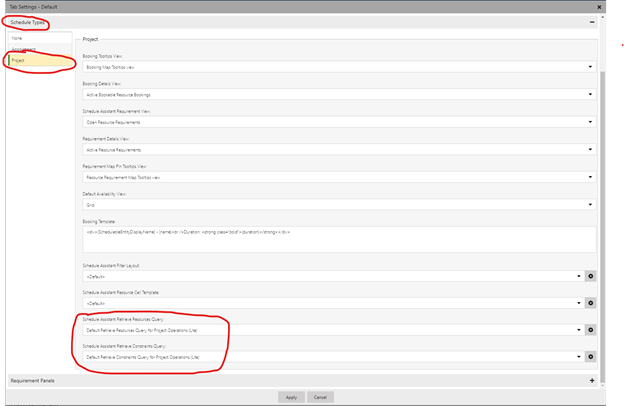

# Configure Schedule Board to show contract workers and subcontracted capacity 

[!INCLUDE[banner](../../includes/banner.md)]

_**Applies To:** Project Operations Core_

Schedule Board in Microsoft Dynamics 365 Project Operations can be used for search for resources in two ways:

- General resource search without the context of any specific project-based resource requirement.
- Requirement–specific resource search where the project requirement will provide the context for the resources suggested.

To notify the schedule board of subcontracted resource capacity and contract workers, you need to make updates to the Schedule Board settings. These updates include: 
- Update Schedule Board settings for general resource search.
- Update Schedule Board settings for requirement–based resource search.

## Update Schedule Board settings for general resource search
### Update filters for general resource search
When you search for a resource, the filters available on the schedule board should be updated so that you can also search for external resources by specifying any or all of the following:
  - Worker type, whether the resources shown should be contract workers or employees.
  - Vendor company to which a resource should belong.
  - Resources that belong to a specific subcontract or subcontract line.
    
### Update retrieve resource query
The query used for searching should also be updated to use these additional filter attributes. Use the following steps to update Schedule Board configuration for general resource search:  
1. Open **Schedule Board Settings** for a specific Schedule Board.
2. Open the **General settings** tab and scroll to **Other settings**.
3. In the list of settings in this section, update the **Filter Layout** to **Default Filter Layout for Project Operations  Core**.
4. Update **Retrieve Resources Query** to **Default Retrieve Resources Query for Project Operations  Core**.

  

## Update Schedule Board settings for requirement–based resource search
### Update filters for requirement-specific resource search 
When you search for a resource, the filters available on the schedule board should be updated so that you can also search for external resources by specifying any or all of the following:
 - Worker type, whether the resources shown should be contract workers or employees.
 - Vendor company to which a resource should belong.
 - Resources that belong to a specific subcontract or subcontract line.

### Update retrieve resource query for requirement-specific resource search 
The query used for searching should also be updated to use these additional filter attributes. Use the following steps to update Schedule Board configuration for requirement-based resource search:

1. Open **Schedule Board Settings** for a specific Schedule Board and then select **Open Default settings** to open the settings for requirement-specific search.
2. Open the **General settings** tab and scroll to **Other settings**.
3. In the list of settings in this section, update the **Filter Layout** to **Default Filter Layout for Project Operations  Core**.
4. Update **Retrieve Resources Query** to **Default Retrieve Resources Query for Project Operations  Core**.
5. Open the **Schedule Types** tab and go to **Project**.
6. Under the settings for **Project**, update **Schedule Assistant Retrieve Resources Query** to **Default Retrieve Resources Query for Project Operations  Core** and update **Schedule Assistant Retrieve Constraints Query** to **Default Retrieve Constraints Query for Project Operations  Core**.

  

[!INCLUDE[footer-include](../../includes/footer-banner.md)]
