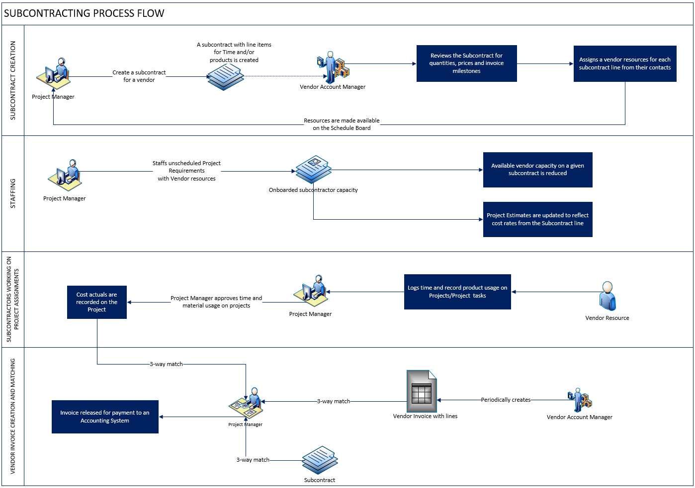

# Subcontract management in Project Operations

[!include [banner](../../includes/dataverse-preview.md)]

_**Applies To:** Lite deployment - deal to proforma invoicing_

Subcontracting for services typically follows the below business process flow.

Here is a step-by-step description of the subcontracting process.

1. The project manager creates a subcontract with a vendor. By default, the price lists that are attached to the vendor record are used for the subcontract. The vendor account has a relationship type of **Vendor** or **Supplier**.
2. The project manager can itemize all the purchases as line items on the subcontract. Subcontract lines can be for time, expenses, or products. The transaction class of the subcontract line determines what the line is for.
3. The vendor account manager and the project manager can iterate over the subcontract. Pricing can be adjusted in the purchase price lists that are attached to the subcontract.
4. At this point or later in the process, if the subcontract line is for time, the vendor account manager associates vendor contacts with each subcontract line. This association provides information to the project manager who is working on the subcontract. When a vendor contact is associated with a subcontract line, the system automatically creates a bookable resource from the contact, if a bookable resource doesn't already exist.
5. The billing method on each subcontract line can be **Fixed Price** or **Time and Material**. For fixed-price subcontract lines, a milestone-based invoice schedule is setup.
6.	Once the subcontract is setup and the negotiation is complete, it is confirmed. Confirmed subcontracts cannot be edited but should changes occur, a Subcontract can be ‘reopened for edits’ that moves the status from Confirmed back to Draft and negotiation can be re-opened. 
7.	When creating a Generic Team Member on a project, the team member can be associated to a Subcontract line. This is to indicate that desire to staff the Generic Team Member with subcontractor capacity.
8.	Named Team Members can be created directly on a project or using by booking them using the resource scheduling expereinces. On a Named Project Team Member who is a Contract Worker, it will be possible to associate to a Subcontract line. This will drawdown the available capacity on a Subcontract line. 
9.	Subcontractor resources will be able to log time, expenses and material usage on projects and project tasks and submit for approval, similar to Employees. When recording time, a contract worker will be able select a specific Subcontract and Subcontract line. 
10.	Upon approval, time approved by subcontracts will record Project cost actuals based on the purchase price of the Contract worker or the Role they performed on the project.
11.	Eventually, Vendor Invoices and Vendor invoice line items can be recorded in the system for the work performed by vendor resources or products delivered by the vendor. Vendor invoice lines must be specific to a project and for a transaction class of Time, Expense, Product/Material and Milestone or Fee. Vendor invoice lines can optionally reference a subcontract line. 
12.	System will automatically associate all cost actuals that match the subcontract line and project to the vendor invoice to facilitate 3-way match and verification process. 
13.	Project Manager will be able to review the automatically matched project actuals, remove or add other project cost actuals and complete verification process. 
14.	Completing the verification process on all lines will mark the Vendor Invoice as Ready for Payment. At this stage, vendor invoice and its lines can be transferred to an Accounting or Payables system for processing the payment to the vendor. Previously recorded project costs will be reversed and actual costs from the vendor invoice line will be recorded on the project. 

## Concept of Quantity-based Subcontract lines and Work-based Subcontract lines

A subcontract line can be quantity – based or work – based. 

When a subcontract line is **quantity-based**, the quantity being purchased on the subcontract line for time, expense or material can be used on any project.

When a subcontract line is **work-based**, subcontract line maps to a body of represented by a node in the Project plan. The value of the subcontract line is the sum of all the components that are required to deliver that body of work. These are modeled as Subcontract line details and can be a collection of Time, Expense or Materials class of line details. The core distinction of work-based subcontract line is also that the subcontract line is dedicated to a single project. 

[!INCLUDE[footer-include](../../includes/footer-banner.md)]
