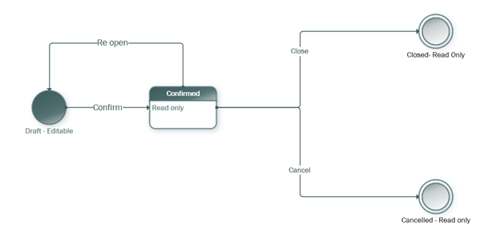

# State transitions on a subcontract 

[!INCLUDE[banner](../../includes/banner.md)]

_**Applies To:** Project Operations for resource/non-stocked based scenarios, Lite deployment - deal to proforma invoicing_

This article explains the state transitions on a subcontract in Microsoft Dynamics 365 Project Operations. Each state is represented as either draft, confirmed, closed, or canceled. The following image represents the state transitions.

  

The following table provides a description of what each state represents in the lifecycle of a subcontract in Project Operations.

| State | Description | Allowed transitions |
| --- | --- | --- |
| Draft | This represents the initial state of a subcontract. Negotiations with the vendor are in progress. The lines and pricing are subject to modifications. A subcontract in this state can be used to estimate and staff project requirements for resources and materials. It can also be referenced on time, expense, and material usage on a project. A subcontract in this state can be edited and deleted. | Confirmed |
| Confirmed | This represents the stage of a subcontract after negotiations with vendor on pricing and line items being purchased is complete. However, the actual delivery of materials and/or work by subcontracted resources is still ongoing. A subcontract in this state can be used to estimate and staff project requirements for resources and materials. It can also be referenced on time, expense, and material usage on a project. A subcontract in this state cannot be edited or deleted. The **Cancel** button allows you to cancel a confirmed subcontract. The **Re-open** button allows you to reopen the subcontract to bring it back into **Draft** status. Use the **Close** button to close a confirmed subcontract. | Closed   Canceled   Draft |
| Closed | This represents the stage of a subcontract when actual delivery of materials and/or work by subcontracted resources is completed. A subcontract in this state can no longer be used to estimate and staff project requirements for resources and materials. Also, it can no longer be referenced on time, expense, and material usage on a project. A subcontract in this state cannot be edited or deleted. | None |
| Canceled | This represents the stage of a subcontract when actual delivery of materials and/or work by subcontracted resources is no longer needed. A subcontract in this state cannot be used to estimate and staff project requirements for resources and materials nor can it be referenced on time, expense, and material usage on a project. A subcontract in this state cannot be edited or deleted. | None |

[!INCLUDE[footer-include](../../includes/footer-banner.md)]
