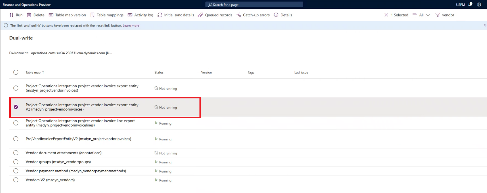
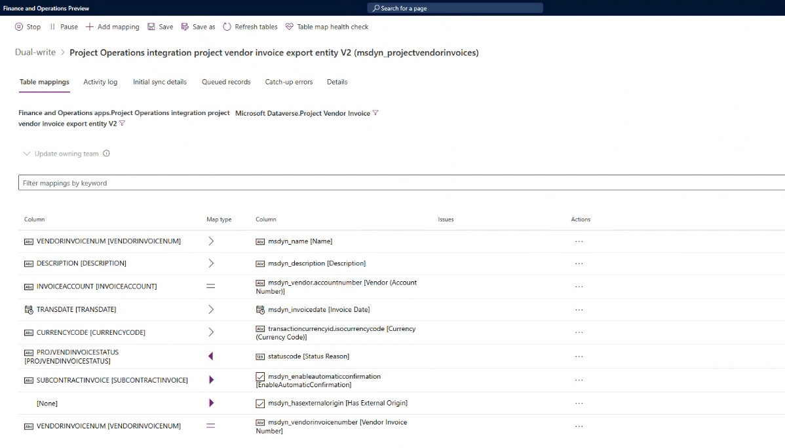

# Block vendor payments until approved by a project manager

[!include [banner](../../includes/dataverse-preview.md)]

_**Applies To:** Project Operations Integrated with ERP_

This article describes the features in Microsoft Dynamics 365 Project Operations that facilitate the withholding of vendor payments for vendor invoices until they receive approval from the project manager in Dataverse. In some cases, project manager authorization is required before vendor payment can be initiated. In these cases, Accounts payable (AP) clerks document the invoice and wait for the project manager's approval before they process the payment.

To use the functionality that's described in this article, you must enable the **Enable Hold Vendor Payment for vendor invoices till PM confirms the invoice for resource based/non-stocked scenarios** feature in the **Feature management** workspace in Dynamics 365 Finance.

## Minimum version required

To use the feature for Project Operations non-stocked/resource-based scenarios, the following versions are required:

- **Project Operations Dataverse** version 4.76.0.0 or later
- **Finance** version 10.0.37 or later

## Run dual-write maps for the vendor invoice header

Make sure that the mapping for **Project Operations integration project vendor invoice export entity V2** and **msdyn\_projectvendorinvoices** uses version 1.0.0.0 or later.

The following screenshot shows the dual-write entity map that's used for vendor invoices.

The following screenshot shows the dual-write field mapping that's used for vendor invoices.

## Set up parameters for subcontract vendor invoice verification and vendor payment blocking

1. In Finance, go to **Project management and accounting** \> **Setup** \> **Project management and accounting parameters**.
1. On the **Financial** tab, if the project manager must verify the vendor invoice in Dataverse, Mark the **Manual verification by PM is required** option to **Yes**. The **Block vendor payments till PM confirmation** field becomes available.
1. If the vendor payment must be blocked until the program manager approves the vendor invoice in Dataverse, set the **Block vendor payments till PM confirmation** option to **Yes**. This field is available only if the **Manual verification by PM is required** option is set to **Yes**.

## Create and post subcontract vendor invoices

When an AP clerk receives an invoice from the subcontractor, a new invoice is created in Finance.

1. In Finance, go to **Accounts payables** \> **Invoices** \> **Pending vendor invoices**.
1. On the Action Pane, select **New** to create a vendor invoice.
1. On the invoice header, in the **Invoice account** field, select **Subcontractor**.
1. Select the invoice date.
1. On the **Header** tab, the **Manual verification by PM is required** and **Block vendor payments till PM confirmation** options take their default settings from the **Project management and accounting parameters** page. You can change the settings at vendor invoice level. Make sure that the **Manual verification by PM is required** and **Block vendor payments till PM confirmation** options are set to **Yes**.
1. On the **Invoice line** FastTab, select **Add line** to create a vendor invoice line.
1. Select the procurement category that was created for the subcontract lines, and enter the unit price, unit of measurement, and quantity.
1. In the **Vendor invoice lines** section, on the **Project** tab, select the project that the subcontractor shares the subcontract invoice against.
1. Select the project category. It can be of any type (**Item**, **Expense**, **Materials**, or **Hours**). If the selected project category is of the **Hour** type, select the role.
1. Select **Post** to post the vendor invoice.

When the vendor invoice is posted, it becomes available in Dataverse for project manager verification and processing. For information about verification of vendor invoices in Dataverse, see [Confirm project vendor invoices](../../procurement/confirm-a-project-vendor-invoice.md).

## Enable a vendor invoice for payment

When the project manager confirms the vendor invoice in Dataverse, the vendor invoice is approved for vendor payment. In some cases, if the vendor payment is required even before the program manager's approval in Dataverse, the vendor invoice can be manually approved for payment.

1. Go to **Accounts payable** \> **Vendors** \> **All vendors**.
1. Select the vendor in the list.
1. On the Action Pane, select **Transactions**.
1. Select the vendor transaction for the vendor invoice.
1. On the **General** tab, set the **Approved** option to **Yes**.
