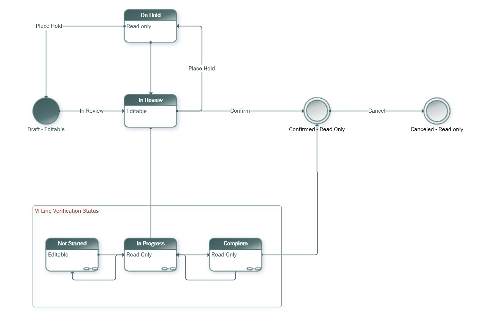

# State transitions on a vendor invoice

[!INCLUDE[banner](../../includes/banner.md)]

_**Applies To:** Project Operations Core_

This article explains the state transitions on a vendor invoice in Microsoft Dynamics 365 Project Operations. The following states are used: **Draft**, **In review**, **Confirmed**, **On hold**, and **Canceled**.

The following illustrations shows the state transitions.

The following table explains what each state represents in the lifecycle of a vendor invoice in Project Operations.

| State | Description | Allowed transitions |
| --- | --- | --- |
| Draft | This state is the initial state of a vendor invoice. The lines and pricing are subject to modification. A vendor invoice in this state can be edited and deleted. | In process |
| In review | This state represents the processing state of a vendor invoice. At least one vendor invoice line has a verification status of **In progress**. | Confirmed, On hold |
| Confirmed | This state represents the stage of a vendor invoice where the application has created cost actuals for each vendor invoice line. Any linked cost actuals that were matched to the vendor invoice lines have been reversed and replaced with the cost actuals from those vendor invoice lines. A vendor invoice in this state can't be edited or deleted. You can use the **Cancel** button to cancel a confirmed vendor invoice. The Cancel action reverses the impact of the Confirm action. | Canceled |
| On hold | 
This state represents a stage of a vendor invoice where the vendor invoice can't move because of an issue with the invoice or the vendor's status. A vendor invoice in this state can't be confirmed, canceled, edited, or deleted.

You can use the Re-open action to move the vendor invoice to the **Draft** or **In review** state. If at least one line on the vendor invoice has a verification status of **In progress** or **Complete**, the vendor invoice will be reopened in the **In review** state. If all the lines on the vendor invoice have a verification status of **Not started**, the vendor invoice will be reopened in the **Draft** state.
 | Draft, In review |
| Canceled | This state represents the stage of a subcontract where actual delivery of materials and/or work by subcontracted resources is no longer required. A subcontract in this state can't be used to estimate and staff project requirements for resources and materials, and also can't be referenced on time, expense, and material usage on a project. A subcontract in this state can't be edited or deleted. | None |

[!INCLUDE[footer-include](../../includes/footer-banner.md)]
