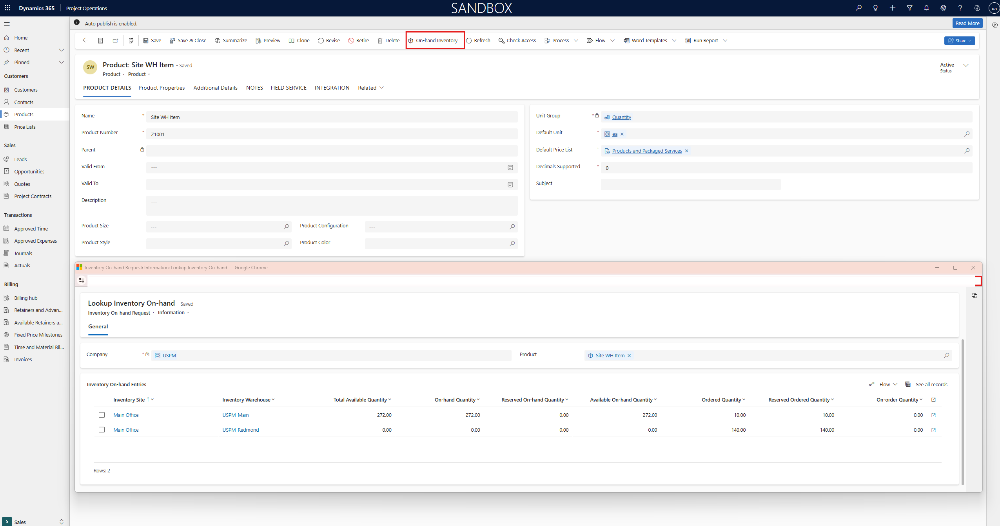

# Managed stocked products for Project Operations integrated deployments

[!INCLUDE[banner](../includes/banner.md)]

_**Applies To:** Project Operations integrated deployments._

This article provides an overview of the stocked product feature in Microsoft Dynamics 365 Project Operations. This feature is seamlessly integrated with Dynamics 365 Finance. It lets users manage stocked products, create purchase orders and subcontracts, consume stock for projects, and use stocked products in project estimates, quotations, and contracts in Dataverse.

The feature supports the creation of project invoices for materials that are consumed under time and materials–based contract lines. It also uses product costs for revenue recognition on fixed-price contract lines. In addition, it helps ensure that both Dynamics 365 Project Operations and Dynamics 365 Finance accurately reflect project costs.

## Prerequisites

### Features

To use the functionality, activate the following features:

- **Enable stocked products usage for project operations integrated deployments** in Dynamics 365 Finance
- **Enable stocked products usage for project operations integrated deployments** in Dynamics 365 Project Operations

### Minimum versions required

To use the feature for Project Operations integrated deployments, you must have the following versions:

- **Project Operations Dataverse** version 4.142.0.x or later
- **Dynamics 365 Finance** version 10.0.44 (10.0.2263.44) or later

### Run dual-write maps

This section provides information about the specific maps that are required for stocked products. These dual-write maps are related to the Dynamics 365 Supply Chain solution. Learn about dual-write entities for the Dynamics 365 Supply Chain solution in [Unified product experience](/dynamics365/fin-ops-core/dev-itpro/data-entities/dual-write/product-mapping).

| Dual-write map | Version |
|---|---|
| Configurations (msdyn_configurations) | 1.0.0.0 |
| Sizes (msdyn_productsizes) | 1.0.0.0 |
| Colors (msdyn_productcolors) | 1.0.0.0 |
| Styles (msdyn_productstyles) | 1.0.0.0 |
| Sites (msdyn_sites) | 1.0.0.0 |
| Warehouses (msdyn_warehouses)| 1.0.0.0 |
| Warehouse locations (msdyn_inventorylocations) | 1.0.0.1 |
| Inventory aisle (msdyn_warehouseaisles) | 1.0.0.0 |
| Storage dimension groups (msdyn_productstoragedimensiongroups) | 1.0.0.0 |
| Tracking dimension groups (msdyn_productdimensiongroups) | 1.0.0.0 |
| Product dimension groups (msdyn_productdimensiongroups) | 1.0.0.0 |
| All products (msdyn_globulproducts) | 1.0.0.0 |
| CDS released distinct product (products) | 1.0.0.3 |
| DV Released products (msdyn_sharedproductdetails) | 1.0.0.0 |
| CDS inventory on-hand entries (msdyn_inventoryonhandentries) | 1.0.0.1 |
| CDS inventory on-hand requests (msdyn_inventoryonhandrequests) | 1.0.01 |
| Item batches (msdyn_batchnumbers) | 1.0.0.0 |
| Item serial numbers (mydyn_serialnumbers) | 1.0.0.0 |
| Project integration table for material estimates (msdyn_estimatelines) | 1.0.0.4 |
| Project Operations integration project vendor invoice line export entity (msdyn_projectvendorinvoicelines) | 1.0.0.9 |
| Project operations integration actuals (msdyn_actuals) | 1.0.0.19 |
| Project subcontract purchase order line (msdyn_subcontractlines) | 1.0.0.1 |
| Units (uoms) | 1.0.0.0 |

## Products

Dynamics 365 Finance serves as the master system for creating and releasing products. When a new product is created or released in Finance, it's automatically synchronized with Dynamics 365 Project Operations.

Dynamics 365 Project Operations reflects the product type, regardless of whether the product is a service item or a stocked item. If the product includes multiple variants, based on dimensions such as size, color, configuration, or style, each variant is represented as a separate product in Project Operations.

In Dynamics 365 Project Operations, the **Activate** button on the Action Pane can be used to activate or deactivate products.

### On-hand inventory

In Dynamics 365 Project Operations, users can view on-hand inventory for specific products in a company. On-hand stock can be accessed from various areas, including the product master, project estimates, project quotation lines, project contract lines, and project journals.

Although Dynamics 365 Project Operations doesn't maintain its own inventory data, it retrieves and shows information about on-hand stock from Dynamics 365 Finance. Currently, Project Operations supports viewing on-hand inventory up to the site and warehouse levels.

### Cost and sales price lists

When a new product is released in Dynamics 365 Finance, and a default purchase price, sales price, or inventory cost is added or updated, Dynamics 365 Project Operations identifies the appropriate cost and sales price lists during synchronization. It selects the first cost price list and sales price list, in alphabetical order, that matches the company's currency.

If any prices are changed in Dynamics 365 Finance, the corresponding prices in Dynamics 365 Project Operations are automatically updated so that they reflect the changes.

## Project material estimates

In Dynamics 365 Project Operations, users can create project estimates for time, expenses, and materials. These estimates are synchronized as project item forecasts in Dynamics 365 Finance. Material estimates can be created for either a specific product or a project variant.

When stocked products are selected, the site and warehouse can be specified in the **Quick Create** dialog or on the details page. The corresponding project item forecast in Dynamics 365 Finance then reflects this information. Additionally, project item forecasts can be used to run master planning. In this way, planned purchase orders or production orders can be generated.

Learn about project material estimates in [Financial estimates for materials on projects](../project-management/create-material-estimate.md).

## Project quotations

Dynamics 365 Project Operations supports the use of stocked products in project quotations. Stocked products can be added directly to the project quotation line details. Sales prices are retrieved based on the price list that is associated with the project quotation. However, users have the flexibility to manually adjust the sales price on the quotation line.

Additionally, a profitability analysis for the project can be reviewed and validated directly from the project quotation page.

Learn about project quotations in [Manage project quotes](../pro/sales/manage-quotes-sales.md).

## Project contracts

Dynamics 365 Project Operations supports the use of stocked products in project contracts. Stocked products can be added directly to the project contract line details. Sales prices are retrieved based on the price list that is associated with the project contract. However, users have the flexibility to manually adjust the sales price on the contract line.

Additionally, a profitability analysis for the project can be reviewed and validated directly from the project contract page.

Learn about project contracts in [Manage project contracts](../pro/sales/manage-contracts-sales.md).

## Purchase orders

Dynamics 365 Project Operations enables execution of the full procurement lifecycle, including purchase requisitions, purchase agreements, and purchase orders.

To use purchase orders in integrated deployments, you must activate the **Enable project purchase orders on Project Operations for resource-based/non-stocked scenarios** feature. If you activate the **Enable stocked products usage for project operations integrated deployments** feature, you can also create purchase orders for stocked items.

When a purchase order line is created or saved, if a project contract exists for the project, the **Project Contract Line ID** field is automatically set based on the project category and activity. The activity is optional if contract lines aren't linked to project tasks in Dynamics 365 Project Operations, or if the project is an internal project. The **Project Contract Line ID** field is important for revenue recognition when it's linked to a fixed-price contract line.

After you confirm the purchase order, accounting distributions are generated to record the project cost. *This behavior applies only to stocked products.* A warehouse worker can then receive the product by using the product receipt functionality.

The Accounts Payable clerk creates the vendor invoice through the invoice feature. Vendor invoices are synchronized with Dynamics 365 Project Operations, and both project cost actuals and unbilled sales actuals are generated.

> [!NOTE]
> When a vendor invoice is posted, project cost is generated and posted directly in Dynamics 365 Finance. Integration journals aren't created for project cost actuals, because the cost is posted during the vendor invoice posting process. *This behavior applies only to stocked products.* For service items or procurement categories, vendor invoices post the transactions to the procurement integration account.
>
> Product receipts aren't recorded to the project actuals in Dataverse and don't affect the project subledger.

Learn about project purchase orders in [Order procurement categories or non-stocked materials for a project using project purchase orders](non-stocked-materials-project-purchase-orders.md).

## Inventory recalculation and closing

To align the inventory cost of a transaction with the assigned inventory model group, you must run the Inventory **Closing and adjustment** job. If the project cost that is recorded through the project integration journal differs from the cost that is calculated based on the inventory model group, an adjustment transaction is generated to update the project cost accordingly.

To update project costs in Dynamics 365 Project Operations, you must run the recurring **Project cost update for inventory adjustments** batch job after the Inventory **Closing and adjustment** job is completed. You can schedule this batch job so that it runs on a recurring basis. However, we recommend that it runs only after the inventory closing and adjustment process is completed.

To run the **Project cost update for inventory adjustments** batch job, follow these steps.

1. In Dynamics 365 Finance, go to **Project management and accounting** \> **Periodic** \> **Project operations integration** \> **Project cost update for inventory adjustments**.
1. Apply the filters for the project or project contract.
1. Select **OK** to update the project cost in Dynamics 365 Project Operations.

[!INCLUDE[footer-include](../includes/footer-banner.md)]
