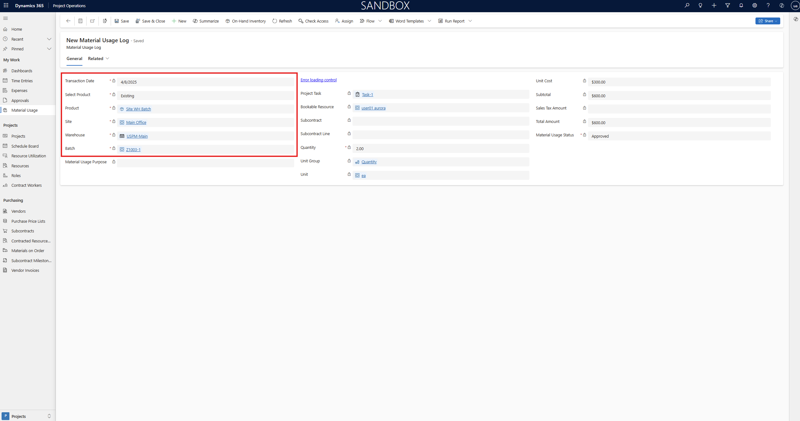
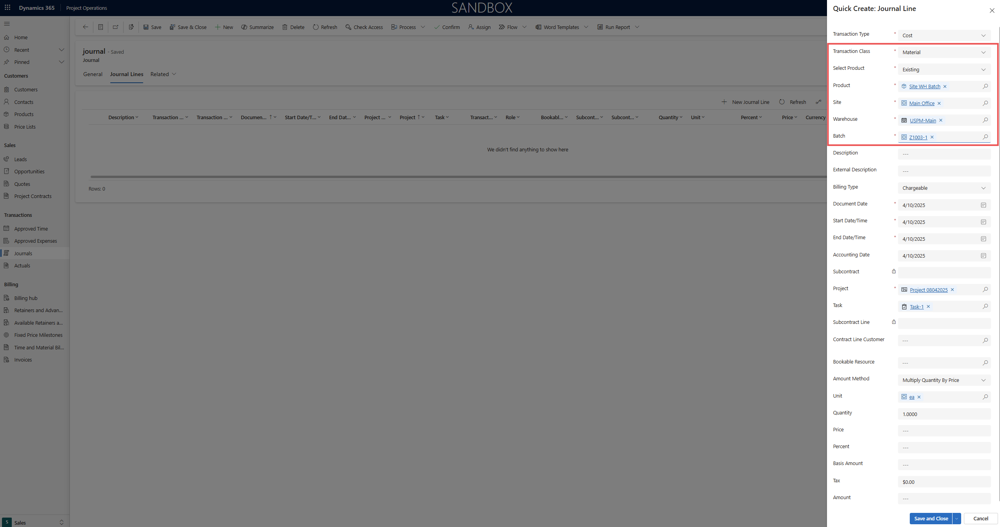

# Manage inventory consumption for Project Operations integrated with ERP deployments

[!INCLUDE[banner](../includes/banner.md)]

_**Applies To:** Project Operations integrated deployments._

This article provides an overview of how inventory consumption works for projects in Dynamics 365 Project Operations integrated deployments. 
During the project execution lifecycle, there are instances where inventory needs to be drawn from existing stock instead of being procured from suppliers. 

This functionality enables project teams to consume materials directly from available stock, ensuring accurate cost tracking, seamless synchronization with Dynamics 365 Finance, and proper inventory control throughout the project lifecycle.

## Material usage

In Dynamics 365 Project Operations, a material usage log provides a way to record material consumption so that it can be approved by the project manager and eventually invoiced to the customer. When you activate the stocked product feature, users can create material usage entries for stocked products. These entries can be created for either a specific product or a project variant. Based on the item and required inventory dimensions, users must specify details such as the site, the warehouse, and, as applicable, the batch or serial number. It's essential to ensure that inventory is consumed only when enough stock that has the relevant inventory dimensions is available.

Learn about project material usage in [Record material usage on projects and project tasks](../material/material-usage-log.md).

### Validations for on-hand inventory

When a user tries to submit material usage for a stocked product, the system validates whether the product is available in stock. If the stock is unavailable, the system shows an error message and prevents submission of the material usage.

In a similar way, when an approver tries to approve material usage, the system validates whether the product is available in stock. If the stock is unavailable, the system shows an error message and blocks approval of the material usage.

### Inventory cost for material usage

When an approver approves material usage, cost and unbilled sales actuals are generated based on the associated cost and sales price lists.

Cost actuals are derived from the cost price list. However, the weighted average cost of the material might differ. When the integration journal for the cost transaction is posted in Dynamics 365 Finance, if the actual cost amount differs from the material's weighted average cost, the difference is treated as an adjustment. This adjustment is synchronized back to Dynamics 365 Project Operations, where it's entered in a new field that is named **Adjustment Value**. The extended amount is updated accordingly.

> [!NOTE]
> In Dynamics 365 Finance, the weighted average cost is always used to post inventory consumption that uses inventory journals, regardless of the costing method that is assigned to the material. To align the inventory cost of a transaction with the assigned inventory model group, you must run the Inventory **Closing and adjustment** job.

## Journals

Entry journals are used to record actuals directly in Dynamics 365 Project Operations. When you use Entry journals, you don't have to enter time, expense, and material usage logs in Project Operations. When you activate the stocked product feature, users can create material consumption entries for stocked products. These entries can be created for either a specific product or a project variant. Based on the item and required inventory dimensions, users must specify details such as the site, the warehouse, and, as applicable, the batch or serial number. It's essential to ensure that inventory is consumed only when enough stock that has the relevant inventory dimensions is available.

Learn about project journals in [Create and confirm Entry journals](../actuals/create-confirm-entry-journals.md).

### Validations for on-hand inventory

When a user tries to confirm the journal for a stocked product line, the system validates whether the product is available in stock. If the stock is unavailable, the system shows an error message and prevents confirmation of the journal entry.

## Inventory reservations
When the material usage is approved or the journals are confirmed, 
**Dynamics 365 Project Operations** generates project actuals of type **Cost**. After the actuals are created, you can reserve the inventory until the **Project Operations integration journal** is posted in Dynamics 365 Finance. 
This ensures that the inventory remains reserved and is not consumed by other transactions such as sales orders, production orders, or material usage for other projects.

The **inventory reservation functionality** is based on the Supply Chain **Inventory Blocking** feature. A new record is created in inventory blocking for each project cost actual recorded for stocked products, 
reserving the inventory specifically for that project.

Once the Project Operations integration journal is posted, the actual inventory consumption is recorded in Dynamics 365 Finance for the projects, and the material reservation is released by clearing the corresponding inventory blocking records.

To reserve the inventory, below are the prerequisites.

### Prerequisites
#### Features
To use the functionality, activate the following features:

- **Enable stocked products usage for project operations integrated deployments** in Dynamics 365 Finance
- **Enable stocked products usage for project operations integrated deployments** in Dynamics 365 Project Operations

#### Minimum versions required
To use this feature for Project Operations integrated deployments, you must have the following versions:

- **Project Operations Dataverse** version 4.161.0.x or later
- **Dynamics 365 Finance** version 10.0.46 or later

#### Run Dual-write maps
This section provides information about the specific maps that are required for inventory reservations. 

| Dual-write map | Version |
|---|---|
| Project operations integration actuals (msdyn_actuals) | 1.0.0.22 |
