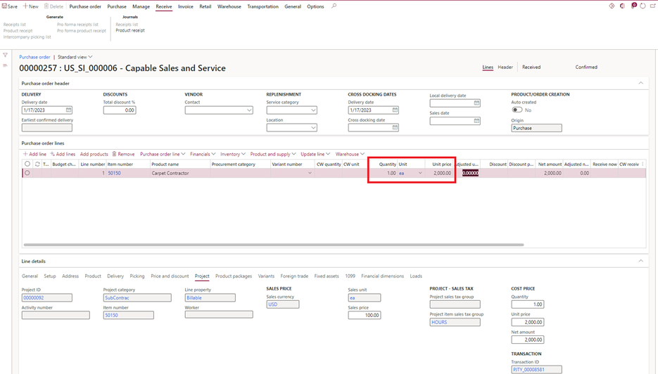
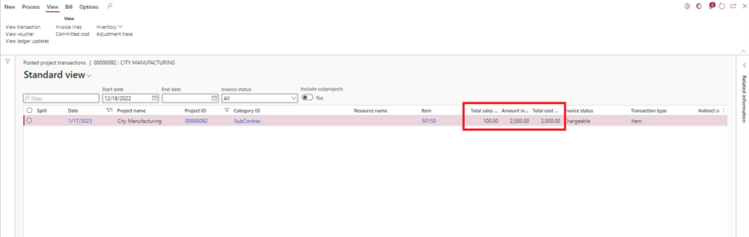
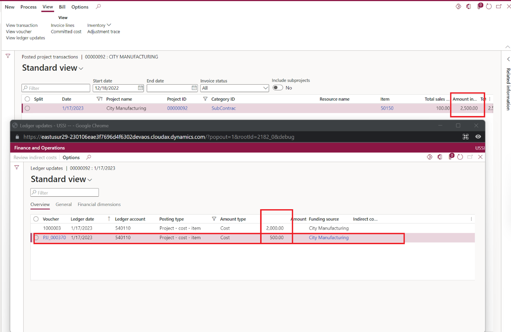

# Purchase orders for Non-stocked/Service items with item requirements

To use **Non-stocked** or **Service** items with item requirements, you enable the **Enable creation of item requirement for non-stocked items** feature in **Feature management**. These item requirements are automatically created if the parameter for **Create item requirement** is set to **Yes** on the **Financial tab** within Project management and accounting parameters.

1. Go to **Project management & accounting parameters** \> **Setup** \> **Project management and accounting parameters**.
1. On the **General** tab, select **Create item requirement**.

When a purchase order line is created, Microsoft Dynamics 365 Finance generates the project item requirement. Each purchase order line has a direct relationship with project item requirement, and purchase order line & item requirement are linked to each other. Any changes to the purchase order have a direct impact on the project item requirement and cause them to be updated.

If the **Item consumption** option is set to **Yes**, item requirements are automatically posted when a purchase order packing slip is posted. If the option is set to **No**, you receive the following message: "Do you want to consume the material?" If the option is set to **No**, you can also manually post the item requirements. Regardless of whether an item requirement is posted manually or automatically, the project cost is generated.

When a purchase order invoice is posted, if there's any change in the unit price or a discount, the project cost is updated during the vendor invoice posting process, and the project subledger details are updated accordingly.

## Example scenario

The following example shows a purchase order and project transactions for **Non-stocked** or **Service** items. The purchase order that's created has a net amount of USD 2,000.00. There's a change in the unit price of the vendor invoice to USD 2,500.00.

The following illustration shows the project posted transactions that are generated when the purchase order product receipt is posted.

The following illustration shows the project posted transactions when the purchase order vendor invoice is posted. Because there's a change in the unit price, the system has posted an adjustment to the existing project posted transactions.

