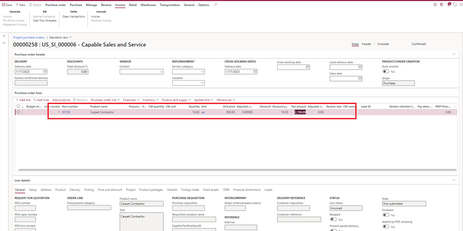
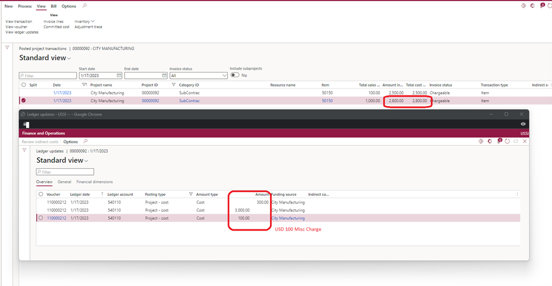

# Purchase orders for Non-stocked/Service items without item requirements

To use purchase orders without item requirements, you must set the **Create Item requirements** option to **No** in Project management & accounting parameters.

1. Go to **Project management and accounting** \> **Setup** \> **Project management & accounting parameters**.
1. On the **General** tab, set the **Create Item requirements** option to **No**.

When a purchase order is created without using the **Item requirements** feature, Microsoft Dynamics 365 Finance generates and posts the project cost at the time of vendor invoice posting. When the purchase order product receipt is posted, no project cost transactions are generated.

Dynamics 365 Finance considers the purchase unit price, discount, and miscellaneous charges that are assigned to the vendor invoice as the project cost. If the miscellaneous charges are configured as loaded on inventory (that is, if they are charges of the **Debit, inventory** type), the miscellaneous charge amount is added to the unit cost and discount, and the project cost is generated accordingly.

## Example scenario

The following example shows a purchase order and project transactions for **Non-stocked** or **Service** items. The purchase order that's created has a net amount of USD 2,700.00 after discounts are applied. Miscellaneous charges of USD 100.00 are added on the purchase order line (Miscellaneous charge of **Item, Debit** type).

The following illustration shows the project cost of USD 2,800.00 and the project subledger that's generated for the purchase order when the vendor invoice is posted.

