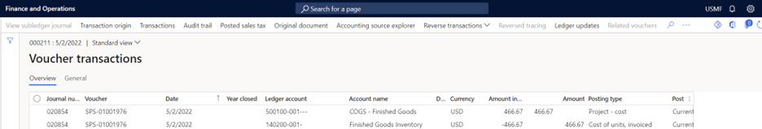
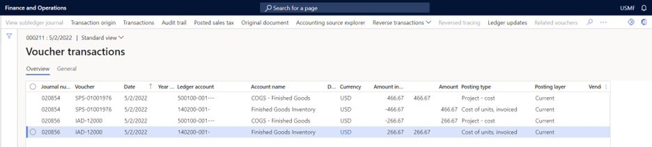
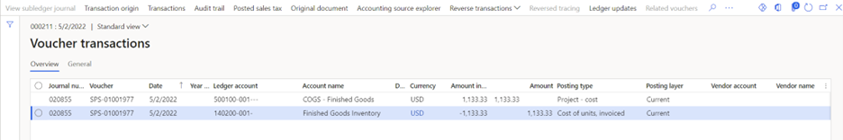

# Inventory consumption for projects

Microsoft Dynamics 365 Finance enables inventory consumption from the warehouse by using project item requirements and the project item journal. Dynamics 365 Finance always considers the **Weighted average** costing method for all item requirements except standard costing. Whenever a new item requirement is posted, the default **Weighted average** costing method is applied, regardless of the item model group that's mapped on the product. This costing method is reflected on the project posted transactions.

This behavior is consistent with the behavior for sales orders without projects, where actual cost consumption is updated after inventory recalculation and costing.

After the **Inventory recalculation** process is run, the system calculates the actual cost, based upon the inventory model that's mapped to the item. It also adjusts the inventory cost for the project.

## Example scenario

The following examples show the project cost transactions that are posted with item requirements for items that use different inventory costing methods.

### FIFO inventory costing method

The following example shows the project cost transactions that are posted for the item requirements for an item that uses the **FIFO** inventory costing method.

| Transaction type | Item ID | Qty | Unit price | Total amount | Item cost price | After recalculation |
|---|---|---|---|---|---|---|
| Purchase order without Project | F001 | 100.00 | 200.00 | 20,000.00 | | |
| Purchase order without Project | F001 | 100.00 | 200.00 | 20,000.00 | | |
| Purchase order without Project | F001 | 100.00 | 1,000.00 | 100,000.00 | | |
| Item requirements or Project item journal | F001 | (1.00) | 200.00 | (200.00) | 466.67 | 200.00 |

The following illustration shows the project posted transactions that are generated after the packing slip posting process for the item requirements is run.

The following illustration shows the project posted transactions that are generated after the **Inventory recalculation** process is run. The system has generated adjustment vouchers for the transactions that were generated for item requirements.

### Weighted average inventory costing method

The following example shows the project cost transactions that are posted for the item requirements for an item that uses the **Weighted average** inventory costing method.

| Transaction type | Item ID | Qty | Unit price | Total amount | Item cost price | After recalculation |
|---|---|---|---|---|---|---|
| Purchase order without Project | W001 | 100.00 | 100.00 | 10,000.00 | | |
| Purchase order without Project | W001 | 100.00 | 300.00 | 30,000.00 | | |
| Purchase order without Project | W001 | 100.00 | 3,000.00 | 300,000.00 | | |
| Item requirements | W001 | (1.00) | 300.00 | (300.00) | 1,133.33 | 1,133.33 |

The following illustration shows the project posted transactions that are generated after the **Item requirements** posting process is run.

