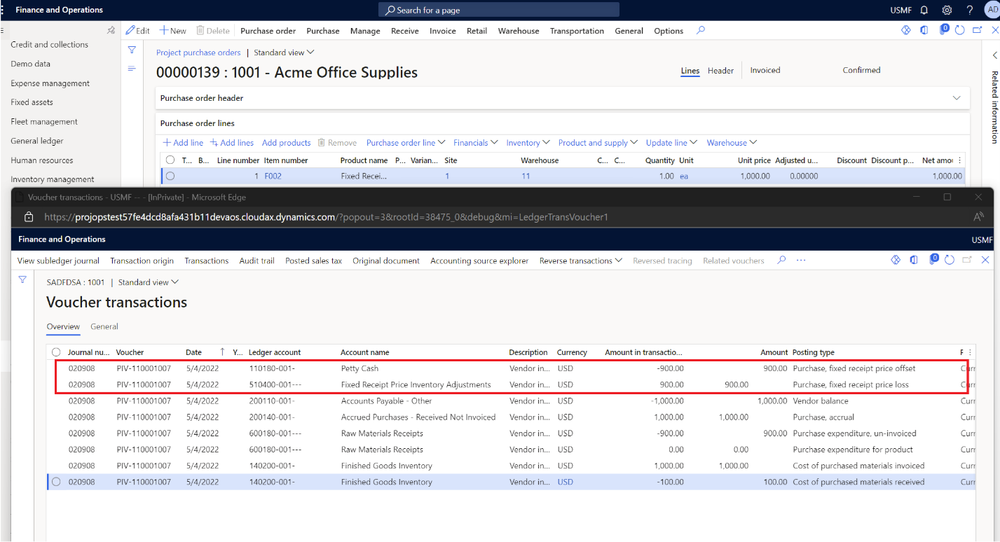
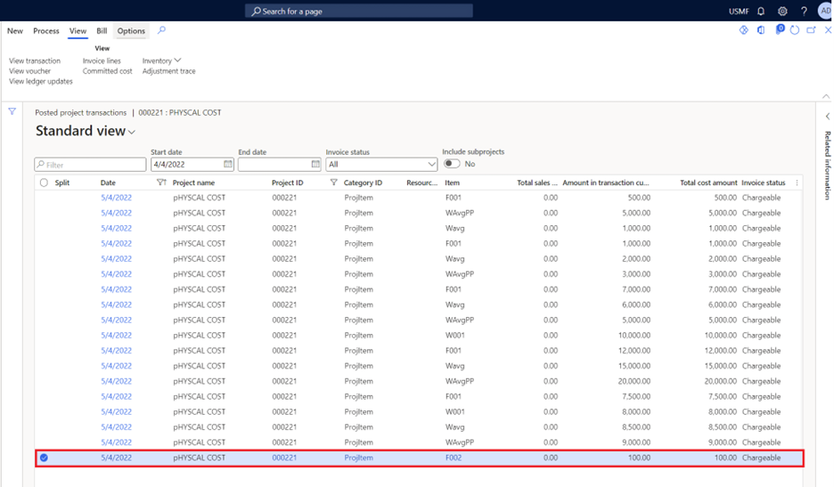

# Purchase orders for stocked items with fixed price

To use the **Fixed receipt price** option for project costing, you must set the **Fixed reciept price** option to **Yes** for item model group.

1. Go to **Inventory management** \> **Setup** \> **Inventory** \> **Item model group**.
1. Set the **Fixed receipt price** option to **Yes**.

This feature works like a standard cost where all the receipts and consumption are done on the cost price that's defined for the item.

If there's a purchase where the unit price is more or less than the cost price that's defined for the item, the system posts the variance to the purchase fixed receipt price profit or loss account and the fixed receipt price offset account. Because of this variance, the system always maintains the item cost price like the standard cost price for the product.

For project item consumption, the project cost is always updated with the item cost price, regardless of whether the consumption is done through item requirements or purchase orders that have item requirements.

If there's a change in the fixed cost price, you must run the **Inventory closing** process, adjust the on-hand inventory, and then activate the new cost.

## Example scenario

The following example shows the project cost for items where the **Fixed price** option is set to **Yes** for the item model group.

The following illustration shows the purchase order and vendor invoice that are posted for the purchase order.

The following illustration shows the project posted transaction where the project cost is posted as USD 100.00.

