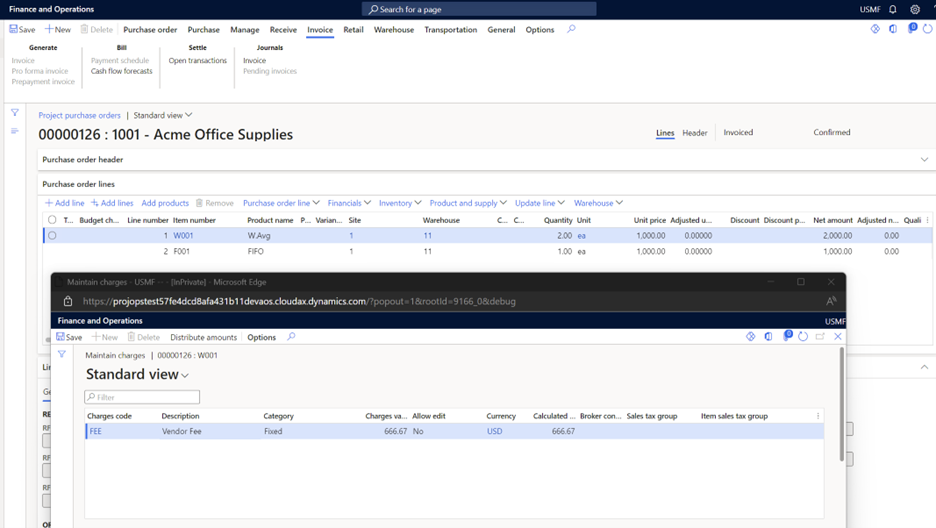
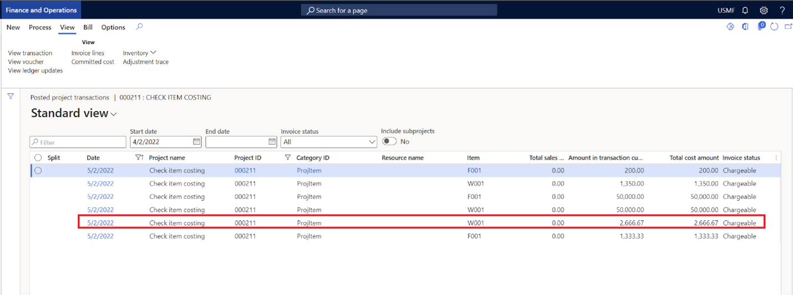

# Purchase orders for stocked items without item requirements

To use purchase orders without item requirements, you must set the **Create Item requirements** option to **No** in Project management & accounting parameters.

1. Go to **Project management and accounting** \> **Setup** \> **Project management & accounting parameters**.
1. On the **General** tab, set the **Create Item requirements** option to **No**.

When a purchase order is created without using the **Item requirements** feature, Microsoft Dynamics 365 Finance generates and posts the project cost at the time of vendor invoice posting.

If a packing slip is posted for the purchase order as part of product receipt, no project cost transactions are generated, regardless of whether the **Include physical value** option is set to **Yes** or **No** for the item model group that's mapped on the item master.

Dynamics 365 Finance considers the purchase unit price, discount, and miscellaneous charges that are assigned to the vendor invoice as the project cost. If the miscellaneous charges are configured as loaded on inventory (Debit, inventory), the miscellaneous charge amount is added to the purchase unit price and discount, and the project cost is generated accordingly.

Finance generates two inventory transactions for each purchase order for stocked items:

- Purchase order
- Transaction for project consumption

Both transactions are linked to each other (**Inventory marking on the inventory transactions**). Therefore, the system can consider the inventory cost as the project cost. Because of the markings and linkage between the inventory transactions, the system considers the project purchase order price together with the charges for the project cost.

Inventory recalculation doesn't have an impact on the project posted transactions, because those transactions are generated during vendor invoice posting, and the project consumption line is linked to the purchase order inventory cost. This rule is applicable to all items that have different inventory costing methods, including **FIFO**, **LIFO**, **Weighted average**, and **Standard costing**.

## Example scenario

In this example, there are two purchase order lines. The item on one line uses the **Weighted average** costing method, and the item on the other line uses the **FIFO** costing method. Miscellaneous charges are applied on the purchase order.

**Line 1:**

- **Item:** W001
- **Quantity:** 2
- **Unit price:** 1,000
- **Inventory costing method:** Weighted average
- **Miscellaneous charges:** 666.67

**Line 2:**

- **Item:** F001
- **Quantity:** 1
- **Unit price:** 1,000
- **Inventory costing method:** FIFO
- **Miscellaneous charges:** 333.33

**Project cost:**

- **Item W001:** 2,666.67 (Purchase cost: 2,000, miscellaneous charges: 666.67)
- **Item F001:** 1,333.33 (Purchase cost: 1,000, miscellaneous charges: 1,333.33)

The following illustration shows the purchase order together with the miscellaneous charges that are applied to item W001.

The following illustration shows the project posted transactions that are generated for the purchase order invoice for items F001 and W001. For item F001, the project cost is recorded as USD 2,666.67. For item W001, the project cost is recorded as USD 1,333.33. Both project cost amounts include the purchase order price and miscellaneous charges that are applied on the purchase order.

