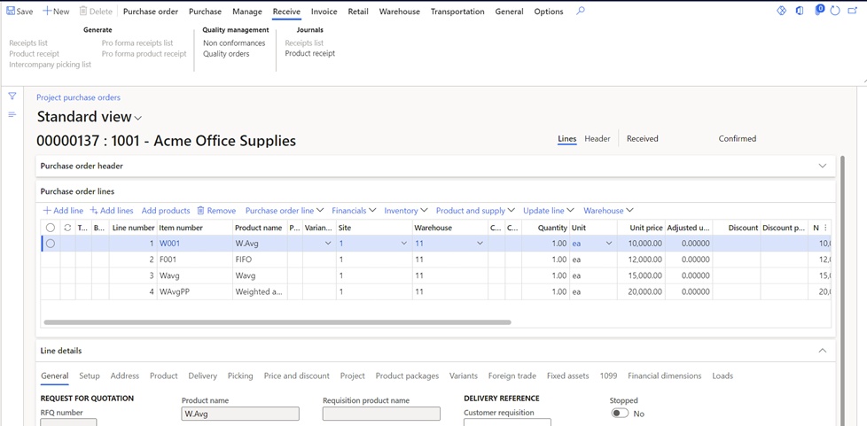
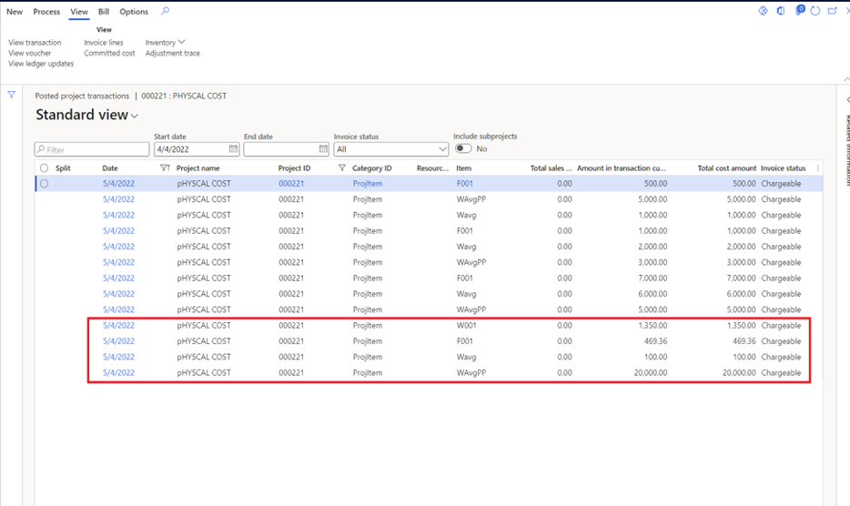
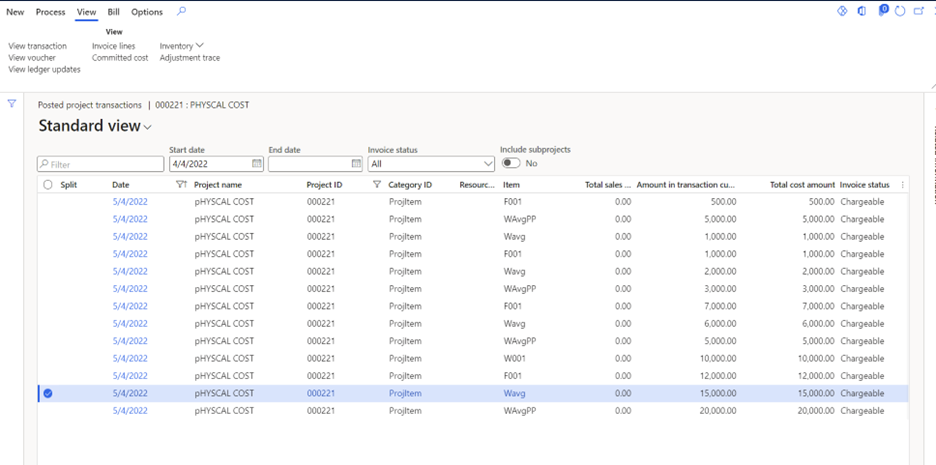

# Purchase orders for stocked items with item requirements

To use purchase orders with item requirements, set the **Item requirements** parameter to **Yes** using these steps.

1. From **Project management and accounting**, select **Setup**, **Project management & accounting parameters**, and then the **General** tab.
1. Locate **Create Item requirements**, and set to **Yes**.
1. Locate **Item consumption**, and set to **Yes**

When a purchase order is created using the **Item requirements** feature, **Microsoft Dynamics 365 Finance** generates the project item requirements. Each purchase order line has a direct relationship with project item requirements, and both lines are linked to each other. Any changes to the purchase order have a direct impact and update on the project item requirements.

For the item requirements, the system displays the unit price for purchase orders as an item cost price after deducting the discount applicable for purchase order lines. Item requirement **cost price** doesn't include the **Miscellaneous charges** applied on the purchase order line.

When a purchase order packing slip is posted, if the **Item consumption** parameter is set to **Yes.**, the Item requirements are automatically posted. Otherwise, the system shows the message **Do you want to consume the material** if item consumption is marked to **No**. You can post the item requirements manually as well.

The system posts/generates the project cost on the **Purchase order unit price** or **Weighted average**. If **Include physical price** is enabled on the item model group for the item, the system posts the project cost with purchase order unit price at purchase order **Packing slip**. Otherwise, the system generates the project transactions with weighted average inventory cost method.

Once the purchase order invoice is posted, and if there are any changes like additional discount or Miscellaneous changes (Debit, inventory) applied on the purchase order lines, then inventory recalculation process is required to update the project cost. **Inventory recalculation** process is also required if **Include physical price** is set to **No** for the item model group.

This rule is applicable to all items with different inventory costing methods including **FIFO, LIFO, Weighted average, and standard costing**.

## Example scenario

The following screen shows the purchase order with items using **FIFO, Weighted average** costing method, and **Miscellaneous charges** applied on the purchase orders. The system has generated the **Item requirements** for each purchase order line.

The following screen shows the **Project posted transactions** afterpurchase order **product receipt.** Project cost is generated using **Weighted average** inventory costing method except **item** WAvgPP. For this item **Include physical value** is set to **Yes** on the item model group.

The following screen shows the **Project posted transactions** after **Inventory recalculation**. **Inventory recalculation** performs the adjustment transactions for the project subledger based upon vendor invoice amount.

