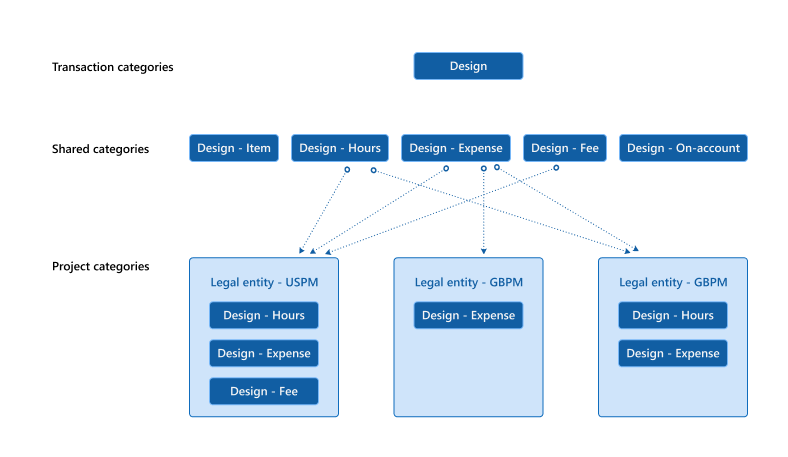

# Configure project categories

_**Applies To:** Project Operations for resource/non-stocked based scenarios_

Project Operations offers robust capabilities for categorizing revenue and expenses on projects. Categories provide the ability to report on and analyze project transactions, and drive posting to the general ledger.

The following diagram illustrates the correlation between transaction categories, shared categories, and project categories. 

Transaction categories are the basic grouping for project transactions. Within that grouping, there is a set of shared categories that can be shared across applications and modules. Getting even further into specifics, project categories are the most granular level of categories. Project categories are specific to legal entity, module, and application.

## Transaction categories

Transaction categories represent the basic grouping for project transactions and are not company or transaction type-specific. For example, Contoso Robotics uses Design, Travel, Installation, and Service Transaction categories to group Project transactions.

Transaction categories are defined in the Project Operations module. 
1. Go to **Settings** \> **Transaction Categories** to open the form. 
2. Create a new transaction category either by selecting **New** or by selecting **Import from Excel**.

## Shared categories

Dynamics 365 uses the Shared categories concept to categorize expenses in different applications, such as Dynamics 365 Finance, Dynamics 365 Supply Chain, and Dynamics 365 Project Operations. For each Transaction category created, Project Operations automatically creates four related Shared categories: Hours, Expense, Fees, and Item. You can review and adjust the shared categories by going to **Project management and accounting** \> **Setup** \> **Categories** \> **Shared Categories**.

## Project categories

Project categories represent most granular level of category configuration and must be configured separately, and for each company, by a Project accountant.

1. Go to **Project Management and Accounting** \> **Setup** \> **Categories** \> **Project categories**.
2. Select **New**.
3. Select the **Category ID** of the Shared category you created in the previous section. Project Operations allows using only those shared categories that are associated with transaction categories.
4. Select a category group.

## Category groups

Category groups are used to share properties, primarily posting profiles, between related Project categories. There must be at least one category group for each transaction type and each project category is assigned a group.

The posting specifications in Project Operations are defined by the project cost and revenue profile rules, project categories, and category groups. You can set up category groups by going to **Project management and accounting** \> **Setup** \> **Categories** \> **Category groups**.

[!INCLUDE[footer-include](../includes/footer-banner.md)]