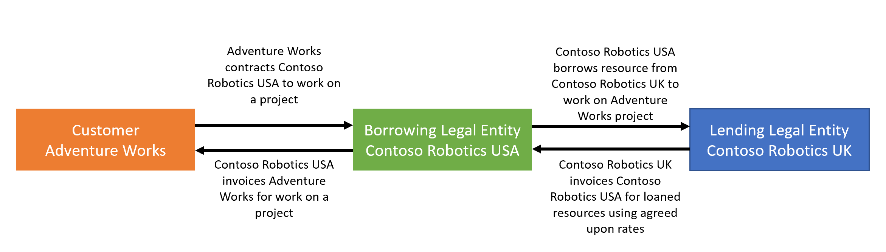
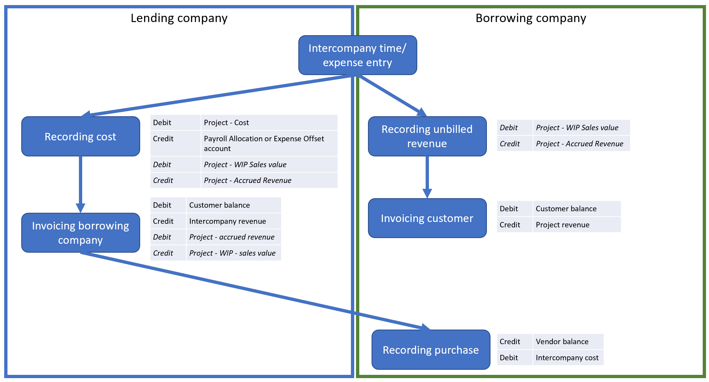

# Intercompany invoicing overview

_**Applies To:** Project Operations Integrated with ERP_

Your organization might have multiple divisions, subsidiaries, and other legal entities that transfer products and services to each other for projects. The legal entity that provides the service or product is called the *lending legal entity*. The legal entity that receives the service or product is called the *borrowing legal entity*.

The following illustration shows a typical scenario where two legal entities, Contoso Robotics USA (the borrowing legal entity) and Contoso Robotics UK (the lending legal entity) share resources to deliver a project for the customer, Adventure works. For this scenario, Contoso Robotics USA is contracted to deliver the work to Adventure Works.

 

Dynamics 365 Project Operations uses the following flow to process intercompany transactions:

1. Resources from the lending legal entity record intercompany time or expense transactions by booking time and expense against projects in the borrowing legal entity.
2. Time and expense costs are recorded in the lending company by using the borrowing company's unit cost price list.
3. Intercompany unbilled sale transactions are recorded in the lending company by using the borrowing company's unit cost price list.
4. Unbilled revenue is recorded in the borrowing company using the project contract sales price list. The customer can be billed when unbilled revenue is recorded. The customer doesn't have to wait until intercompany invoice processing is complete.
5. Intercompany customer invoices are created on a periodic basis in the lending company. The invoices are created manually or by using a periodic automated process. A single invoice can be created for each borrowing legal entity or separate invoices can be created by project.
6. When the intercompany customer invoice is posted in the lending legal entity, the corresponding pending vendor invoice is created in the borrowing legal entity. The costs in the pending vendor invoice will be recorded to the project subledger when the invoice is posted.

The following diagram illustrates intercompany invoicing as it relates to accounting events and expected postings to the general ledger.

## Additional resources

- [Configure intercompany invoicing](configure-intercompany-invoicing.md)
- [Record intercompany transactions](create-intercompany-transactions.md)
- [Create intercompany customer and vendor invoices](create-intercompany-customer-vendor-invoices.md)

[!INCLUDE[footer-include](../includes/footer-banner.md)]
