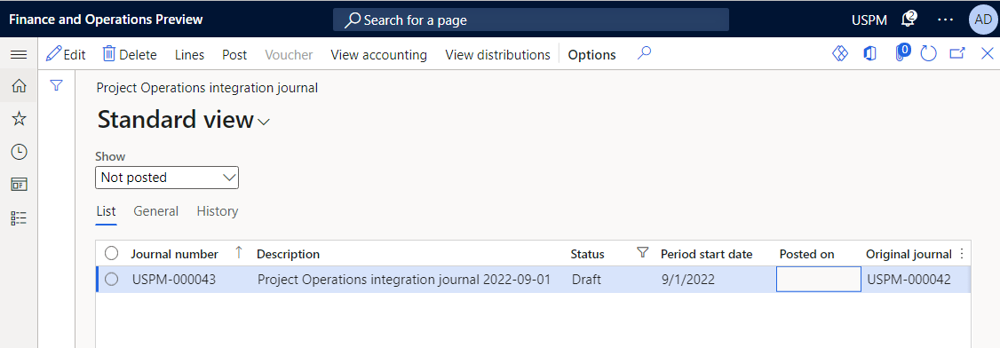

# Integration journal in Project Operations

[!INCLUDE[banner](../includes/banner.md)]

_**Applies To:** Project Operations for resource/non-stocked based scenarios._

Time, expense, fee, and material entries create **Actual** transactions, which represent the operational view of work that's completed against a project. Microsoft Dynamics 365 Project Operations gives accountants a tool for reviewing transactions and adjusting the accounting attributes as they require. After the review and adjustments are completed, the transactions are posted to the project subledger and general ledger. An accountant can perform these activities by using the **Project Operations Integration** journal (in Dynamics 365 Finance, go to **Project management and accounting** \> **Journals**, and select the **Project Operations Integration** journal).

## Create records in the Project Operations Integration journal

Records in the Project Operations Integration journal are created using the periodic process, **Import from staging table**. You can run this process by going to **Project management and accounting** \> **Periodic** \> **Project Operations Integration** \> **Import from staging table** in Finance. You can run the process interactively or configure the process to run in the background as needed.

When the periodic process runs, any actuals that aren't yet added to the Project Operations Integration journal are found. A journal line for each actual transaction is created. The system groups journal lines into separate journals based on the value selected in the **Period unit on Project Operations Integration journal** field on the **Project Operations on Dynamics 365 Customer Engagement** tab of the **Project management and accounting parameters** page in Finance (**Project management and accounting** > **Setup** > **Project management and accounting parameters**). Possible values for this field include:

- **Days**: Actuals are grouped by transaction date. A separate journal is created for each day.
- **Months**: Actuals are grouped by calendar month. A separate journal is created for each month.
- **Years**: Actuals are grouped by calendar year. A separate journal is created for each year.
- **All**: All actual transactions are included in the same integration journal. If the journal isn't available when the periodic process runs, for example if the journal is in the process of posting transactions, a new journal is created.

Journal lines are created based on project actuals. The following list includes some of the more notable default and transformation rules:

- Each project actual transaction has a line in the Project Operations Integration journal. Cost and unbilled sales transactions for time and material billing type are shown on separate lines.
- The **Date** field represents the date of the transaction. The **Accounting date** field represents the date when the transaction is recorded in the ledger. If the accounting date is in a [closed financial period](/dynamics365/finance/general-ledger/close-general-ledger-at-period-end), and the **Automatically set accounting date to open ledger period** parameter is set on the **Financial** tab of the **Project management and accounting parameters** page, the system adjusts the accounting date of the transaction to the first date in the next open ledger period.
- The **Voucher** field shows the voucher number for every actual transaction. The voucher number sequence is defined on the **Number sequences** tab, on the **Project management and accounting parameters** page. Each line is assigned a new number. After the voucher is posted, you can view how cost and unbilled sales transaction are related by selecting **Related vouchers** on the **Voucher transaction** page.
- The **Category** field represents a project transaction and defaults based on the transaction category for the related project actual.

    - If **Transaction category** is set in the Project actual and a related **Project category** exists in a given legal entity, the category defaults to this project category.
    - If **Transaction category** isn't set in the Project actual, the system uses the value in the **Project category defaults** field on the **Project Operations on Dynamics 365 Customer Engagement** tab on the **Project management and accounting parameters** page.

- The **Resource** field represents the project resource related to this transaction. The resource is used as a reference in Project invoice proposals to customers.
- The default value of the **Exchange rate** field comes from the **Currency exchange rate** value that's set in Finance. If the exchange rate setup is missing, the **Import from staging** periodic process doesn't add the record to a journal, and an error message is added to the job execution log.
- The **Line property** field represents the billing type in Project actuals. Line property and billing type mapping are defined on the **Project Operations on Dynamics 365 Customer Engagement** tab on the **Project management and accounting parameters** page.

Only the following accounting attributes can be updated in the Project Operations integration journal lines:

- **Billing sales tax group** and **Billing item sales tax group**
- **Financial dimensions** (using the **Distribute amounts** action)

Integration journal lines can be deleted. However, any unposted lines will be inserted into the journal again after you rerun the **Import from staging** periodic process.

## Post the Project Operations integration journal

When you post the Integration journal, a project subledger and general ledger transactions are created. These are used in downstream customer invoicing, revenue recognition, and financial reporting.

The selected Project Operations integration journal can be posted by using **Post** on the Project Operations integration journal page. All journals can be automatically posted by running a process at **Periodics** \> **Project Operations integration** \> **Post Project Operations integration journal**.

Posting can be performed interactively or in a batch. All journals that have more than 100 lines are automatically posted in a batch. For better performance when journals that have many lines are posted in a batch, enable the **Post Project Operations integration journal using multiple batch tasks** feature in the **Feature management** workspace.

### Transfer all lines that have posting errors to a new journal

> [!NOTE]
> To use this capability, enable the **Transfer all lines with posting errors to a new Project Operations integration journal** feature in the **Feature management** workspace.

This feature helps improve the experience with the Project Operations integration journal. When it's enabled, dual-write timing issues and setup issues no longer prevent valid journals from being posted. During posting to the Project Operations integration journal, the system validates every line in the journal. It posts all lines that have no errors and creates a new journal for all lines that have posting errors.

To review the journals that have posting error lines, go to **Project management and accounting** \> **Journals** \> **Project Operations integration journal**, and filter the list of journals by using the **Original journal** field. The following illustration shows an example where the journals on the **Project Operations integration journal** page have been filtered in this way.

If a periodic batch job is configured to post the integration journal, posting is reattempted. If the timing issue was fixed, the journals are posted. You should manually investigate any remaining journals by reviewing the logs and taking any required action.

### Working with integration journal lines that have warnings and errors

If there are configuration issues, or if other issues are found during posting, the system logs a warning or error to describe the issue. The transaction remains in the integration journal, so that it can be posted later.

The **Enable integration journal processing improvements** feature is available in version 10.0.37 and is recommended for all customers. This feature prevents a race condition error. It prevents the system from trying to continually post integration journals that fail until the configuration issue is resolved.

When this feature is enabled, new statuses are visible on the integration journal line and are used to control posting. This feature also optimizes posting to ensure that work can be split into multiple threads. This feature depends on the **Transfer all lines with posting errors to a new journal** feature. In addition, we recommend that you enable the **Post Project Operations Integration journal using multiple batch tasks** feature.

This feature introduces an enhanced process where posting transactions are attempted, and any lines without errors are successfully posted. If any errors are encountered, that subset of transactions is moved to a new integration journal, and the header and lines have a status of **Error**. The system doesn't try again to post the transactions that have the error until the underlying issue is fixed, the header is updated, and line is set back to draft status. Common examples of underlying issues include a closed financial period and an incorrect financial dimension that isn't valid for the account structure. After the underlying issue is fixed, the user selects **Update to draft** on the integration journal line or the integration journal header to mark the transactions as ready to be processed again.

| Line status | Description | How the user can fix the error |
|---|---|---|
| Draft | The line is in draft status as it existed before the new **Enable integration journal processing improvements** feature was enabled. The line can be posted. | |
| Error | One or more integration journal lines have an error, and the header can't be posted. | **Reset to draft** can be performed. |
| Processing | The line is in processing status and will soon move to the posted status. If a line is in processing status for a long time, an error likely occurred. A user can manually reset the line to draft status. | **Reset to draft** can be performed. | 
| Posted | The line was successfully posted, and no further action is required. | |
| Unrecoverable | The line has an error that can't be posted by the system. A support ticket might be required. This error should occur only for transactions that existed before the feature was enabled. | |
| Invalid actuals | 
The line has an error that can't be posted because of missing actuals in Dataverse. A support ticket might be required.

You can learn more about this situation in [Enable actuals validation to prevent invalid actuals](../advanced-configuration/enable-actuals-validation.md).
 | |

| Header status | Description | How the user can fix the error |
|---|---|---|
| Draft | The header is in draft status, because as it hasn't yet been posted. | |
| Processing | The header is in processing status and will soon move to the posted status. | **Reset to draft** can be performed. |
| Posted | The header was successfully posted, and no further action is required. | |
| Error | One or more integration journal lines have an error, and the header can't be posted. A user can manually reset the header to draft status and then try to post again. | **Reset to draft** can be performed. |

#### Transactions in the processing state

Integration journal lines might remain in a processing state for an extended period and might have to be reset. If transactions are listed in pending status, and either 24 hours have passed or an administrator has verified that no interactive or batch posting processes are running for the integration journal, the status probably wasn't correctly updated. Users can manually reset the status to draft by selecting **Update to draft** on the integration journal line.

#### Other improvements in the 10.0.38 release

Here are some other improvements that were made in this area in the 10.0.38 release:

- You can multiselect rows when you work with integration headers.
- A new, optional **Limit the integration journal lines per header** parameter provides more flexible control over posting. When the parameter is disabled, 200 lines are used by default. You can increase or decrease the value of the parameter as you require. By decreasing the value, you reduce the time that's required to post the journal.
- The **Add filters to the Project Integration journal posting batch job** feature adds default filters that let users specify a period start date, a journal number, or an original journal number in the batch job filter. These filters are useful when you have transactions that require setup or configuration changes before they can be posted. You can now avoid trying to post until the issue is fixed.

[!INCLUDE[footer-include](../includes/footer-banner.md)]
